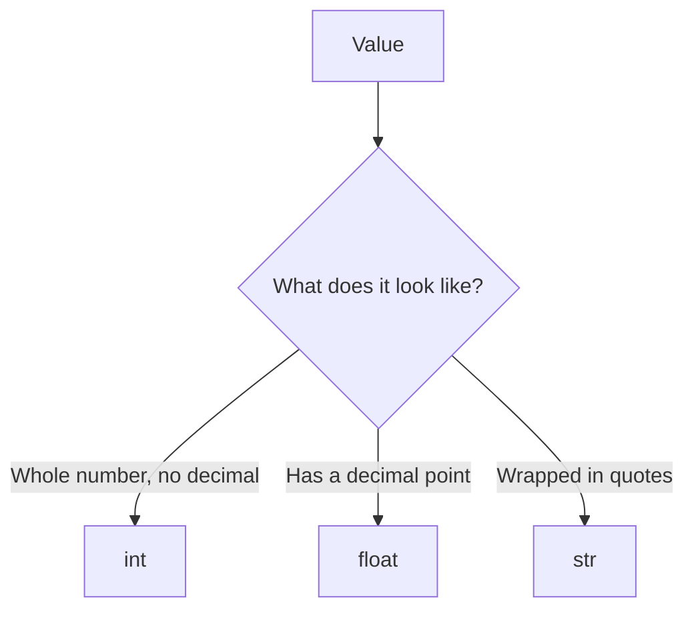
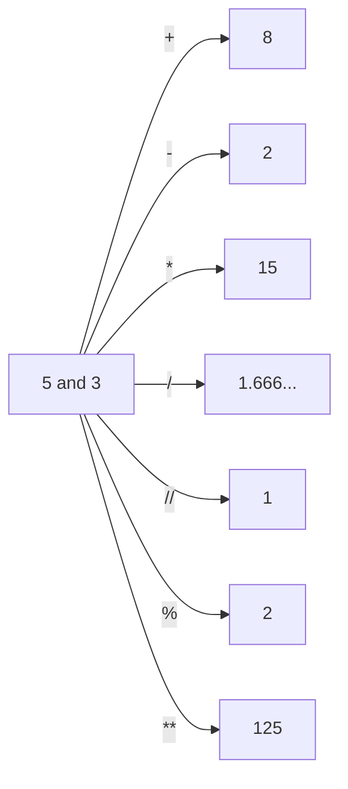
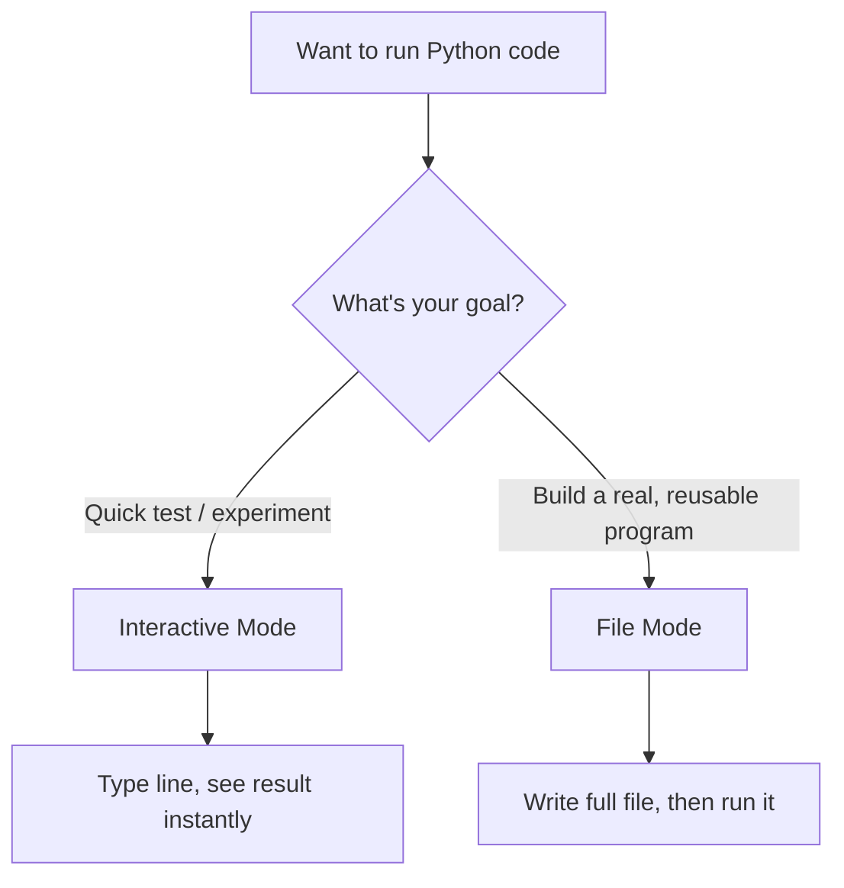
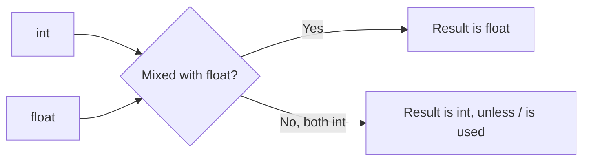
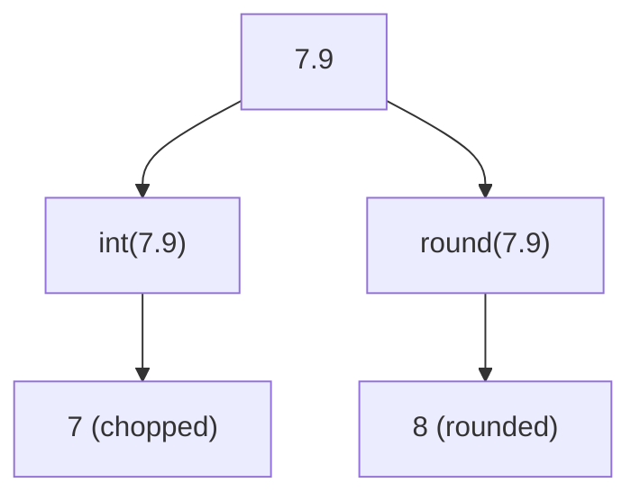

# Lecture 2: Data Types and Numeric Operations

Welcome back! In Lecture 1, you learned how to display text, take input, store values in variables, and work with strings. Today, we go one level deeper: we're going to learn *what kind* of data Python can store, and how Python does math.

By the end of this lecture, you'll understand integers, floats, arithmetic operators, how to safely take numeric input from a user, how to round numbers properly, and how to convert between number types — all explained from absolute zero.

---

## Table of Contents

1. [Data Types](#1-data-types)
2. [Integer (int) Data Type](#2-integer-int-data-type)
3. [Interactive Mode vs File Mode](#3-interactive-mode-vs-file-mode)
4. [Taking Integer Input](#4-taking-integer-input)
5. [Float (float) Data Type](#5-float-float-data-type)
6. [The round() Function](#6-the-round-function)
7. [Converting Float to Integer](#7-converting-float-to-integer)
8. [Practice Programs](#practice-programs)
9. [Chapter Summary](#chapter-summary)
10. [Cheat Sheet](#cheat-sheet)
11. [Frequently Asked Questions (FAQ)](#frequently-asked-questions-faq)
12. [Common Beginner Errors](#common-beginner-errors)
13. [Mini Quiz (20 Questions)](#mini-quiz-20-questions)
14. [Answer Key](#answer-key)
15. [Revision Notes (1-Page Quick Revision)](#revision-notes-1-page-quick-revision)

---

## 1. Data Types

### What is a data type?

A **data type** is a label that tells the computer what *kind* of value something is, and therefore what the computer is allowed to do with it.

**Definition:** A data type classifies a piece of data — for example, as a whole number, a decimal number, or text — so that the computer knows how to store it and how to handle operations on it.

### Why does this exist? Why do we need it?

Computers don't "understand" data the way humans do. A human looks at `5` and `"5"` and immediately knows one is a number and one is a word that happens to look like a number. A computer cannot guess this — it needs to be told explicitly. Data types exist so that:

- The computer knows **how much memory** to set aside for a value.
- The computer knows **which operations are valid** — you can add two numbers, but you cannot mathematically "add" two sentences the same way.
- Errors can be **caught early**, before they cause confusing, incorrect results.

**Real-life analogy:** Imagine a warehouse with different storage sections: one for liquids, one for solids, one for fragile items. If you tried to store liquid detergent in the "fragile glass items" section without labeling it correctly, the warehouse workers wouldn't know how to handle it safely. Data types are the "labels" that tell Python how to safely handle each piece of data.

### Real-world applications

- A **banking app** needs to know that `"balance"` is a number (so it can calculate interest), not text.
- A **text editor** needs to know that what you type is text, not a math expression.
- A **game score tracker** needs whole numbers for points, while a **GPS app** needs decimal numbers for coordinates.

### Different types of data in Python (Introduction)

Python has several built-in data types. Today we focus on two of them in depth, and briefly re-mention a third you already met in Lecture 1.

| Data Type | Python Name | Example    | Meaning                          |
| --------- | ------------ | ---------- | ---------------------------------- |
| Integer   | `int`        | `5`, `-12` | Whole numbers, no decimal point   |
| Float     | `float`      | `3.14`, `-0.5` | Numbers with a decimal point   |
| String    | `str`        | `"hello"`  | Text (covered in Lecture 1)       |

You can check the data type of any value using the built-in function `type()`.

```python
print(type(5))
print(type(3.14))
print(type("hello"))
```

**Output:**

```text
<class 'int'>
<class 'float'>
<class 'str'>
```

**Line-by-line explanation:**

- `type(5)` asks Python "what kind of data is `5`?" and Python answers `int` (integer).
- `type(3.14)` asks the same question about `3.14`, and Python answers `float`.
- `type("hello")` asks about `"hello"`, and Python answers `str` (string).



> **Note**
> `<class 'int'>` is just Python's formal way of naming the data type. You'll see this format often — don't let it confuse you.

### Quick Recap

- A data type tells Python what kind of value it's dealing with.
- Data types determine what operations are valid and how much memory is used.
- `type()` lets you check the data type of any value.

### Key Takeaways

- Every value in Python has a data type, whether you think about it or not.
- Data types prevent the computer from making incorrect assumptions about your data.

### Interview Corner

> **Q: Why does Python need data types if it can figure out values on its own?**
> A: Python does automatically detect a value's type (this is called "dynamic typing"), but it still strictly enforces rules based on that type once detected — this prevents nonsensical operations like adding a number to a sentence.

---

## 2. Integer (`int`) Data Type

### What is an integer?

**Definition:** An **integer** is a whole number — a number with no fractional or decimal part. It can be positive, negative, or zero.

**Why does it exist?** Many real-world quantities are naturally whole — the number of people in a room, the number of items in a cart, the number of days in a week. Integers exist to represent exactly this kind of "countable, indivisible" quantity.

**Real-life analogy:** Think of counting apples in a basket. You can have 3 apples, or 0 apples, or even "owe" someone 2 apples (represented as -2), but you never naturally say you have "3.5 apples in a basket" when counting whole apples — that's what integers represent.

### Characteristics of integers

- No decimal point.
- Can be positive, negative, or zero.
- In Python, integers can be **as large as your computer's memory allows** — there's no fixed upper limit like in many other languages.

```python
print(type(10))
print(type(-10))
print(type(0))
```

**Output:**

```text
<class 'int'>
<class 'int'>
<class 'int'>
```

### Positive and negative integers

| Type              | Example | Description                          |
| ------------------ | -------- | -------------------------------------- |
| Positive integer   | `7`      | Greater than zero                     |
| Negative integer   | `-7`     | Less than zero (written with a `-` sign) |
| Zero                | `0`      | Neither positive nor negative          |

```
Number Line:

  -3   -2   -1    0    1    2    3
   │    │    │    │    │    │    │
  neg  neg  neg  zero pos  pos  pos
```

> **Common Mistake**
> Writing a negative number with a space, like `- 7` instead of `-7`. Python requires the minus sign to be directly attached to the number when used as a literal value.

### Arithmetic operators that can be applied to integers

An **operator** is a special symbol that tells Python to perform a specific mathematical operation on values, called **operands**.

**Real-life analogy:** Operators are like verbs in a sentence — they describe an *action* to perform on the surrounding "nouns" (the numbers).

#### Addition (`+`)

**What?** Adds two numbers together.

```python
print(5 + 3)
```

**Output:**

```text
8
```

#### Subtraction (`-`)

**What?** Subtracts the second number from the first.

```python
print(5 - 3)
```

**Output:**

```text
2
```

#### Multiplication (`*`)

**What?** Multiplies two numbers.

**Why `*` and not `x`?** The letter `x` is also used as a variable name in programming, so it would be ambiguous. The asterisk `*` is a symbol reserved specifically for multiplication, avoiding any confusion.

```python
print(5 * 3)
```

**Output:**

```text
15
```

#### Division (`/`)

**What?** Divides the first number by the second. In Python, division **always returns a float**, even if the numbers divide evenly.

```python
print(10 / 2)
print(7 / 2)
```

**Output:**

```text
5.0
3.5
```

**Why does `10 / 2` give `5.0` and not `5`?** Python's designers decided that `/` should *always* produce consistent, predictable results — a float — regardless of whether the division happens to come out even. This avoids surprises where the result type depends on the specific numbers involved. If you specifically want a whole-number result, you use floor division instead (next section).

#### Floor Division (`//`)

**What?** Divides two numbers and **rounds down** to the nearest whole number, discarding anything after the decimal point.

**Why does it exist?** Sometimes you don't want the decimal remainder at all — for example, figuring out how many full boxes of 10 items you can make from 47 items. You want a whole number answer, not `4.7`.

```python
print(7 // 2)
print(-7 // 2)
```

**Output:**

```text
3
-4
```

**Explanation:** `7 // 2` is mathematically `3.5`, and floor division rounds *down* (toward negative infinity) to `3`. For `-7 // 2`, the true result is `-3.5`, and rounding *down* (toward negative infinity, not toward zero) gives `-4` — this surprises many beginners.

```
7 // 2
   │
   ▼
 3.5 → round DOWN → 3
```

> **Common Mistake**
> Assuming floor division always rounds *toward zero*. It actually always rounds toward **negative infinity**, which matters for negative numbers.

#### Modulus (`%`)

**What?** Returns the **remainder** after division.

**Why does it exist?** Many real-world problems care about "what's left over" rather than the full division result — for example, checking if a number is even or odd, or figuring out if today is a specific day in a repeating 7-day cycle.

```python
print(7 % 2)
print(10 % 5)
```

**Output:**

```text
1
0
```

**Explanation:** `7 % 2` — 7 divided by 2 is 3 with a remainder of 1, so the result is `1`. `10 % 5` divides evenly with 0 left over, so the result is `0`.

> **Tip**
> `number % 2 == 0` is a classic technique to check whether a number is even (we won't use `==` conditions today, but keep this trick in mind for later).

#### Exponent (`**`)

**What?** Raises a number to the power of another number (repeated multiplication).

```python
print(2 ** 3)
print(5 ** 2)
```

**Output:**

```text
8
25
```

**Explanation:** `2 ** 3` means `2 × 2 × 2 = 8`. `5 ** 2` means `5 × 5 = 25`.

### Comparison table of all operators

| Operator | Name           | Example  | Result | Notes                          |
| -------- | -------------- | -------- | ------ | -------------------------------- |
| `+`      | Addition        | `5 + 3`  | `8`    | —                                |
| `-`      | Subtraction     | `5 - 3`  | `2`    | —                                |
| `*`      | Multiplication  | `5 * 3`  | `15`   | —                                |
| `/`      | Division        | `10 / 2` | `5.0`  | Always returns a float          |
| `//`     | Floor Division  | `7 // 2` | `3`    | Rounds down toward negative infinity |
| `%`      | Modulus         | `7 % 2`  | `1`    | Returns the remainder           |
| `**`     | Exponent        | `2 ** 3` | `8`    | Repeated multiplication         |



### Common Mistakes

- Confusing `/` (always float) with `//` (floor division, whole number result).
- Forgetting `%` returns the *remainder*, not the quotient.
- Assuming floor division rounds toward zero instead of toward negative infinity.

### Why This Happens

Python enforces consistent, type-predictable behavior. `/` was intentionally designed to always give a float so that code behaves the same way regardless of input values — this avoids subtle bugs in larger programs.

### Best Practices

> **Best Practice**
> Use `/` when you need a precise, decimal-accurate result. Use `//` when you specifically want a whole number and don't care about the remainder. Use `%` when you specifically care about the remainder itself.

### Quick Recap

- Integers are whole numbers — positive, negative, or zero.
- Python provides seven core arithmetic operators for numbers: `+`, `-`, `*`, `/`, `//`, `%`, `**`.
- `/` always returns a float; `//` always returns a rounded-down whole number.

### Memory Trick

> Think **"/ is fancy, // is floor."** A single slash `/` gives the *fancy*, precise decimal answer. A double slash `//` "cuts off" the decimal, like flooring (cutting) a tall building down to one level.

### Interview Corner

> **Q: What is the difference between `/` and `//` in Python?**
> A: `/` performs true division and always returns a float. `//` performs floor division, rounding the result down to the nearest whole number (toward negative infinity).

> **Q: What does the `%` operator return?**
> A: It returns the remainder after dividing the first operand by the second.

### Practice: Section 2

**Conceptual Questions**

1. What is an integer, and how is it different from a float?
2. Why does `/` always return a float in Python, even for evenly divisible numbers?
3. Explain, in your own words, what floor division does.
4. What does the modulus operator return?
5. Why do you think Python uses `**` instead of `^` for exponentiation?

**Output Prediction Questions**

```python
print(9 // 2)
print(9 % 2)
print(2 ** 4)
print(-9 // 2)
print(10 / 4)
```

**Coding Exercises**

1. Print the sum of `12` and `8`.
2. Print the result of `15` divided by `4` using true division.
3. Print the result of `15` floor-divided by `4`.
4. Print the remainder of `15` divided by `4`.
5. Print `3` raised to the power of `4`.

**Challenge Problems**

1. Given the integer `247`, use `//` and `%` together to determine how many full hundreds it contains and what remains after removing those hundreds.
2. Without running the code, predict the output of `(-15) % 4`, then explain why floor division's "round toward negative infinity" rule affects the result of `%` on negative numbers too.

---

## 3. Interactive Mode vs File Mode

### What is Interactive Mode?

**Definition:** **Interactive Mode** (sometimes called the Python shell or REPL — Read, Evaluate, Print, Loop) is a way of running Python where you type one line of code at a time, and Python immediately runs it and shows the result.

**Real-life analogy:** Interactive Mode is like having a live conversation with a calculator — you ask a question, and it answers immediately, one exchange at a time.

**Example of what it looks like:**

```text
>>> 5 + 3
8
>>> name = "David"
>>> print(name)
David
```

The `>>>` symbol is the **prompt** — it means "Python is ready for your next line."

### What is File Mode?

**Definition:** **File Mode** means writing all your code into a `.py` file first, and then running the entire file at once, from top to bottom.

**Real-life analogy:** File Mode is like writing a full letter before sending it, rather than a live chat message-by-message — you compose everything first, review it, then "send" (run) it all together.

**Example:** You would create a file named `program.py` containing:

```python
name = "David"
print(f"Hello, {name}")
```

And then run the entire file at once from a terminal (the exact command depends on your operating system setup, which we won't cover today).

### Advantages and disadvantages of each

| Aspect                    | Interactive Mode                          | File Mode                                  |
| -------------------------- | -------------------------------------------- | --------------------------------------------- |
| Best for                  | Quick testing, experimenting                | Real, reusable programs                       |
| Saves your code?          | ❌ No — lost when you close it                | ✅ Yes — saved permanently in a `.py` file    |
| Good for long programs?   | ❌ Not practical                              | ✅ Yes                                        |
| Immediate feedback?       | ✅ Instant, line by line                      | ⚠️ Only after running the whole file          |
| Easy to share with others?| ❌ No                                         | ✅ Yes — just share the file                  |



### When to use Interactive Mode

- Testing a small idea, like checking what `7 // 2` equals.
- Exploring how a new function behaves.
- Quick calculations, similar to using a calculator.

### When to use File Mode

- Writing any program you want to keep, reuse, or share.
- Writing programs longer than a couple of lines.
- Anything meant to be run more than once.

> **Best Practice**
> Use Interactive Mode to experiment and learn, but always move your final, working code into a `.py` file using File Mode so you don't lose your work.

### Quick Recap

- Interactive Mode runs code line-by-line with instant feedback but nothing is saved.
- File Mode runs a complete, saved `.py` file all at once.

### Interview Corner

> **Q: Why would a developer prefer File Mode over Interactive Mode for a real project?**
> A: File Mode preserves the code permanently, allows it to be shared, version-controlled, and re-run reliably — Interactive Mode is disposable and only suited for quick experiments.

### Practice: Section 3

**Conceptual Questions**

1. What does the `>>>` symbol mean in Interactive Mode?
2. Why is code typed in Interactive Mode not saved?
3. What file extension is used for Python files?
4. Give one real-world scenario where Interactive Mode would be more useful than File Mode.
5. Give one real-world scenario where File Mode would be more useful than Interactive Mode.

**Coding Exercises**

1. Imagine you're testing whether `10 % 3` gives the answer you expect — which mode would you use, and why?
2. Describe, in words, the steps you would take to run a saved Python file (no need to give exact terminal commands).

---

## 4. Taking Integer Input

### Why is this needed?

Recall from Lecture 1 that `input()` **always returns a string**, even if the user types digits. If we want to actually perform *math* on what the user types, we must first convert that string into a number.

### Different ways to take integer input

#### Approach 1: Two separate steps

```python
age_text = input("Enter your age: ")
age = int(age_text)
print(age + 1)
```

**Output (user types 20):**

```text
Enter your age: 20
21
```

**Line-by-line explanation:**

- `input("Enter your age: ")` collects the user's typed text and stores it in `age_text`. At this point, `age_text` is a **string** — even though it looks like `"20"`.
- `int(age_text)` converts that string into an actual integer, `20`, and stores it in `age`.
- `print(age + 1)` can now safely perform math, because `age` is a real number, giving `21`.

#### Approach 2: Combined in a single line

```python
age = int(input("Enter your age: "))
print(age + 1)
```

**Output:**

```text
Enter your age: 20
21
```

**Line-by-line explanation:**

- `input("Enter your age: ")` runs first, collecting text from the user (returns a string like `"20"`).
- `int(...)` immediately wraps around that result, converting the string into an integer before it's even stored.
- `age = ...` stores the final integer directly.

```
input("Enter your age: ")
         │
         ▼
      "20"   (string)
         │
         ▼ int()
        20   (integer)
         │
         ▼
       age = 20
```

### Converting input using `int()`

**What?** `int()` is a function that converts a value — commonly a string of digits — into an integer.

**Why does this exist?** Since `input()` always returns text, and text cannot be used in math directly, Python needs an explicit way to say "treat this text as a number now." `int()` is that explicit conversion tool.

```python
print(int("42"))
print(type(int("42")))
```

**Output:**

```text
42
<class 'int'>
```

> **Common Mistake**
> Trying to convert text that isn't a valid whole number, like `int("hello")` or `int("3.5")`, causes a `ValueError`. `int()` can only convert strings that represent whole numbers.

```python
int("3.5")
```

**Output:**

```text
Traceback (most recent call last):
ValueError: invalid literal for int() with base 10: '3.5'
```

> **Note**
> To convert a decimal-looking string, you'd need `float()` instead — covered in Section 5.

### Multiple approaches to solving simple arithmetic problems

**Problem: Add two numbers entered by the user.**

**Style A — Two-step, clearly separated:**

```python
first_text = input("Enter first number: ")
second_text = input("Enter second number: ")
first = int(first_text)
second = int(second_text)
total = first + second
print(total)
```

**Style B — Combined conversion:**

```python
first = int(input("Enter first number: "))
second = int(input("Enter second number: "))
total = first + second
print(total)
```

**Style C — Directly inside `print()` (not recommended for beginners, but shown for awareness):**

```python
print(int(input("Enter first number: ")) + int(input("Enter second number: ")))
```

### Comparing different coding styles

| Style | Readability | Beginner-Friendly? | Reusable variables? |
| ----- | ------------ | -------------------- | ---------------------- |
| A (fully separated) | ✅ Very high | ✅ Yes | ✅ Yes |
| B (combined conversion) | ✅ High | ✅ Yes | ✅ Yes |
| C (all inline) | ❌ Low | ⚠️ Awareness only | ❌ No — values aren't stored |

> **Best Practice**
> As a beginner, prefer Style B: combine `input()` and `int()` in one line for conciseness, but still assign the result to a clearly named variable, so it can be reused later.

### Quick Recap

- `input()` always returns a string.
- `int()` converts a string of digits into an integer.
- You can combine `input()` and `int()` in one line, or keep them as two separate steps — both work identically.

### Interview Corner

> **Q: Why can't you directly add two values returned by `input()`?**
> A: Because `input()` always returns strings, and adding two strings performs text concatenation (joining), not mathematical addition. You must convert them with `int()` (or `float()`) first.

### Practice: Section 4

**Conceptual Questions**

1. Why does `input()` always return a string, even when the user types numbers?
2. What does `int()` do?
3. What happens if you call `int()` on text that isn't a valid whole number?
4. What is the difference between the two-step approach and the combined approach for taking numeric input?
5. Why might inline conversion (Style C) be considered bad practice for beginners?

**Output Prediction Questions**

```python
value = int("15")
print(value + 5)
print(type(value))
```

**Coding Exercises**

1. Ask the user for a number and print that number plus 10.
2. Ask the user for two numbers and print their product.
3. Ask the user for a number and print whether it is even or odd using `%` (just print the remainder — we're not using conditions yet).
4. Ask the user for a number and print its square using `**`.
5. Ask the user for two numbers and print the result of floor-dividing the first by the second.

**Challenge Problems**

1. Write a program that asks for three numbers, one at a time, and prints their total sum.
2. Write a program that asks for a number of minutes and prints how many full hours and remaining minutes that equals, using `//` and `%`.

---

## 5. Float (`float`) Data Type

### What is a float?

**Definition:** A **float** (short for "floating-point number") is a number that includes a decimal point, representing values that are not necessarily whole.

**Why does it exist?** Many real-world quantities are not whole numbers — prices (`$4.99`), measurements (`5.5 kilometers`), temperatures (`36.6°C`). Floats exist to represent this fractional precision.

**Real-life analogy:** If integers are like counting whole apples, floats are like measuring the *weight* of those apples on a kitchen scale — `1.75 kg` — where the fractional part genuinely matters.

### Characteristics of floating-point numbers

- Always contains a decimal point.
- Can represent very precise or very large/small fractional values.
- Even `5.0` is a float, despite having no fractional part after the decimal — the presence of the decimal point is what makes it a float, not the value itself.

```python
print(type(3.14))
print(type(5.0))
print(type(-2.5))
```

**Output:**

```text
<class 'float'>
<class 'float'>
<class 'float'>
```

> **Common Mistake**
> Assuming `5.0` behaves identically to `5` in every context. While they're mathematically equal, `5` is an `int` and `5.0` is a `float` — different data types.

### When to use float instead of int

| Use `int` when...              | Use `float` when...                      |
| -------------------------------- | ------------------------------------------ |
| Counting whole, indivisible things (people, items) | Measuring something that can have fractions (money, weight, distance) |
| Exact whole-number results matter | Precision beyond whole numbers matters   |

### Arithmetic operations with float values

All the same operators from Section 2 work on floats too.

```python
print(2.5 + 1.5)
print(5.0 - 2.2)
print(3.0 * 2.0)
print(7.5 / 2.5)
```

**Output:**

```text
4.0
2.8
6.0
3.0
```

**Mixing int and float:**

When you perform an operation between an `int` and a `float`, Python automatically converts the result to a `float`. This is called **implicit type conversion** (or "type coercion") — Python does it automatically, without you asking.

```python
print(5 + 2.5)
print(type(5 + 2.5))
```

**Output:**

```text
7.5
<class 'float'>
```

**Why does Python do this automatically?** Because combining a whole number with a fractional number can only be accurately represented *with* the fractional part — converting everything to `float` guarantees no precision is lost.



> **Note**
> There's one exception you already learned: the `/` operator *always* returns a float, even for two integers, as covered in Section 2.

### Floating-point precision (a quick honest note)

Sometimes floats produce results that look slightly "off," like:

```python
print(0.1 + 0.2)
```

**Output:**

```text
0.30000000000000004
```

**Why does this happen?** Computers store floats in binary (base 2), and many decimal fractions (like 0.1) cannot be represented *exactly* in binary — similar to how `1/3` cannot be written exactly as a finite decimal in base 10. This tiny rounding difference is a well-known characteristic of floating-point numbers in almost all programming languages, not a bug specific to Python.

> **Tip**
> Don't worry about fixing this today — just be aware that float math can show tiny rounding artifacts. The `round()` function (next section) helps manage this.

### Quick Recap

- A float is any number containing a decimal point.
- Mixing `int` and `float` in an operation automatically produces a `float`.
- Floats can show tiny precision quirks due to how computers store decimal numbers in binary.

### Memory Trick

> **"Float = has a dot."** If you see a decimal dot anywhere in the number, it's a float. No dot, no float.

### Interview Corner

> **Q: What data type results from adding an `int` and a `float` together?**
> A: A `float`. Python automatically converts (coerces) the result to the more precise type whenever `int` and `float` are mixed.

> **Q: Why does `0.1 + 0.2` not equal exactly `0.3` in Python?**
> A: Because floating-point numbers are stored in binary, and many decimal fractions cannot be represented exactly in binary, leading to tiny rounding errors.

### Practice: Section 5

**Conceptual Questions**

1. What makes a number a float rather than an int?
2. Why does adding an int and a float always produce a float?
3. Give two real-world examples where float would be more appropriate than int.
4. Why might `0.1 + 0.2` not print exactly `0.3`?
5. Is `5.0` the same data type as `5`? Explain.

**Output Prediction Questions**

```python
print(4 + 2.0)
print(type(4 + 2.0))
print(3.5 * 2)
print(10 / 2)
print(type(10 // 2))
```

**Coding Exercises**

1. Print the sum of `4.5` and `3.2`.
2. Print the type of the result of `7 + 3.0`.
3. Ask the user for a decimal number and print it multiplied by `2`.
4. Print the result of `9 / 4`.
5. Print the result of mixing `10` (int) and `2.5` (float) using multiplication, and print its type.

**Challenge Problems**

1. Write a short program that takes a float price from the user and a whole-number quantity, then prints the total cost.
2. Explain, without running code, whether `10 // 3.0` would return an `int` or a `float`, and why (hint: think about what type `//` returns when a float is involved).

---

## 6. The `round()` Function

### Purpose of the `round()` function

**Definition:** `round()` is a built-in function that rounds a number to the nearest whole number, or to a specified number of decimal places.

**Why does it exist?** Raw float math can produce long, messy, or imprecise decimal results (as we just saw with `0.1 + 0.2`). `round()` gives us control to present numbers cleanly and predictably — essential for things like currency, grades, or measurements.

**Real-life analogy:** Imagine measuring a piece of wood and getting `15.9997 cm` on a precise digital tool, but for practical carpentry purposes, you just want to say "16 cm." `round()` is that practical simplification step.

### Syntax of `round()`

```python
round(number)
round(number, decimal_places)
```

### Rounding to the nearest whole number

When you call `round()` with just one argument, it rounds to the nearest whole number.

```python
print(round(4.3))
print(round(4.7))
print(round(4.5))
```

**Output:**

```text
4
5
4
```

**Explanation:**

- `round(4.3)` rounds down to `4`, since `4.3` is closer to `4`.
- `round(4.7)` rounds up to `5`, since `4.7` is closer to `5`.
- `round(4.5)` — this is the surprising one for beginners! Python uses a rule called **"round half to even"** (also called "banker's rounding") for exact `.5` cases, rounding to whichever neighboring even number is closest. Since `4` is even, `round(4.5)` gives `4`, not `5`.

> **Common Beginner Confusion**
> Many beginners expect `round(4.5)` to always give `5`, based on the "round half up" rule taught in school. Python instead rounds `.5` values to the *nearest even* number to reduce statistical bias when rounding many numbers repeatedly. Test it yourself: `round(5.5)` gives `6` (since 6 is the nearest even number), while `round(4.5)` gives `4`.

```
round(4.5)  → nearest even → 4
round(5.5)  → nearest even → 6
```

### Rounding to a specified number of decimal places

When you provide a second argument, `round()` rounds to that many digits *after* the decimal point.

```python
print(round(3.14159, 2))
print(round(3.14159, 4))
print(round(2.005, 2))
```

**Output:**

```text
3.14
3.1416
2.0
```

**Line-by-line explanation:**

- `round(3.14159, 2)` keeps 2 digits after the decimal: `3.14`.
- `round(3.14159, 4)` keeps 4 digits after the decimal: `3.1416` (the 5th digit, `9`, rounds the `5` up to `6`).
- `round(2.005, 2)` might surprise you — due to the same binary floating-point storage quirk discussed in Section 5, `2.005` isn't stored *exactly*, so it can round differently than expected (`2.0` instead of the mathematically expected `2.01`).

### Understanding the optional decimal place argument

| Call                        | Meaning                                       |
| ----------------------------- | ------------------------------------------------ |
| `round(x)`                   | Round to the nearest whole number (returns `int`) |
| `round(x, 0)`                 | Round to the nearest whole number, but returns a `float` |
| `round(x, n)` where `n > 0`   | Round to `n` digits after the decimal point (returns `float`) |

```python
print(round(4.5))
print(round(4.5, 0))
print(type(round(4.5)))
print(type(round(4.5, 0)))
```

**Output:**

```text
4
4.0
<class 'int'>
<class 'float'>
```

> **Note**
> This is a subtle but important detail: `round(x)` returns an `int`, but `round(x, 0)` returns a `float` — because specifying *any* decimal places argument (even `0`) tells Python you want float-style rounding behavior.

### Practical examples

```python
price = 19.9967
print(round(price, 2))
```

**Output:**

```text
20.0
```

```python
pi_estimate = 3.14159265
print(round(pi_estimate, 3))
```

**Output:**

```text
3.142
```

### Quick Recap

- `round(x)` rounds to the nearest whole number.
- `round(x, n)` rounds to `n` decimal places.
- Python uses "round half to even" for exact `.5` ties.

### Memory Trick

> **"Round half, go even."** When a number sits exactly on the halfway point (`.5`), Python rounds toward whichever neighbor is an even number.

### Interview Corner

> **Q: Why does `round(2.5)` return `2` instead of `3`?**
> A: Python uses banker's rounding ("round half to even") for exact halfway values, rounding to the nearest even number rather than always rounding up.

> **Q: What's the difference between `round(x)` and `round(x, 0)`?**
> A: `round(x)` returns an `int`. `round(x, 0)` returns a `float`, because supplying a decimal-places argument (even zero) signals float-style rounding.

### Practice: Section 6

**Conceptual Questions**

1. What does `round()` do when given only one argument?
2. What does the second argument to `round()` control?
3. Why might `round(4.5)` not equal `5`?
4. What data type does `round(x, 2)` return?
5. Why is `round()` useful when working with float math?

**Output Prediction Questions**

```python
print(round(7.5))
print(round(6.5))
print(round(3.14159, 1))
print(round(9.995, 2))
print(type(round(10.0)))
```

**Coding Exercises**

1. Round `7.826` to two decimal places.
2. Round `12.5` to the nearest whole number and print its type.
3. Ask the user for a float and round it to one decimal place.
4. Round `100.00001` to zero decimal places, showing it as a float.
5. Round the result of `10 / 3` to three decimal places.

**Challenge Problems**

1. Write a program that calculates the average of three numbers entered by the user and displays the result rounded to two decimal places.
2. Predict, without running: what does `round(1.005, 2)` output, and why might it differ from what you'd expect mathematically? (Hint: relate this back to Section 5's floating-point precision discussion.)

---

## 7. Converting Float to Integer

### Using the `int()` function

**What?** Just as `int()` can convert a numeric string into an integer, it can also convert a `float` into an `int`.

```python
print(int(7.9))
print(int(7.1))
print(int(-7.9))
```

**Output:**

```text
7
7
-7
```

### Difference between truncation and rounding

**This is one of the most important distinctions in this lecture.**

`int()` does **not** round — it **truncates**, meaning it simply chops off everything after the decimal point, regardless of whether the decimal part is closer to the next whole number.

**Real-life analogy:** Truncation is like cutting a ribbon at a marked line without measuring which side is longer — you just cut exactly where told (the decimal point), no matter what.

```
int(7.9)
   │
   ▼ chop off ".9"
   7          ← NOT rounded to 8!
```

Compare this with `round()`, which actually considers *which* whole number is closer:

```python
print(int(7.9))    # truncates → 7
print(round(7.9))  # rounds → 8
```

**Output:**

```text
7
8
```

### `int()` vs `round()`

| Function   | Behavior                                  | `7.9` becomes | `-7.9` becomes |
| ----------- | -------------------------------------------- | -------------- | ---------------- |
| `int()`     | Truncates (chops decimal, moves toward zero) | `7`            | `-7`            |
| `round()`   | Rounds to the nearest whole number            | `8`            | `-8`            |



> **Common Mistake**
> Using `int()` when you actually meant to round. `int(4.9)` gives `4`, which surprises beginners expecting `5`. If you want proper rounding, always use `round()`.

> **Best Practice**
> Use `int()` only when you deliberately want to discard the decimal part entirely (truncate). Use `round()` when you want mathematically accurate rounding.

### Practical examples

```python
price = 49.99
whole_dollars = int(price)
print(whole_dollars)
```

**Output:**

```text
49
```

```python
average_score = 87.6
rounded_score = round(average_score)
print(rounded_score)
```

**Output:**

```text
88
```

### Quick Recap

- `int()` converts a float to an integer by **truncating** — simply removing the decimal part.
- `round()` converts by **rounding** to the mathematically nearest whole number.
- These two behave very differently and should not be confused.

### Memory Trick

> **"`int()` cuts, `round()` thinks."** `int()` blindly chops off the decimal. `round()` actually considers which whole number is closer.

### Interview Corner

> **Q: What is the difference between `int(4.9)` and `round(4.9)`?**
> A: `int(4.9)` truncates to `4` by simply discarding the decimal part. `round(4.9)` evaluates which whole number is closer and returns `5`.

> **Q: What happens with `int()` on a negative float, like `int(-4.9)`?**
> A: It truncates *toward zero*, giving `-4`, not `-5` — truncation always moves toward zero, not toward negative infinity (unlike floor division).

### Practice: Section 7

**Conceptual Questions**

1. What does it mean for `int()` to "truncate" a float?
2. How is truncation different from rounding?
3. What does `int(-9.9)` return, and why?
4. When would you deliberately want truncation instead of rounding?
5. Why is it a common mistake to use `int()` when you actually want to round?

**Output Prediction Questions**

```python
print(int(3.99))
print(round(3.99))
print(int(-3.99))
print(round(-3.5))
print(int(0.999999))
```

**Coding Exercises**

1. Convert `15.87` to an integer using `int()` and print the result.
2. Convert `15.87` to an integer using `round()` and print the result.
3. Ask the user for a float and print both its truncated and rounded whole-number versions.
4. Print `int(-12.5)` and explain the result in a comment.
5. Print the type of `int(9.99)` to confirm it's an integer.

**Challenge Problems**

1. Write a program that asks for a total bill amount (a float) and a number of people (an int), calculates each person's share, and prints both the truncated whole-dollar share and the properly rounded share.
2. Explain, in your own words, a real scenario where using `int()` instead of `round()` (or vice versa) could cause a meaningful real-world problem (e.g., in billing or measurements).

---

## Practice Programs

### Program 1: Integer Addition Calculator

**Explanation:** This program asks the user for two whole numbers and displays their sum.

```python
first = int(input("Enter first number: "))
second = int(input("Enter second number: "))
total = first + second
print("The sum is:", total)
```

**Output (example: user enters 12 and 8):**

```text
Enter first number: 12
Enter second number: 8
The sum is: 20
```

**Line-by-line explanation:**

- `int(input(...))` collects text from the user and immediately converts it into an integer.
- This happens twice, once for `first` and once for `second`.
- `total = first + second` adds the two integers using the `+` operator.
- `print("The sum is:", total)` displays a label followed by the computed sum, separated by the default comma space.

---

### Program 2: Float Addition Calculator

**Explanation:** This program is nearly identical to Program 1, but uses `float()` instead of `int()`, allowing decimal input.

```python
first = float(input("Enter first number: "))
second = float(input("Enter second number: "))
total = first + second
print("The sum is:", total)
```

**Output (example: user enters 4.5 and 3.2):**

```text
Enter first number: 4.5
Enter second number: 3.2
The sum is: 7.7
```

**Line-by-line explanation:**

- `float(...)` works exactly like `int()`, except it converts the input string into a `float`, correctly preserving any decimal portion.
- The rest of the program behaves the same as Program 1, but now supports decimal values.

> **Note**
> `float()` is a sibling function to `int()` — both convert strings (or numbers) into a specific numeric type, but `float()` preserves decimals while `int()` does not.

---

### Program 3: Division of Two Floating-Point Numbers

**Explanation:** This program asks for two float values and divides the first by the second.

```python
numerator = float(input("Enter the numerator: "))
denominator = float(input("Enter the denominator: "))
result = numerator / denominator
print("The result is:", result)
```

**Output (example: user enters 7.0 and 2.0):**

```text
Enter the numerator: 7.0
Enter the denominator: 2.0
The result is: 3.5
```

**Line-by-line explanation:**

- Two float values are collected and converted, just like Program 2.
- `result = numerator / denominator` uses true division, which always returns a float.
- The final line displays the label and computed result.

> **Common Mistake**
> This program does not check whether the user entered `0` as the denominator. Dividing by zero causes a `ZeroDivisionError` — we are only *aware* of this today; handling it properly belongs to a future lecture on errors.

---

### Program 4: Rounding Decimal Values

**Explanation:** This program asks the user for a decimal number and how many decimal places to round it to, then displays the rounded result.

```python
number = float(input("Enter a decimal number: "))
places = int(input("Enter number of decimal places: "))
rounded_value = round(number, places)
print("Rounded value:", rounded_value)
```

**Output (example: user enters 3.14159 and 2):**

```text
Enter a decimal number: 3.14159
Enter number of decimal places: 2
Rounded value: 3.14
```

**Line-by-line explanation:**

- `number` is collected as a float — the value we want to round.
- `places` is collected as an integer — how many decimal digits to keep.
- `round(number, places)` performs the rounding using both values.
- The final result is displayed with a clear label.

---

### Program 5: Converting Float Values into Integers

**Explanation:** This program asks for a float and shows both the truncated (`int()`) and rounded (`round()`) whole-number versions, side by side, so the difference is crystal clear.

```python
value = float(input("Enter a decimal number: "))
truncated = int(value)
rounded = round(value)
print("Truncated (int()):", truncated)
print("Rounded (round()):", rounded)
```

**Output (example: user enters 7.8):**

```text
Enter a decimal number: 7.8
Truncated (int()): 7
Rounded (round()): 8
```

**Line-by-line explanation:**

- `value` stores the float entered by the user.
- `truncated = int(value)` chops off the decimal portion entirely, regardless of its size.
- `rounded = round(value)` calculates the mathematically nearest whole number.
- Both results are printed with clear labels, letting the user directly compare the two behaviors.

> **Best Practice**
> Programs like this are a great way to build intuition — running the same input through two different functions side by side makes the difference between them concrete and memorable.

---

## Chapter Summary

In this lecture, you learned:

- **Data types** classify values so Python knows how to handle them correctly.
- **Integers (`int`)** are whole numbers, and support seven arithmetic operators: `+`, `-`, `*`, `/`, `//`, `%`, `**`.
- **Interactive Mode** runs code line-by-line for quick testing; **File Mode** runs a saved `.py` file all at once for real programs.
- Taking numeric input requires converting the string result of `input()` using `int()` (or `float()`), since `input()` always returns text.
- **Floats (`float`)** represent decimal numbers, and mixing `int` and `float` in an operation always produces a `float`.
- **`round()`** rounds numbers to the nearest whole number, or to a specified number of decimal places, using "round half to even" for exact ties.
- **`int()`** converts a float to an integer by **truncating** (chopping off the decimal), which is fundamentally different from **rounding**.

---

## Cheat Sheet

| Concept                        | Syntax / Example              | Result / Notes                        |
| -------------------------------- | -------------------------------- | ---------------------------------------- |
| Check data type                 | `type(5)`                       | `<class 'int'>`                        |
| Addition                        | `5 + 3`                          | `8`                                     |
| Subtraction                     | `5 - 3`                          | `2`                                     |
| Multiplication                  | `5 * 3`                          | `15`                                    |
| True division                   | `10 / 2`                         | `5.0` (always float)                    |
| Floor division                  | `7 // 2`                         | `3` (rounds down)                       |
| Modulus (remainder)             | `7 % 2`                          | `1`                                     |
| Exponent                        | `2 ** 3`                         | `8`                                     |
| Convert string to int           | `int("42")`                     | `42`                                    |
| Convert string to float         | `float("3.14")`                 | `3.14`                                  |
| Round to nearest whole number   | `round(4.6)`                    | `5`                                     |
| Round to n decimal places       | `round(3.14159, 2)`             | `3.14`                                  |
| Truncate float to int           | `int(7.9)`                      | `7` (NOT rounded)                       |

---

## Frequently Asked Questions (FAQ)

**Q1. Why does `10 / 3` give so many decimal digits?**
Because true division (`/`) calculates the mathematically precise result as a float, and `10 / 3` does not divide evenly, so Python shows the decimal expansion it computed.

**Q2. Is `5` the same as `5.0` in Python?**
They are mathematically equal in value, but they are different data types: `5` is an `int`, and `5.0` is a `float`.

**Q3. Why did `round(2.5)` give me `2` instead of `3`?**
Python uses "round half to even" for values exactly halfway between two whole numbers, rounding to the nearest even number rather than always rounding up.

**Q4. What's the difference between `int()` and `round()` when converting a float?**
`int()` truncates — it simply removes the decimal part. `round()` calculates the true nearest whole number, considering the size of the decimal part.

**Q5. Why does `input()` always return a string, even for numbers?**
Because Python cannot know in advance whether you intend to treat the typed text as a number, a word, or something else — treating everything as text is the safe, predictable default. You must explicitly convert it using `int()` or `float()`.

**Q6. Can I use `//` and `%` with floats too?**
Yes — both operators work with floats as well as integers, following the same rounding-down and remainder logic.

**Q7. What happens if I try to convert non-numeric text with `int()`?**
Python raises a `ValueError`, because it cannot interpret non-numeric text as a whole number.

---

## Common Beginner Errors

| Error Scenario                          | What Happens                          | Why                                          |
| ------------------------------------------ | ---------------------------------------- | ------------------------------------------------ |
| `int("hello")`                            | `ValueError`                            | The text isn't a valid whole number            |
| `int("3.5")`                              | `ValueError`                            | `int()` cannot parse a decimal point in a string directly |
| Forgetting to convert `input()` before math | `TypeError` when combined with numbers | Strings and numbers can't be combined with most math operators |
| Expecting `round(2.5)` to give `3`        | Gives `2` instead                       | Python uses "round half to even," not "round half up" |
| Expecting `int(4.9)` to round to `5`      | Gives `4` instead                       | `int()` truncates; it does not round            |

---

## Mini Quiz (20 Questions)

1. What data type is `7`?
2. What data type is `7.0`?
3. What does `type()` do?
4. What symbol represents multiplication in Python?
5. What does `/` always return, regardless of the numbers used?
6. What does `//` do differently from `/`?
7. What does the `%` operator return?
8. What does `**` do?
9. What is Interactive Mode best used for?
10. What is File Mode best used for?
11. What does `input()` always return, even if the user types a number?
12. Which function converts a string into an integer?
13. Which function converts a string into a float?
14. What happens when you mix an `int` and a `float` in one arithmetic operation?
15. Why might `0.1 + 0.2` not exactly equal `0.3`?
16. What does `round(4.5)` return, and why?
17. What is the difference between `round(x)` and `round(x, 0)` in terms of return type?
18. What does `int(7.9)` return?
19. Does `int()` round or truncate?
20. What error occurs if you try `int("abc")`?

---

## Answer Key

1. `int`
2. `float`
3. It tells you the data type of a value.
4. `*`
5. A `float`
6. `//` rounds the result down to the nearest whole number (floor division), while `/` always returns the precise decimal result.
7. The remainder after division.
8. Exponentiation — raises a number to the power of another.
9. Quick testing and experimenting, line by line.
10. Writing and running complete, reusable, saved programs.
11. A string.
12. `int()`
13. `float()`
14. The result is automatically converted to a `float`.
15. Because floats are stored in binary, and many decimal fractions cannot be represented exactly in binary.
16. `4` — because Python uses "round half to even" for exact `.5` values, and `4` is the nearest even number.
17. `round(x)` returns an `int`; `round(x, 0)` returns a `float`.
18. `7`
19. Truncates (chops off the decimal without considering rounding).
20. `ValueError`

---

## Revision Notes (1-Page Quick Revision)

- **Data type** = classification of a value (`int`, `float`, `str`) → check with `type()`.
- **`int`** = whole number (no decimal point). **`float`** = number with a decimal point.
- **Operators:** `+` add, `-` subtract, `*` multiply, `/` true divide (always float), `//` floor divide (rounds down), `%` remainder, `**` exponent.
- **Interactive Mode** = line-by-line, instant, nothing saved. **File Mode** = full `.py` file, saved, run all at once.
- **`input()`** always returns a **string** — convert with `int()` or `float()` before doing math.
- Mixing `int` + `float` in an operation → result is always a `float`.
- **`round(x)`** → nearest whole number, "round half to even" for ties (`round(2.5)` → `2`).
- **`round(x, n)`** → rounds to `n` decimal places.
- **`int(float_value)`** → **truncates** (chops decimal off) — does **not** round.
- Remember: `int()` cuts, `round()` thinks.

Congratulations — you've completed Lecture 2: Data Types and Numeric Operations! Practice the exercises above before moving on.


---

## 🐾 Thanks for studying with me! 🐾

That wraps up **Lecture 2 — Data Types and Numeric Operations** all in one cozy little `.md` file. 🖤🤍 Hope it made things click a little easier. See you in the next one! 👋

📌 **Follow for more notes & updates:**
- 📸 Insta: [@mehrunnisa.ai](https://www.instagram.com/mehrunnisa.ai/)
- ✍️ Substack: [The Epoch](https://theepoch.substack.com/)
- 🎥 YouTube: [@mehrunnisa.ai](https://www.youtube.com/@Mehrunnisa-ai)

---