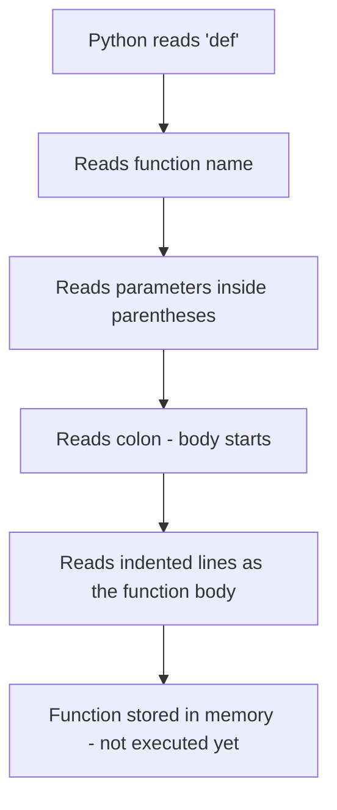
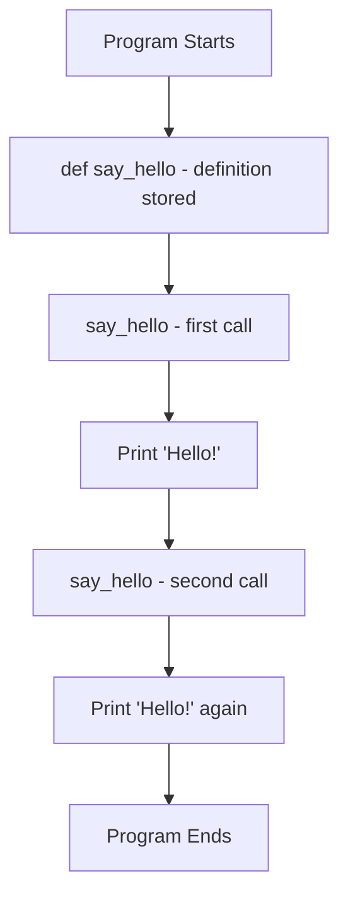
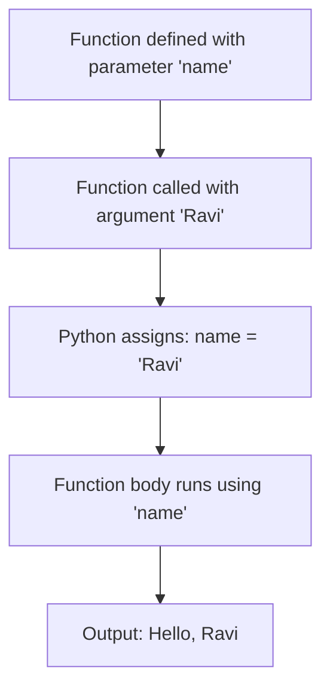
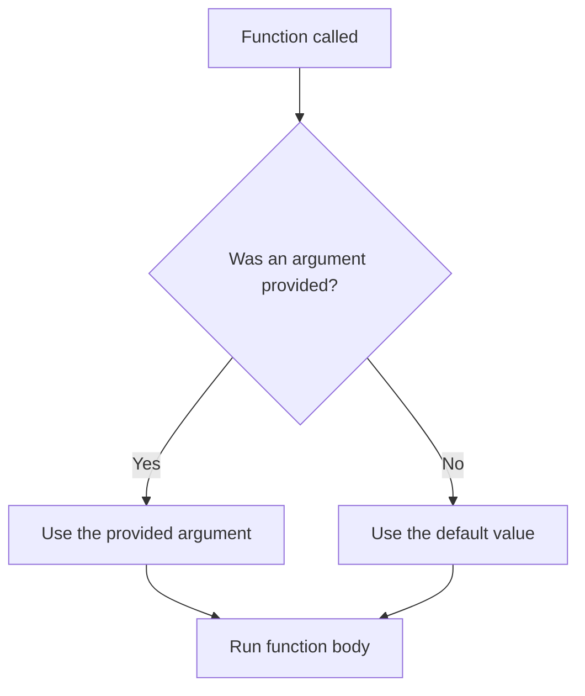
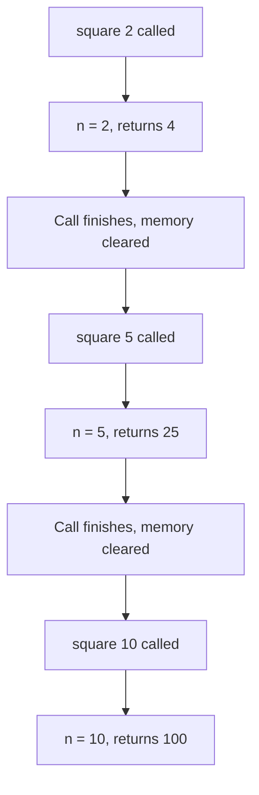
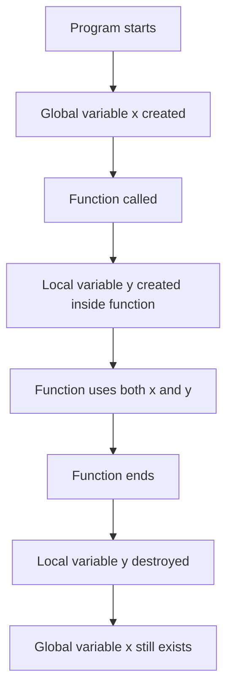
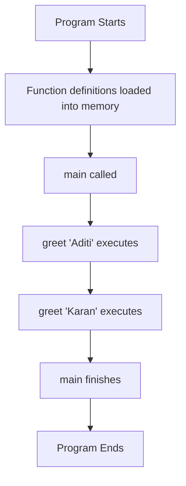
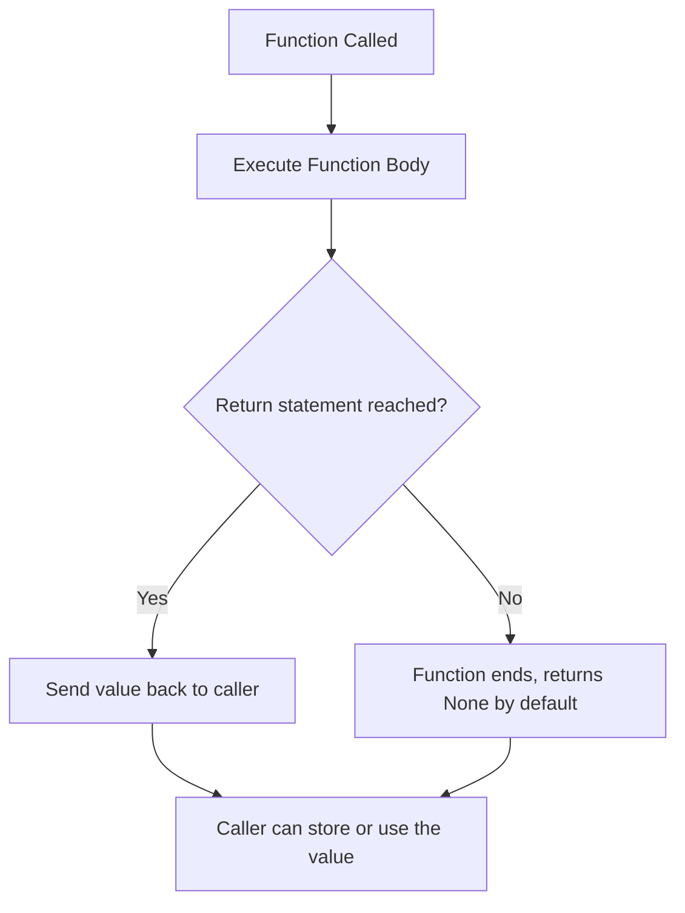
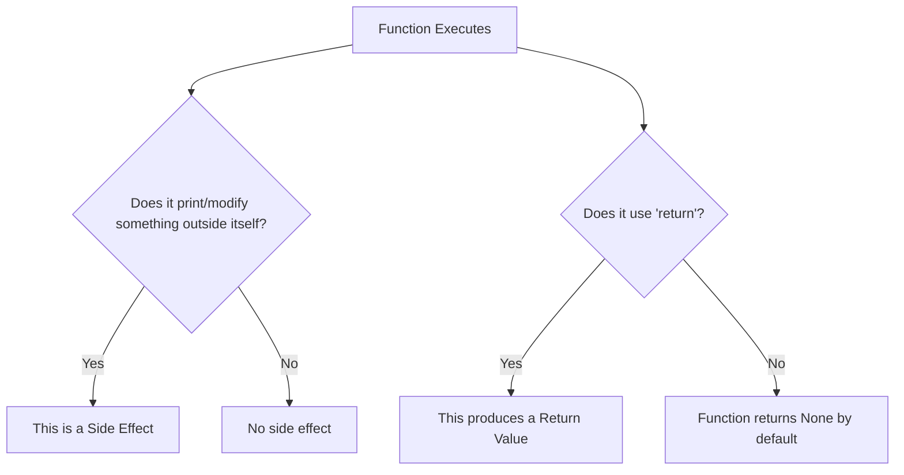
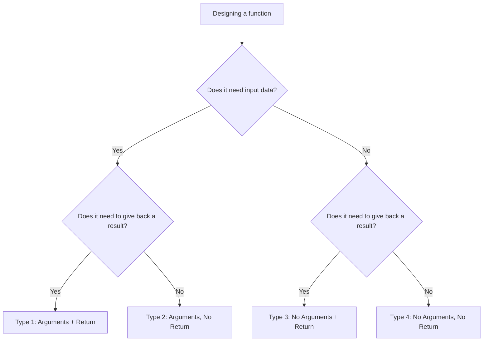

# Lecture 02: Functions in Python ( little more topics )

---

## Welcome

Before we start, let's set expectations. You know **nothing** about functions yet, and that's perfectly fine. We will build every idea from zero, using plain English and everyday analogies before we ever touch code.

Think of this document as a chapter from a book. Read it slowly. Try the examples yourself. Don't rush.

---

## Table of Contents

1. [What is a Function?](#1-what-is-a-function)
2. [Why Do We Use Functions?](#2-why-do-we-use-functions)
3. [Built-in Functions](#3-built-in-functions)
4. [User-Defined Functions](#4-user-defined-functions)
5. [Creating Functions Using `def`](#5-creating-functions-using-def)
6. [Function Definition vs Function Call](#6-function-definition-vs-function-call)
7. [Parameters and Arguments](#7-parameters-and-arguments)
8. [Different Ways of Passing Arguments](#8-different-ways-of-passing-arguments)
9. [Default Parameters](#9-default-parameters)
10. [Calling a Function Multiple Times](#10-calling-a-function-multiple-times)
11. [Variable Scope: Global and Local](#11-variable-scope-global-and-local)
12. [Organizing Code Using `main()`](#12-organizing-code-using-main)
13. [Side Effects](#13-side-effects)
14. [Return Values](#14-return-values)
15. [Side Effects vs Return Values](#15-side-effects-vs-return-values)
16. [The Four Types of Functions](#16-the-four-types-of-functions)
17. [Calculating the Square of a Number](#17-calculating-the-square-of-a-number)
18. [Practice Zone](#18-practice-zone)
19. [Chapter Summary & Cheat Sheet](#19-chapter-summary--cheat-sheet)
20. [Glossary](#20-glossary)

---

## 1. What is a Function?

### Definition

A **function** is a named, reusable block of code that performs a specific task. You give it a name once, and then you can "use" that name as many times as you want, instead of rewriting the same instructions over and over.

### Why It Exists

Imagine you had to explain to a friend, in full detail, how to make tea — every single time they wanted a cup. That would be exhausting. Instead, you just say **"make tea"**, and they already know all the steps because you taught them once.

A function is exactly that: a set of instructions you teach the computer **once**, under a name, so you can just say the name later.

### Real-Life Analogy

> 🧠 **Analogy: The Recipe Card**
> A recipe card for "Boil an Egg" contains the steps once. Any time you want a boiled egg, you don't rewrite the recipe — you just say "follow the Boil an Egg recipe." A function is a recipe card for the computer.

### Syntax (Preview)

```python
def greet():
    print("Hello, welcome to Python!")
```

Here, `greet` is the name of our "recipe." We haven't used it yet — we've only written it down.

### How Python Executes This Internally (Beginner Level)

When Python sees `def greet():`, it does **not** run the code inside immediately. It just:

1. Reads the name (`greet`).
2. Stores the block of code in memory, tied to that name.
3. Moves on to the next line.

The code inside only runs when you **call** the function (explained soon).

```mermaid
flowchart TD
A[Python reads 'def greet():'] --> B[Python stores the function in memory as 'greet']
B --> C[Python moves to next line of the program]
C --> D{Is 'greet()' called later?}
D -->|Yes| E[Python runs the code inside greet]
D -->|No| F[The function is simply never used]
```

### Beginner Mistakes

* ❌ Thinking the code inside a function runs the moment you define it. It does **not**.
* ❌ Forgetting the colon `:` at the end of `def greet():`.
* ❌ Forgetting to indent the code inside the function.

### Best Practices

* ✅ Give functions clear, descriptive names (`calculate_total`, not `func1`).
* ✅ Keep a function focused on **one task**.

### Summary

A function is a reusable, named block of instructions. Defining it does not run it — you must call it separately.

---

## 2. Why Do We Use Functions?

### Definition

Functions exist to make code **reusable**, **organized**, and **easier to understand**.

### Why Programmers Use Them

| Reason | Explanation |
|---|---|
| **Reusability** | Write the logic once, use it many times. |
| **Readability** | `calculate_area()` tells you what's happening better than 10 raw lines of math. |
| **Maintainability** | Fix a bug in one place (inside the function) instead of everywhere it was copy-pasted. |
| **Breaking down problems** | Big problems become a set of small, manageable functions. |

### Real-Life Analogy

> 🧠 **Analogy: A Factory Assembly Line**
> Instead of one worker doing every single task for a car from scratch, different stations (functions) each do one job: attach wheels, paint the body, install seats. This is faster, cleaner, and easier to fix if something goes wrong at one station.

### Example: Without vs With Functions

**Without a function (repetitive):**

```python
print("Hello, Aman!")
print("Hello, Priya!")
print("Hello, Raj!")
```

**With a function (reusable):**

```python
def greet(name):
    print("Hello, " + name + "!")

greet("Aman")
greet("Priya")
greet("Raj")
```

**Line-by-line explanation:**

1. `def greet(name):` — We define a function named `greet` that expects one piece of information called `name`.
2. `print("Hello, " + name + "!")` — Inside the function, we build a greeting message using whatever `name` was given.
3. `greet("Aman")` — We call the function, plugging in `"Aman"` as `name`. Python runs the function body with `name = "Aman"`.
4. This repeats for `"Priya"` and `"Raj"`.

* **What happens first:** Python defines `greet` and stores it in memory.
* **What happens second:** Python executes `greet("Aman")`, which runs the print statement with `name` set to `"Aman"`.
* **What is stored in memory:** The function `greet`, and temporarily, the value of `name` during each call.
* **What value is returned:** None — this function only prints; it does not return anything (we'll explain "return" soon).
* **Side effect?** Yes — printing to the screen is a side effect.
* **Return value?** No.

> 💡 **Tip:** If you find yourself copy-pasting the same lines of code more than once, that's a strong signal you need a function.

### Common Interview Questions

* Q: Why are functions considered a core part of "clean code"?
* Q: What problems can arise from **not** using functions in a large program?

### Summary

Functions reduce repetition, organize logic, and make large programs manageable.

---

## 3. Built-in Functions

### Definition

**Built-in functions** are functions that come pre-packaged with Python. You don't need to write them — they're ready to use the moment you open Python.

### Why They Exist

Some tasks (printing text, finding the length of something, converting types) are so common that Python's creators built them in, so every programmer doesn't waste time reinventing them.

### Examples

```python
print("Hello")      # Displays text on the screen
len("Python")        # Returns the number of characters -> 6
type(42)             # Tells you the data type -> <class 'int'>
max(3, 9, 5)         # Returns the largest value -> 9
input("Your name: ") # Waits for user to type something
```

**Explanation of each:**

* `print()` — Sends output to the screen. Side effect (nothing returned to store).
* `len()` — Counts items/characters. Returns a value (the count).
* `type()` — Reveals what kind of data something is. Returns a value.
* `max()` — Compares numbers and returns the biggest. Returns a value.
* `input()` — Pauses the program and waits for the user to type. Returns the typed text.

### Table: Built-in vs User-Defined Functions

| Feature | Built-in Functions | User-Defined Functions |
|---|---|---|
| Who creates them | Python itself | You, the programmer |
| Availability | Always available | Must be defined before use |
| Examples | `print()`, `len()`, `input()` | `greet()`, `calculate_total()` |
| Customizable logic | No (fixed behavior) | Yes (you control everything inside) |

### Beginner Mistakes

* ❌ Trying to redefine a built-in function's name (e.g., naming your own variable `list` or `print`), which hides the original built-in.

### Best Practices

* ✅ Learn common built-ins (`print`, `len`, `type`, `input`, `range`) early — they save enormous time.

### Summary

Built-in functions are ready-made tools provided by Python for everyday tasks.

---

## 4. User-Defined Functions

### Definition

A **user-defined function** is a function that **you** create, using the `def` keyword, to perform a task specific to your program.

### Why They Exist

Python cannot predict every unique task a programmer will need (like calculating a specific company's employee bonus). So, Python lets you **define your own logic**.

### Syntax

```python
def function_name(parameters):
    # code to execute
    return value   # optional
```

### Example

```python
def calculate_bonus(salary):
    bonus = salary * 0.10
    return bonus

result = calculate_bonus(50000)
print(result)
```

**Explanation:**

1. `def calculate_bonus(salary):` — Defines a function named `calculate_bonus` that needs one input, `salary`.
2. `bonus = salary * 0.10` — Calculates 10% of the salary and stores it in a local variable `bonus`.
3. `return bonus` — Sends the calculated value back to whoever called the function.
4. `result = calculate_bonus(50000)` — Calls the function with `50000`, and stores the returned value in `result`.
5. `print(result)` — Displays `5000.0`.

* **What happens first:** Python defines the function (stores it in memory, does not run it).
* **What happens second:** `calculate_bonus(50000)` is called; `salary` becomes `50000` temporarily.
* **What is stored in memory:** `salary` and `bonus` exist only during the function's execution; `result` persists afterward.
* **What value is returned:** `5000.0`.
* **Side effect?** No printing happens *inside* the function.
* **Return value?** Yes.

### Summary

User-defined functions let you encode your own custom logic, tailored to your program's needs.

---

## 5. Creating Functions Using `def`

### Definition

`def` is the **keyword** (a reserved word Python understands specially) used to start a function definition.

### Syntax Breakdown

```python
def function_name(parameter1, parameter2):
    """Optional docstring explaining the function"""
    statement_1
    statement_2
    return result
```

| Part | Meaning |
|---|---|
| `def` | Tells Python "a function definition is starting" |
| `function_name` | The name you choose to call this function by |
| `(parameter1, parameter2)` | Placeholders for information the function needs |
| `:` | Marks the start of the function's body |
| indented lines | The actual instructions (the function "body") |
| `return` | (Optional) sends a value back |

> ⚠️ **Warning:** Indentation is not optional in Python — it's how Python knows which lines belong inside the function. Standard is 4 spaces.

### Step-by-Step Execution



### Example

```python
def add_numbers(a, b):
    total = a + b
    return total
```

Nothing happens on screen yet — we've only *defined* the recipe.

### Beginner Mistakes

* ❌ Missing the colon `:`.
* ❌ Inconsistent indentation (mixing tabs and spaces).
* ❌ Naming a function starting with a number (`2add()` is invalid).

### Best Practices

* ✅ Use `snake_case` for function names (`add_numbers`, not `AddNumbers`).
* ✅ Add a short docstring for anything non-trivial.

### Summary

`def` is how you tell Python "I am about to teach you a new recipe" — the name, ingredients (parameters), and steps follow.

---

## 6. Function Definition vs Function Call

### Definitions

* **Function Definition:** Writing the function using `def` — teaching Python the recipe.
* **Function Call:** Actually using the function by writing its name followed by parentheses `()` — telling Python "run that recipe now."

### Why This Distinction Matters

Beginners often expect a function to "just run" as soon as it's written. It does not. Definition and execution are two **separate** steps.

### Real-Life Analogy

> 🧠 **Analogy: A Recipe Book vs Cooking**
> Writing a recipe in a cookbook (**definition**) doesn't make food appear. You must actually go to the kitchen and cook it (**call**) to get a result.

### Example

```python
def say_hello():        # Definition
    print("Hello!")

say_hello()              # Call — this actually runs it
say_hello()              # Call again — runs it a second time
```

**Execution order:**

1. Python reads `def say_hello():` — stores the function. Nothing prints yet.
2. Python reaches `say_hello()` — this is the call. Now the body executes, printing `Hello!`.
3. Python reaches the second `say_hello()` — executes again, printing `Hello!` a second time.

### Flowchart



### Table: Definition vs Call

| Aspect | Definition | Call |
|---|---|---|
| Keyword used | `def` | None — just the function name + `()` |
| Runs the code? | No | Yes |
| How many times can it happen | Once (per name) | As many times as you like |

### Beginner Mistakes

* ❌ Writing `say_hello` without parentheses, expecting it to run (this just *refers* to the function, it doesn't call it).
* ❌ Calling a function before it has been defined in the file.

### Summary

Defining a function teaches Python the steps. Calling a function tells Python to actually perform those steps, right now.

---

## 7. Parameters and Arguments

### Definitions

* **Parameter:** A named placeholder listed inside the parentheses of a function **definition**. It represents "what kind of information this function expects."
* **Argument:** The actual value you provide inside the parentheses when you **call** the function.

### Real-Life Analogy

> 🧠 **Analogy: A Mailing Label**
> A parameter is like a blank field on a form that says "Recipient Name: ____". An argument is what you actually **write** in that blank — e.g., "Recipient Name: Ravi".

### Syntax and Example

```python
def greet(name):      # 'name' is a PARAMETER
    print("Hello, " + name)

greet("Ravi")           # "Ravi" is an ARGUMENT
```

**Step-by-step:**

1. `def greet(name):` — Python creates a function `greet` that expects one parameter, `name`.
2. `greet("Ravi")` — Python calls `greet`, and assigns the argument `"Ravi"` to the parameter `name`.
3. Inside the function, `name` now behaves like a variable holding `"Ravi"`.
4. `print("Hello, " + name)` runs, displaying `Hello, Ravi`.

### Table: Parameters vs Arguments

| Aspect | Parameter | Argument |
|---|---|---|
| Where it appears | In the function **definition** | In the function **call** |
| What it is | A name/placeholder | An actual value |
| Example | `def greet(name):` → `name` is the parameter | `greet("Ravi")` → `"Ravi"` is the argument |

### Flowchart: Parameter and Argument Flow



### Beginner Mistakes

* ❌ Using the terms "parameter" and "argument" interchangeably in interviews (interviewers often check if you know the difference).
* ❌ Forgetting to pass a required argument, causing an error like `TypeError: greet() missing 1 required positional argument`.

### Common Interview Questions

* Q: What's the difference between a parameter and an argument?
* A: A parameter is the placeholder in the definition; an argument is the actual value supplied at the call.

### Summary

Parameters are placeholders declared when defining a function. Arguments are the real values you plug in when calling it.

---

## 8. Different Ways of Passing Arguments

### Definition

Python allows you to pass arguments to a function in several ways, giving flexibility in how you call it.

### Types

#### a) Positional Arguments

Arguments matched to parameters **based on order**.

```python
def describe_pet(animal, name):
    print(name + " is a " + animal)

describe_pet("dog", "Tommy")
# animal = "dog", name = "Tommy" (matched by position)
```

#### b) Keyword Arguments

Arguments matched to parameters **by explicitly naming them**, so order doesn't matter.

```python
describe_pet(name="Tommy", animal="dog")
# Same result, order doesn't matter because names are specified
```

#### c) Mixing Positional and Keyword Arguments

```python
describe_pet("dog", name="Tommy")
# Positional first, then keyword — this is allowed
```

> ⚠️ **Warning:** Once you use a keyword argument, all arguments after it must also be keyword arguments. You cannot go back to positional.

#### d) Variable-Length Arguments (`*args` and `**kwargs`)

For when you don't know in advance how many arguments will be passed.

```python
def add_all(*numbers):
    total = 0
    for n in numbers:
        total += n
    return total

print(add_all(1, 2, 3, 4))   # 10
```

`*numbers` collects any number of positional arguments into a tuple.

```python
def print_info(**details):
    for key, value in details.items():
        print(key, ":", value)

print_info(name="Ravi", age=25)
```

`**details` collects any number of keyword arguments into a dictionary.

### Table: Argument-Passing Styles

| Style | Syntax Example | Order Matters? | Use Case |
|---|---|---|---|
| Positional | `func(1, 2)` | Yes | Simple, few arguments |
| Keyword | `func(a=1, b=2)` | No | Improves readability |
| Default | `def func(a=5):` | N/A | Optional arguments |
| `*args` | `def func(*args):` | Collects extras | Unknown number of positional values |
| `**kwargs` | `def func(**kwargs):` | Collects extras | Unknown number of named values |

### Beginner Mistakes

* ❌ Mixing up the order of positional arguments, causing wrong values to be assigned.
* ❌ Placing a positional argument **after** a keyword argument (`func(a=1, 2)` — this is invalid syntax).

### Summary

Python gives multiple ways to supply arguments — positional (by order), keyword (by name), and variable-length (`*args`, `**kwargs`) for flexibility.

---

## 9. Default Parameters

### Definition

A **default parameter** is a parameter that already has a value assigned in the function definition, used **only if** the caller doesn't provide one.

### Why It Exists

Sometimes most calls to a function use the same value for a parameter. Defaults save you from typing that value every single time.

### Syntax

```python
def greet(name="Guest"):
    print("Hello, " + name)

greet()          # Uses default -> Hello, Guest
greet("Meera")   # Overrides default -> Hello, Meera
```

**Step-by-step for `greet()`:**

1. Python calls `greet` with no arguments.
2. Since no argument was given for `name`, Python uses the default: `"Guest"`.
3. The body runs: `print("Hello, " + "Guest")`.

**Step-by-step for `greet("Meera")`:**

1. Python calls `greet` with the argument `"Meera"`.
2. Since an argument **was** provided, it overrides the default.
3. The body runs with `name = "Meera"`.

> 📝 **Note:** Default parameters must come **after** non-default parameters in the definition.
> ✅ `def func(a, b=5):` — valid
> ❌ `def func(a=5, b):` — invalid (SyntaxError)

### Flowchart



### Beginner Mistakes

* ❌ Using a mutable default (like a list) — this is a famous Python trap because the same list is reused across calls unless handled carefully. (Advanced note, mentioned only for awareness.)
* ❌ Placing default parameters before required ones.

### Best Practices

* ✅ Use defaults for genuinely optional settings, not for every parameter.

### Summary

Default parameters provide a fallback value, making some arguments optional when calling a function.

---

## 10. Calling a Function Multiple Times

### Definition

A function, once defined, can be **called as many times as needed** — each call is independent.

### Why It Matters

This is the entire point of reusability: define once, use endlessly, in different contexts, with different arguments.

### Example

```python
def square(n):
    return n * n

print(square(2))   # 4
print(square(5))   # 25
print(square(10))  # 100
```

**Explanation:**

Each call to `square()` is a **fresh, separate execution**. The value of `n` in one call has no memory of a previous call. When `square(2)` finishes and returns `4`, Python "forgets" that execution entirely before starting `square(5)`.

### Flowchart



### Beginner Mistakes

* ❌ Assuming a variable set inside a function "remembers" its value from a previous call — it does not (each call starts fresh, unless you use special techniques not covered here).

### Summary

Every function call is a fresh, independent execution — you can call the same function as often as your program needs.

---

## 11. Variable Scope: Global and Local

### Definition

**Scope** refers to the part of the program where a variable can be accessed/used.

* **Global Scope:** Variables defined outside any function — accessible almost anywhere in the file.
* **Local Scope:** Variables defined **inside** a function — only accessible within that function.

### Real-Life Analogy

> 🧠 **Analogy: House Rooms**
> A **global** variable is like a rule posted in the living room — everyone in the house can see and follow it. A **local** variable is like a note you write inside your own bedroom — only visible while you're in that room; it disappears once you leave.

### Example

```python
x = 10   # Global variable

def show_number():
    y = 5   # Local variable
    print(x)   # Can access global x
    print(y)   # Can access local y

show_number()
print(x)      # Works fine — x is global
print(y)      # ERROR — y only exists inside show_number
```

**Explanation:**

1. `x = 10` — created in the global scope, available everywhere.
2. Inside `show_number()`, `y = 5` is created in **local scope** — it only exists while the function runs.
3. After `show_number()` finishes, `y` is destroyed. Trying to `print(y)` outside causes a `NameError`.

### Table: Global vs Local Scope

| Feature | Global Scope | Local Scope |
|---|---|---|
| Defined where | Outside all functions | Inside a function |
| Accessible from | Anywhere in the file (after definition) | Only within that function |
| Lifetime | Exists for the whole program run | Created on call, destroyed when function ends |
| Can functions read it? | Yes | Only the function it belongs to |
| Can functions modify it directly? | Not without the `global` keyword | Yes, freely |

### Flowchart



> ⚠️ **Warning:** A local variable inside a function **hides** a global variable of the same name, within that function only. This is a common source of confusing bugs.

### Beginner Mistakes

* ❌ Trying to access a local variable from outside its function.
* ❌ Assuming changes made to a variable inside a function automatically change the global variable (it doesn't, unless you explicitly use the `global` keyword).

### Best Practices

* ✅ Prefer local variables — they reduce the risk of unexpected changes to data elsewhere in your program.
* ✅ Avoid relying on the `global` keyword unless truly necessary.

### Common Interview Questions

* Q: What is variable scope, and why does it matter?
* Q: What happens if a local and global variable share the same name?

### Summary

Global variables live for the whole program and are widely accessible. Local variables live only inside the function where they're created.

---

## 12. Organizing Code Using `main()`

### Definition

`main()` is a **convention** (a common practice, not a strict Python rule) where programmers put the "starting point" logic of their program inside a function called `main`, and then call it at the bottom of the file.

### Why We Use `main()`

* It keeps the "entry point" of the program clearly labeled and organized.
* It avoids cluttering the global scope with loose, top-level code.
* It follows a pattern used in many programming languages, making code familiar to other programmers.

### Real-Life Analogy

> 🧠 **Analogy: A Reception Desk**
> `main()` is like the reception desk of a building — the one clear place to start, which then directs you to other departments (other functions) as needed.

### Syntax

```python
def greet(name):
    print("Hello, " + name)

def main():
    greet("Aditi")
    greet("Karan")

main()   # This is what actually starts everything
```

**Step-by-step:**

1. Python defines `greet` and stores it.
2. Python defines `main` and stores it.
3. Python reaches `main()` at the bottom — this is the actual call that kicks off execution.
4. Inside `main`, `greet("Aditi")` runs, printing `Hello, Aditi`.
5. Then `greet("Karan")` runs, printing `Hello, Karan`.

### The `if __name__ == "__main__":` Pattern (Common Addition)

```python
def main():
    print("Program running")

if __name__ == "__main__":
    main()
```

This checks whether the file is being run directly (not imported by another file) before calling `main()`. For a beginner, just know: this is a standard, professional way to start a Python program.

### Flowchart



### Beginner Mistakes

* ❌ Forgetting to actually call `main()` at the bottom — defining it alone does nothing.
* ❌ Writing all logic loose at the top level instead of organizing it inside `main()`.

### Best Practices

* ✅ Keep `main()` short — it should mostly just call other functions in the right order.

### Summary

`main()` is a convention for organizing where your program logically "starts," making code cleaner and more professional.

---

## 13. Side Effects

### Definition

A **side effect** is any change a function makes to the world **outside of itself** — such as printing to the screen, modifying a file, or changing a global variable — **other than** returning a value.

### Why It Matters

Understanding side effects helps you predict what a function actually *does*, beyond just what it *gives back*.

### Example

```python
def show_message():
    print("Processing complete.")   # Side effect: printing to screen

show_message()
```

* **Side effect?** Yes — text appears on the screen.
* **Return value?** No — nothing is sent back to be stored or used.

### Real-Life Analogy

> 🧠 **Analogy: Turning On a Light Switch**
> Flipping a light switch (side effect) changes something in the room (the light turns on) but doesn't hand you anything to hold. Compare this to a vending machine, which **gives you** a snack (a return value) after you press a button.

### Beginner Mistakes

* ❌ Assuming `print()` inside a function means the function "returns" that text. It does not — printing and returning are different things.

### Summary

A side effect is an observable change caused by a function, aside from any value it returns — like printing, writing files, or modifying global data.

---

## 14. Return Values

### Definition

A **return value** is the data a function sends back to the code that called it, using the `return` keyword.

### The `return` Statement

```python
def add(a, b):
    return a + b

result = add(3, 4)
print(result)   # 7
```

**Step-by-step:**

1. `add(3, 4)` is called; `a = 3`, `b = 4`.
2. `return a + b` calculates `7` and immediately sends it back, **ending the function's execution** at that point.
3. `result = add(3, 4)` stores that returned value, `7`, into `result`.
4. `print(result)` displays `7`.

> 📝 **Note:** As soon as Python executes a `return` statement, the function stops immediately — any code after `return` inside that function will **not** run.

### Example: Code After `return` is Ignored

```python
def demo():
    return 1
    print("This will never run")   # Unreachable code

demo()
```

### Flowchart: Return Value Flow



### Beginner Mistakes

* ❌ Forgetting to `return` a value and then trying to use the function's result (you'll get `None`).
* ❌ Writing code after `return` expecting it to run.
* ❌ Confusing `print()` (displays on screen) with `return` (sends value back to be used in code).

### Best Practices

* ✅ Use `return` when the result needs to be used later in your program (e.g., stored, passed to another function).
* ✅ Use `print()` only when you simply want to show something to the user right now.

### Summary

`return` sends a value back from a function to wherever it was called, allowing that value to be stored or reused — and it ends the function immediately.

---

## 15. Side Effects vs Return Values

### Table Comparison

| Aspect | Side Effect | Return Value |
|---|---|---|
| What it does | Changes something outside the function (screen, file, global variable) | Sends a value back to the caller |
| Keyword involved | None specifically (e.g., `print()`) | `return` |
| Can be stored in a variable? | No | Yes |
| Example | `print("Done")` | `return total` |
| Visible immediately on screen? | Often yes | Not unless you `print()` the returned value |

### Flowchart



### Example Showing Both

```python
def process_order(item):
    print("Processing:", item)   # Side effect
    return item.upper()           # Return value

result = process_order("laptop")
print(result)
```

* **Side effect:** `Processing: laptop` is printed.
* **Return value:** `"LAPTOP"` is returned and stored in `result`.
* Both can happen in the **same function** — they are not mutually exclusive.

### Common Interview Questions

* Q: Can a function have both a side effect and a return value at once?
* A: Yes — for example, a function might log something to the screen (side effect) and also return a calculated result.

### Summary

Side effects change the outside world; return values hand back data. A function can have neither, either, or both.

---

## 16. The Four Types of Functions

Based on whether a function takes **arguments** and whether it **returns** a value, every function falls into one of four categories.

### Table: All Four Types

| Type | Takes Arguments? | Returns a Value? | Example |
|---|---|---|---|
| 1. With arguments, with return value | Yes | Yes | `def add(a, b): return a + b` |
| 2. With arguments, without return value | Yes | No | `def greet(name): print("Hi", name)` |
| 3. Without arguments, with return value | No | Yes | `def get_pi(): return 3.14159` |
| 4. Without arguments, without return value | No | No | `def show_menu(): print("1. Start\n2. Exit")` |

### 16.1 Functions With Arguments and Return Values

```python
def multiply(a, b):
    return a * b

result = multiply(4, 5)
print(result)   # 20
```

* **Side effect?** No.
* **Return value?** Yes, `20`.

### 16.2 Functions With Arguments and Without Return Values

```python
def print_receipt(item, price):
    print(item + ": Rs." + str(price))

print_receipt("Notebook", 50)
```

* **Side effect?** Yes — text is printed.
* **Return value?** No (returns `None` implicitly).

### 16.3 Functions Without Arguments and With Return Values

```python
def get_default_tax_rate():
    return 0.18

tax = get_default_tax_rate()
print(tax)   # 0.18
```

* **Side effect?** No.
* **Return value?** Yes, `0.18`.

### 16.4 Functions Without Arguments and Without Return Values

```python
def show_welcome():
    print("Welcome to the Python Course!")

show_welcome()
```

* **Side effect?** Yes — prints a message.
* **Return value?** No.

### Flowchart: Choosing the Right Type



### Beginner Mistakes

* ❌ Trying to `print()` the result of a Type 2 or Type 4 function expecting a meaningful value (you'll just get `None`).

### Summary

Every function you write can be classified by whether it accepts input (arguments) and whether it produces output (a return value) — giving four possible combinations.

---

## 17. Calculating the Square of a Number

Python offers multiple ways to calculate the square of a number (`n × n`). Let's compare them.

### Method 1: Multiplication (`n * n`)

```python
def square_multiply(n):
    return n * n

print(square_multiply(6))   # 36
```

This directly multiplies `n` by itself. Simple and fast.

### Method 2: Exponent Operator (`n ** 2`)

```python
def square_power(n):
    return n ** 2

print(square_power(6))   # 36
```

The `**` operator means "raise to the power of." `n ** 2` means "n raised to the power 2," which is mathematically the square.

### Method 3: The `pow()` Built-in Function

```python
def square_pow(n):
    return pow(n, 2)

print(square_pow(6))   # 36
```

`pow(n, 2)` is a built-in function that computes `n` raised to the power `2` — same result, using Python's built-in tool instead of an operator.

### Table: Comparing the Three Approaches

| Method | Syntax | Readability | Performance (Beginner Level) | Notes |
|---|---|---|---|---|
| Multiplication | `n * n` | Very clear for squaring specifically | Fastest for simple squaring | Doesn't generalize to other powers |
| Exponent operator | `n ** 2` | Clear, mathematical | Slightly more overhead than `*` | Easily changed to other powers (e.g., `n ** 3`) |
| `pow()` function | `pow(n, 2)` | Explicit, function-style | Similar to `**` | Useful when the power is a variable or for modular exponentiation (advanced) |

### Step-by-Step Execution (for `square_power(6)`)

1. Function is called with `n = 6`.
2. Python evaluates `n ** 2`, i.e., `6 ** 2`.
3. This equals `36`.
4. `return 36` sends this value back.
5. `print(square_power(6))` displays `36`.

### Beginner Mistakes

* ❌ Confusing `n ** 2` with `n * 2` (multiplication by 2, not squaring!).
* ❌ Forgetting that `pow()` takes the base and exponent as **separate** arguments: `pow(n, 2)`, not `pow(n2)`.

### Best Practices

* ✅ Use `n * n` or `n ** 2` for simple squaring — both are fine and commonly used.
* ✅ Use `pow()` when the exponent might change dynamically, or for advanced use cases (like modular exponentiation: `pow(n, 2, mod)`).

### Summary

Squaring a number can be done with plain multiplication, the exponent operator `**`, or the built-in `pow()` function — all producing the same result through different approaches.

---

## 18. Practice Zone

### 🧩 Conceptual Questions (10)

1. What is a function, in your own words?
2. Why do we use functions instead of writing repeated code?
3. What is the difference between a built-in and a user-defined function?
4. What keyword is used to define a function in Python?
5. What is the difference between a function definition and a function call?
6. What is the difference between a parameter and an argument?
7. What is a default parameter, and when would you use one?
8. What is the difference between global and local scope?
9. What is a side effect? Give one real-life analogy.
10. What is the purpose of the `main()` function convention?

### 🔮 Predict the Output (10)

```python
# Q1
def add(a, b):
    return a + b
print(add(2, 3))
```

```python
# Q2
def greet(name="Friend"):
    print("Hi", name)
greet()
```

```python
# Q3
x = 5
def change():
    x = 10
    print(x)
change()
print(x)
```

```python
# Q4
def square(n):
    return n ** 2
    print("done")
print(square(4))
```

```python
# Q5
def show():
    print("Hello")
result = show()
print(result)
```

```python
# Q6
def multiply(a, b=2):
    return a * b
print(multiply(5))
```

```python
# Q7
def outer():
    print("Start")
def main():
    outer()
    print("End")
main()
```

```python
# Q8
def calc(n):
    return pow(n, 2)
print(calc(3) + calc(2))
```

```python
# Q9
def info(**data):
    print(len(data))
info(name="A", age=20)
```

```python
# Q10
def demo(*args):
    return sum(args)
print(demo(1, 2, 3, 4))
```

### 💻 Coding Exercises (10)

1. Write a function `is_even(n)` that returns `True` if `n` is even, `False` otherwise.
2. Write a function `greet_user(name, greeting="Hello")` with a default greeting.
3. Write a function `find_max(a, b, c)` that returns the largest of three numbers.
4. Write a function `factorial(n)` that returns the factorial of `n` (use a loop).
5. Write a function `celsius_to_fahrenheit(c)` that converts and returns Fahrenheit.
6. Write a function `count_vowels(word)` that returns the number of vowels in `word`.
7. Write a function `sum_all(*numbers)` that returns the sum of any number of arguments.
8. Write a `main()` function that calls three of your own functions in order.
9. Write a function `square_all(numbers)` that returns a list of squares of a given list.
10. Write a function `describe(**info)` that prints each key-value pair passed to it.

### 🐞 Debugging Exercises (5)

```python
# Bug 1 - Fix the missing colon
def greet(name)
    print("Hello", name)
```

```python
# Bug 2 - Fix the indentation error
def add(a, b):
return a + b
```

```python
# Bug 3 - Fix the default parameter order
def func(a=5, b):
    return a + b
```

```python
# Bug 4 - Fix why 'result' prints None
def add(a, b):
    print(a + b)
result = add(2, 3)
print(result)
```

```python
# Bug 5 - Fix the scope issue causing a NameError
def create_value():
    value = 100
print(value)
```

### ❓ Frequently Asked Questions

**Q: Do I always need to use `return` in a function?**
No. Use `return` only when the caller needs to use the function's result elsewhere. If you just need to display something, `print()` is enough.

**Q: Can a function call itself?**
Yes — this is called recursion, an advanced topic for a future lecture.

**Q: What does a function return if there's no `return` statement?**
It returns `None` automatically.

**Q: Can I have multiple `return` statements in one function?**
Yes, but only the first one reached during execution will run — the function exits immediately after.

### 🎯 Interview Questions

1. Explain the difference between parameters and arguments with an example.
2. What is the difference between local and global scope?
3. What does a function return if it has no explicit `return` statement?
4. What are `*args` and `**kwargs` used for?
5. Why is code organized using functions considered good practice?

---

## 19. Chapter Summary & Cheat Sheet

### One-Page Summary

* A **function** is a reusable, named block of code.
* **Built-in functions** come with Python; **user-defined functions** are written by you using `def`.
* **Defining** a function stores it; **calling** it executes it.
* **Parameters** are placeholders in the definition; **arguments** are actual values passed at the call.
* Arguments can be passed **positionally**, by **keyword**, or collected via **`*args`**/**`**kwargs`**.
* **Default parameters** provide fallback values when arguments are omitted.
* Every call to a function is **independent** — you can call it as many times as needed.
* **Global scope** variables exist everywhere; **local scope** variables exist only inside their function.
* **`main()`** is a convention for organizing your program's entry point.
* A **side effect** changes something outside the function (like printing); a **return value** sends data back via `return`.
* Functions fall into **four types** based on arguments (yes/no) and return values (yes/no).
* Squaring a number can be done with `n * n`, `n ** 2`, or `pow(n, 2)`.

### Cheat Sheet: Key Syntax

```python
# Basic function
def function_name(parameter):
    return parameter

# Default parameter
def function_name(parameter=default_value):
    pass

# Variable-length arguments
def function_name(*args, **kwargs):
    pass

# Calling with different argument styles
function_name(value)                 # positional
function_name(parameter=value)       # keyword

# main() convention
def main():
    pass

if __name__ == "__main__":
    main()

# Squaring a number
n * n
n ** 2
pow(n, 2)
```

### Memory Trick

> 🧠 **PDR** — **P**arameters are placeholders, **D**efinitions store the recipe, **R**eturn sends data back.

---

## 20. Glossary

| Term | Meaning |
|---|---|
| **Function** | A named, reusable block of code that performs a task. |
| **Built-in function** | A function provided by Python itself (e.g., `print()`). |
| **User-defined function** | A function created by the programmer using `def`. |
| **`def`** | The keyword used to begin a function definition. |
| **Function definition** | The act of writing/storing a function using `def`. |
| **Function call** | The act of actually running a function by writing its name and `()`. |
| **Parameter** | A named placeholder in a function's definition. |
| **Argument** | An actual value passed into a function during a call. |
| **Positional argument** | An argument matched to a parameter by its order. |
| **Keyword argument** | An argument matched to a parameter by explicitly naming it. |
| **Default parameter** | A parameter with a preset value used if no argument is given. |
| **`*args`** | Collects extra positional arguments into a tuple. |
| **`**kwargs`** | Collects extra keyword arguments into a dictionary. |
| **Scope** | The region of a program where a variable can be accessed. |
| **Global scope** | The outermost level of a program; variables here are widely accessible. |
| **Local scope** | The scope inside a function; variables here only exist during that call. |
| **`main()`** | A conventional function used to organize a program's starting logic. |
| **Side effect** | An observable change a function makes outside itself (e.g., printing). |
| **Return value** | The data a function sends back using `return`. |
| **`return`** | The keyword used to send a value back from a function and end its execution. |
| **`None`** | Python's way of representing "no value" — the default return if `return` is not used. |

---

### 📌 Final Reminder

> Functions are the building blocks of organized programs. Master **definition vs call**, **parameters vs arguments**, **scope**, and **side effects vs return values**, and you'll have a rock-solid foundation for everything that follows in Python.

**End of Lecture 02.**

---

## 🐾 Thanks for studying with me! 🐾

That wraps up **Lecture 2 — Functions in Python** all in one cozy little `.md` file. 🖤🤍 Hope it made things click a little easier. See you in the next one! 👋

📌 **Follow for more notes & updates:**
- 📸 Insta: [@mehrunnisa.ai](https://www.instagram.com/mehrunnisa.ai/)
- ✍️ Substack: [The Epoch](https://theepoch.substack.com/)
- 🎥 YouTube: [@mehrunnisa.ai](https://www.youtube.com/@Mehrunnisa-ai)

---
