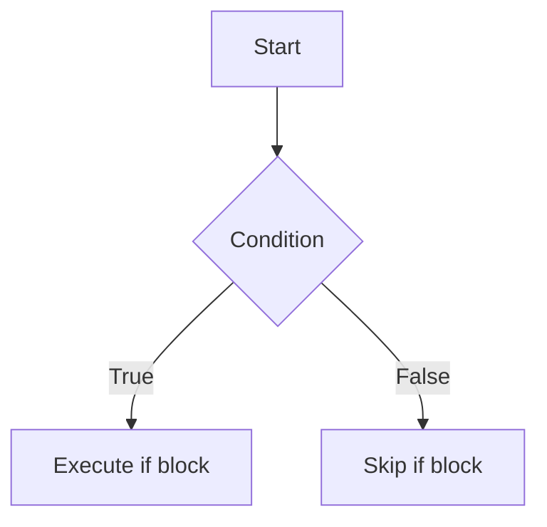
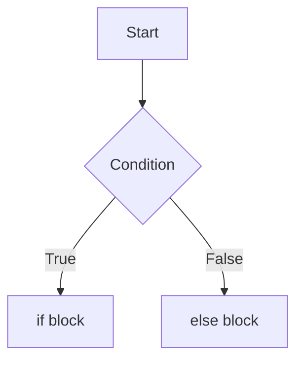
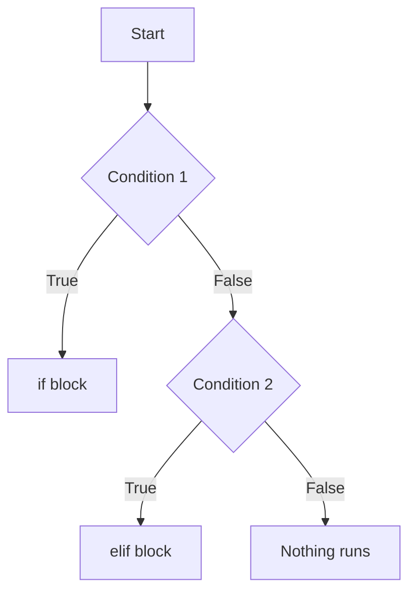
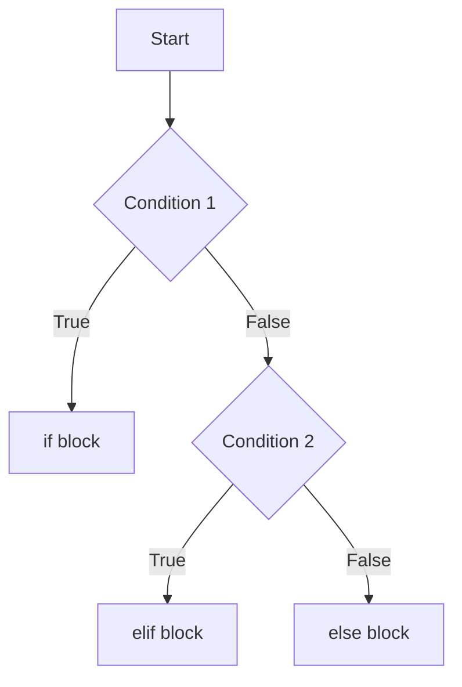

# Lecture 4: Conditionals and Boolean Logic

## Relational Operators

Relational operators are used to **compare two values**. The result of a comparison is always `True` or `False`. These are the operators studied today:

```text
>
<
>=
<=
==
!=
```

- `>` — greater than
- `<` — less than
- `>=` — greater than or equal to
- `<=` — less than or equal to
- `==` — equal to (comparison, not assignment)
- `!=` — not equal to

These operators are what you used to build the comparisons `x > y`, `x < y`, `x == y`, `x != y`, and `grade > 90` etc. in the code below.

An important distinction from the code:

```python
x = int(input("Enter the value of x: "))   # = assigns a value
if x == y:                                  # == compares two values
```

`=` stores a value into a variable. `==` checks whether two values are equal and produces `True` or `False`.

---

## Conditional Statements

A **conditional statement** lets your program choose which block of code to run, based on whether a condition is `True` or `False`. Today's conditional statements were:

```text
if
elif
else
```

Python checks these from top to bottom and runs the first block whose condition is `True`.

---

## Boolean Expressions

A **Boolean expression** is an expression that produces a result of:

```text
True / False
```

which can also be thought of as:

```text
1 / 0
Yes / No
```

The term **Boolean** comes from the mathematician **George Boole**.

Using the comparisons from your own code:

```python
x > y
x < y
x == y
x != y
```

Each of these is a Boolean expression. For example, with `x = 10` and `y = 5`:

```text
x > y   →  10 > 5   →  True
x < y   →  10 < 5   →  False
x == y  →  10 == 5  →  False
x != y  →  10 != 5  →  True
```

---

## Boolean `True` and `False`

```python
True
False
```

These are the only two possible values a Boolean expression can produce. As shown above, comparisons such as:

```python
x > y
x < y
x == y
x != y
```

each produce one of these two values, and it is this `True`/`False` result that an `if`/`elif`/`else` statement uses to decide which block of code to run.

---

## `if` Statement

The `if` statement runs its block of code **only if** its condition evaluates to `True`. If the condition is `False`, the `if` block is skipped entirely.

```text
x > y
  ↓
comparison
  ↓
Boolean expression
  ↓
True or False
  ↓
if decides which code runs
```

Example from your code:

```python
x = int(input("Enter the value of x: "))
y = int(input("Enter the value of y: "))

if x > y:
    print(f"{x} is greater than {y}")
```

If `x > y` evaluates to `True`, the `print` line runs. If it evaluates to `False`, Python skips that line.

---

## `else` Statement

The `else` statement has no condition of its own. It runs **only if** the `if` condition above it was `False`.

Example from your code:

```python
x = int(input("Enter the value of x: "))
y = int(input("Enter the value of y: "))

if x > y:
    print(f"{x} is greater than {y}")
else:
    print(f"{x} and {y} is equal")
```

Here, if `x > y` is `False`, the `else` block runs instead.

---

## `elif` Statement

`elif` (short for "else if") lets you check an additional condition **only if** the condition(s) above it were `False`. Python checks conditions from top to bottom and stops at the first one that is `True`.

Full example from your code:

```python
x = int(input("Enter the value of x: "))
y = int(input("Enter the value of y: "))

if x > y:
    print(f"{x} is greater than {y}")
elif x < y:
    print(f"{x} is less than {y}")
else:
    print(f"{x} and {y} is equal")
```

Walking through this: Python first checks `x > y`. If `True`, it runs that block and skips the rest. If `False`, it checks `x < y`. If `True`, it runs that block and skips `else`. If both `x > y` and `x < y` are `False`, `else` runs, meaning `x` and `y` must be equal.

---

## Combining Conditionals With Functions

This example shows the conditional logic from above placed inside a function:

```python
def main():
    x = int(input("Enter the value of x: "))
    y = int(input("Enter the value of y: "))
    compare(x, y)

def compare(x, y):
    if x > y:
        print(f"{x} is greater than {y}")
    elif x < y:
        print(f"{x} is less than {y}")
    else:
        print(f"{x} and {y} is equal")

main()
```

`main()` collects `x` and `y` from the user and passes them to `compare(x, y)`. Inside `compare`, the exact same `if`/`elif`/`else` logic runs as before — the condition is evaluated, produces `True` or `False`, and that result decides which `print` line executes. The only difference from the earlier version is that the comparison logic now lives inside its own function instead of running directly at the top level.

---

## `or`

The `or` operator combines two Boolean expressions. The result is `True` if **at least one** side is `True`.

Example from your code:

```python
if (x > y) or (x < y):
    print(f"{x} is not equal to {y}")
else:
    print(f"{x} is equal to {y}")
```

Here, `x > y` and `x < y` cannot both be `True` at once, but if either one is `True`, it means `x` and `y` are different, so `or` correctly detects that they are not equal.

Related example from your code:

```python
if x != y:
    print(f"{x} is not equal to {y}")
else:
    print(f"{x} is equal to {y}")
```

Related example from your code:

```python
if x == y:
    print(f"{x} is equal to {y}")
else:
    print(f"{x} is not equal to {y}")
```

### `or` Truth Table

| A     | B     | A or B |
| ----- | ----- | ------ |
| False | False | False  |
| False | True  | True   |
| True  | False | True   |
| True  | True  | True   |

`A or B` is `False` only when **both** `A` and `B` are `False`. In every other case, it is `True`.

---

## `and`

The `and` operator combines two Boolean expressions. The result is `True` only if **both** sides are `True`.

Example from your code:

```python
if (x > y) and (x >= y):
    print(f"{x} is more than {y}")
else:
    print(f"{x} is not equal to {y}")
```

Here, both `x > y` and `x >= y` must be `True` at the same time for the `if` block to run. If `x = 5` and `y = 5`, `x > y` is `False`, so even though `x >= y` is `True`, the overall `and` expression is `False`, and `else` runs.

### `and` Truth Table

| A     | B     | A and B |
| ----- | ----- | ------- |
| False | False | False   |
| False | True  | False   |
| True  | False | False   |
| True  | True  | True    |

`A and B` is `True` only when **both** `A` and `B` are `True`.

---

## `not`

The `not` operator reverses a Boolean result: `True` becomes `False`, and `False` becomes `True`.

Example from your code:

```python
if not (x > y):
    print(f"{x} is greater then {y}")
else:
    print(f"{x} is less than {y}")
```

> ⚠️ **Correction:** When `not (x > y)` is `True`, that means `x` is **not** greater than `y` — i.e., `x` is less than or equal to `y`. The message printed in this branch, `"{x} is greater then {y}"`, is technically backwards relative to what the condition checks (and "then" should be spelled "than"). Logically, this branch runs when `x` is *not* greater than `y`, not when it is.

### `not` Truth Table

| A     | not A |
| ----- | ----- |
| False | True  |
| True  | False |

---

## `match` Keyword

`match` starts a pattern-matching block. It compares one value against a series of possible patterns listed as `case` options, checked from top to bottom, and runs the block for the first pattern that matches.

Example from your code:

```python
name = input("Enter your name: ")

match name:
    case "Harry":
        print("Gryffindor")
    case "Ron":
        print("Gryffindor")
    case "Harmiani":
        print("Gryffindor")
    case "Draco":
        print("Slytherin")
    case _:
        print("WhO?")
        input("You wanna know your house?")
```

- `match` introduces the value being checked (`name`).
- Each `case` is one possible pattern to compare `name` against.
- `case _:` is the catch-all pattern — it matches anything not caught by the cases above it, similar to how `else` works at the end of an `if`/`elif` chain.

### Combining Multiple Cases

Example from your code, showing several possible values grouped into a single `case` using `|`:

```python
match name:
    case "Harry" | "Ron" | "Harmioni":
        print("Gryffindor")
    case "Draco":
        print("Slytherin")
    case _:
        print("WhO?")
        input("You wanna know your house? ")
```

`|` means "or" between patterns. `case "Harry" | "Ron" | "Harmioni":` matches if `name` equals `"Harry"`, **or** `"Ron"`, **or** `"Harmioni"`, running the same block for any of the three.

### `match` vs the `break` Behavior From C

Your note on this:

> "Interesting thing is, in C we have to add a `break` statement, but here we are not adding any `break` statement."

In C, once a `switch` case matches, execution keeps running into the *next* case too unless a `break` stops it (fall-through). In Python, `match` does not fall through — once a `case` matches and its block finishes, Python automatically exits the `match` statement, so no `break` is needed.

---

## Flowcharts

### `if` Flowchart



### `if-else` Flowchart



### `if-elif` Flowchart



### `if-elif-else` Flowchart



---

## Truth Tables

### `and` Truth Table

| A     | B     | A and B |
| ----- | ----- | ------- |
| False | False | False   |
| False | True  | False   |
| True  | False | False   |
| True  | True  | True    |

### `or` Truth Table

| A     | B     | A or B |
| ----- | ----- | ------ |
| False | False | False  |
| False | True  | True   |
| True  | False | True   |
| True  | True  | True   |

### `not` Truth Table

| A     | not A |
| ----- | ----- |
| False | True  |
| True  | False |


----

---

## 🐾 Thanks for studying with me! 🐾

That wraps up **Lecture 4 — Conditionals and Boolean Logic** all in one cozy little `.md` file. 🖤🤍 Hope it made things click a little easier. See you in the next one! 👋

📌 **Follow for more notes & updates:**
- 📸 Insta: [@mehrunnisa.ai](https://www.instagram.com/mehrunnisa.ai/)
- ✍️ Substack: [The Epoch](https://theepoch.substack.com/)
- 🎥 YouTube: [@mehrunnisa.ai](https://www.youtube.com/@Mehrunnisa-ai)


---