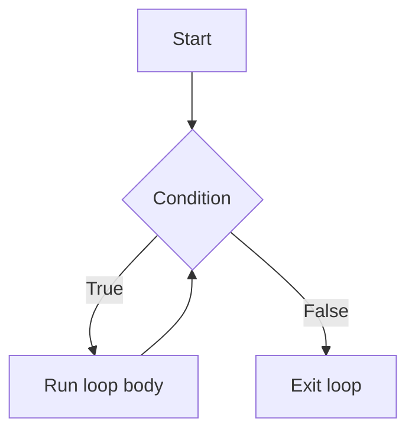
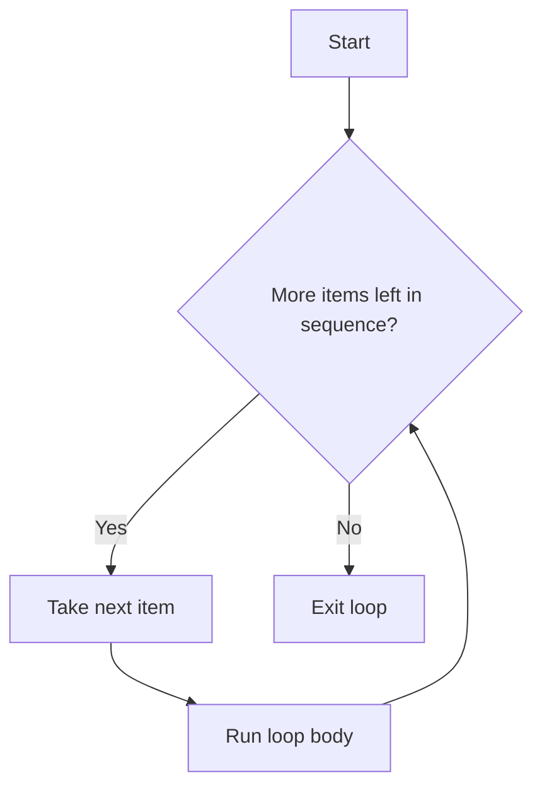
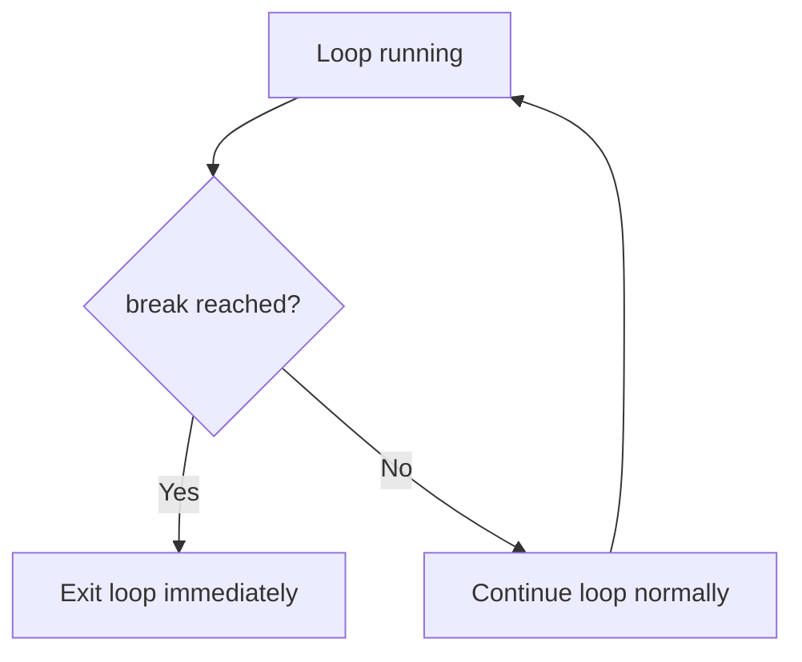
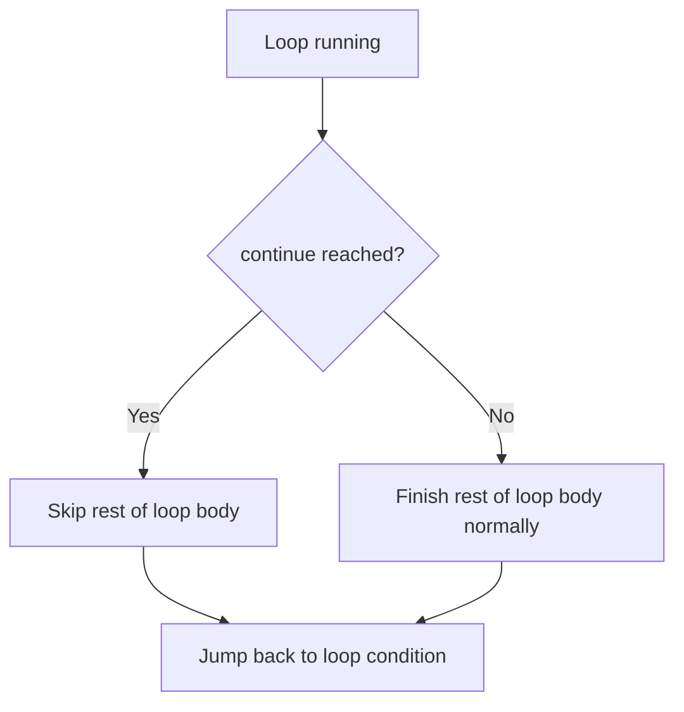
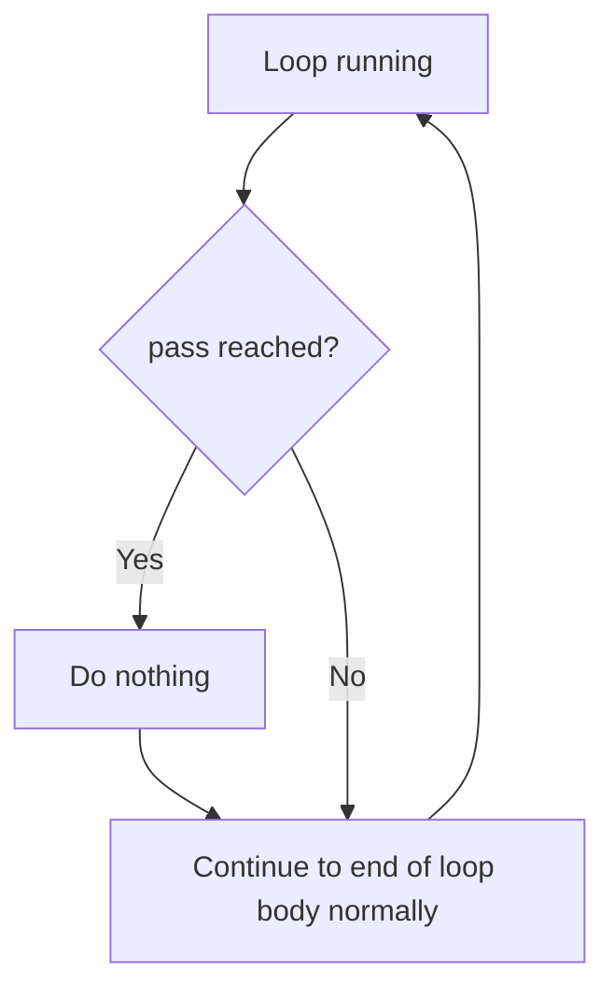

# 🐾 Lecture 5: Loops, Break / Continue / Pass, Lists, and `range()` 🐾

*Detailed notes for exactly what was studied today — using your own code as the examples, with extra analogies to make it stick.*

---

## 📖 Table of Contents

1. [While Loop](#while-loop)
2. [For Loop](#for-loop)
3. [Break, Continue, and Pass](#break-continue-and-pass)
4. [Making the Same Program Using Functions](#making-the-same-program-using-functions)
5. [Lists](#lists)
6. [Flowcharts](#flowcharts)
7. [Practice Questions](#practice-questions)
8. [Footer](#-thanks-for-studying-with-me)

---

## While Loop

### 🐼 The Analogy

Think of a `while` loop like a **parent telling a kid to keep cleaning their room "while it's still messy."** The parent doesn't say "clean it exactly 5 times." They just keep checking: *"Is it still messy?"* As long as the answer is **yes**, the kid keeps cleaning. The moment the answer becomes **no**, the kid stops. A `while` loop works the exact same way — it keeps re-checking its condition, and it only stops the instant that condition turns `False`.

A **`while` loop** keeps repeating its block of code **as long as** its condition stays `True`. Once the condition becomes `False`, the loop stops.

```python
i = 1
while i <= 5:
    print(i)
    i += 1  # here i = 5
```

Here's what happens step by step: Python checks `i <= 5`. Since `i` starts at `1`, this is `True`, so the loop body runs — it prints `i`, then increases `i` by `1` using `i += 1`. Then Python goes back and checks `i <= 5` again with the new value. This repeats until `i` becomes `6`, at which point `i <= 5` is `False`, and the loop stops.

```text
i = 1
   ↓
i <= 5 ?  → True → print(i) → i += 1 → check again
   ↓ (repeats)
i = 6
   ↓
i <= 5 ?  → False → loop ends 🐾
```

### ⚡ Quick Example

```python
count = 1
while count <= 3:
    print("Hi!")
    count += 1
# Output: Hi!  Hi!  Hi!   (printed 3 times, then stops)
```

### Cat Program 🐱

```python
i = 1
while i <= 10:  # This code won't work until we change the value of i
    print("Meow")
    i += 1
```

This works the same way — as long as `i <= 10` is `True`, it prints `"Meow"` and increases `i`. The comment is an important reminder: if `i` were never changed inside the loop (no `i += 1`), the condition would stay `True` forever, and the loop would never stop. This is called an **infinite loop** — like leaving a tap running because nobody ever turns the handle. 🚰

### Counting Down Instead of Up 🐶

```python
z = 4
while z >= 1:
    print("bark")
    z -= 1
```

This is the same idea, but going in the opposite direction. `z` starts at `4`, and instead of increasing, it *decreases* by `1` each time using `z -= 1`. The loop keeps running as long as `z >= 1` is `True`. Once `z` reaches `0`, `z >= 1` becomes `False`, and the loop stops. Think of it like a **countdown timer** — it ticks down toward zero, and once it hits zero, the alarm (loop) stops.

---

## For Loop

### 🐧 The Analogy

A `for` loop is like **going through a checklist, item by item, until you reach the bottom.** You don't check "is the list finished yet?" over and over like a `while` loop — you just naturally move down the list one item at a time, and when there are no more items, you're done automatically. No manual counting required.

A **`for` loop** repeats its block of code once for each item in a sequence (like a list, or a range of numbers).

### For Loop With a List of Numbers

```python
for i in [0, 1, 2, 3]:
    print("Meow")
```

Here, `i` takes on each value in the list `[0, 1, 2, 3]`, one at a time — `0`, then `1`, then `2`, then `3` — and for each of those values, the loop body runs once, printing `"Meow"`. Since the list has 4 items, `"Meow"` prints 4 times.

The problem with this approach: it works fine for a short list, but what if you needed to print something a million times? Typing out a list of a million numbers by hand isn't realistic — imagine hand-writing a checklist with a million lines on it! This is exactly the problem `range()` solves.

### For Loop With `range()`

```python
for i in range(5):  # This will iterate over 0, 1, 2, 3, 4
    print("Meow")
```

`range(5)` generates the sequence `0, 1, 2, 3, 4` automatically — five numbers starting at `0`, without you having to type each one. Think of `range(5)` as a **vending machine that spits out numbered tickets 0 through 4** — you don't have to write the tickets yourself, you just ask for 5 of them. The `for` loop then goes through each of these numbers one at a time, running the loop body once per number. So `range(5)` produces exactly 5 repetitions, printing `"Meow"` 5 times — the same result as the list version above, but without manually writing out the numbers.

```text
range(5)
   ↓
generates: 0, 1, 2, 3, 4
   ↓
for i in range(5):
   ↓
loop body runs once for each number
   ↓
"Meow" printed 5 times 🐾
```

### ⚡ Quick Example

```python
for i in range(3):
    print("Lap", i)
# Output:
# Lap 0
# Lap 1
# Lap 2
```

### A Shortcut Without a Loop

```python
print("Meow\n" * 5, end="")  # Prints Meow 5 times
```

This is a different, non-loop way to get a similar repeated-printing effect: multiplying the string `"Meow\n"` by `5` repeats the text itself five times in a row, and `print(..., end="")` then displays it all at once. It's like **photocopying a page 5 times** instead of writing it out 5 separate times by hand.

---

## Break, Continue, and Pass

### ⚫⚪ The Analogy

Imagine you're on a **treadmill (a loop) that never stops on its own**:

- `break` is like **hitting the big red STOP button** — you get off the treadmill immediately, no matter what.
- `continue` is like **skipping the rest of this lap and jumping straight to the start of the next one** — you're still on the treadmill, just skipping ahead.
- `pass` is like **standing still for a second, doing nothing, then carrying on as normal** — it's a placeholder, not an action.

These three keywords all change how a loop behaves, but each one does something different.

### Asking the User for a Positive Number (using `break`)

```python
i = int(input("Enter a positive number: "))

while i <= 0:
    if i <= 0:
        i = int(input("Enter a positive number: "))
        break

if i > 0:
    for j in range(i):
        print("Meow")
```

Here, if the first number entered is already positive (`i > 0`), the `while i <= 0:` loop never even starts, since its condition is already `False`. But if the number is `0` or negative, the loop body runs: it asks for a new number and then immediately hits `break`, which exits the `while` loop right away — regardless of whether the new number is actually positive. After the loop, `if i > 0:` checks the final value of `i`, and if it's positive, a `for` loop prints `"Meow"` that many times.

### `break` — Method 1

```python
while True:
    n = int(input("Enter the positive number: "))

    if n < 0:
        continue
    else:
        break

for i in range(n):
    print("Meow")
```

**What is happening here?**

`while True` means the loop will run forever until `break` is reached — there's no condition that turns `False` on its own, so the only way out is `break`. It's like a **guard standing at a door who will let absolutely nobody through unless you know the secret word** — the loop keeps running endlessly until `break` gives the signal to open the door.

If `n < 0`: `continue` skips the remaining statements inside the loop and immediately goes back to the beginning, asking for input again.

If `n >= 0`: `break` stops the loop, and the `for` loop starts, printing `"Meow"` `n` times.

```text
while True (runs forever)
   ↓
ask for n
   ↓
n < 0 ?
  ↓ Yes → continue → jump back to top, ask again
  ↓ No  → break → exit the while loop
   ↓
for loop prints "Meow" n times 🐾
```

### ⚡ Quick Example (`continue`)

```python
for i in range(5):
    if i == 2:
        continue
    print(i)
# Output: 0  1  3  4   (2 is skipped, loop still runs to the end)
```

### `break` — Method 2

```python
while True:
    num = int(input("Enter the positive number: "))

    if num > 0:
        break

for i in range(num):
    print("Meow")
```

**What is happening here?**

`while True` means the code will keep running forever. The loop only stops when `break` executes. `break` happens only if `num > 0` — so this version doesn't need `continue` at all, because if `num > 0` is `False`, there's simply nothing left to do in that pass of the loop, and Python naturally loops back to the top on its own.

### ⚡ Quick Example (`break`)

```python
for i in range(10):
    if i == 3:
        break
    print(i)
# Output: 0  1  2   (loop stops completely once i == 3)
```

### `pass`

```python
while True:
    n = int(input("Enter the positive number: "))

    if n < 0:
        pass
    else:
        break

for i in range(n):
    print("Meow")
```

**Explanation:**

If `n < 0` is `True`, `pass` executes — and `pass` literally does nothing. It's a placeholder that says "do not perform any action here." Think of `pass` like a **sign that just says "nothing to see here" — you pause, look, and just move on.**

The `if` block ends. The `while` loop reaches its end.

Since the condition is `while True`, the loop automatically starts again on its own — `pass` didn't need to explicitly send it back to the top the way `continue` does, because there's nothing left in the loop body to skip past anyway.

So yes, this program still works the same way as the `continue` version! 🎉

```text
n < 0 ?
  ↓ Yes → pass (does nothing) → reaches end of loop body → while True loops again anyway
  ↓ No  → break → exit the while loop
```

### ⚡ Quick Example (`pass`)

```python
for i in range(3):
    if i == 1:
        pass  # placeholder, does nothing
    print(i)
# Output: 0  1  2   (pass doesn't skip or stop anything, it's just a no-op)
```

---

## Making the Same Program Using Functions

### 🐾 The Analogy

This is like **splitting a chore between two people**: one person's *only* job is to keep asking "what's the number?" until they get a good answer (`get_number`), and the other person's *only* job is to do the actual "meowing" once they're handed that number (`print_Meow`). Each person focuses on one task instead of one person doing everything at once.

```python
def main():
    number = get_number()
    print_Meow(number)


def get_number():
    while True:
        i = int(input("Enter the number: "))

        if i > 0:
            return i


def print_Meow(n):
    for i in range(n):
        print("Meow")


main()
```

This reorganizes the same `while True` + `break`-style logic from before, but instead of `break`, `get_number()` uses `return i` to exit the loop — as soon as `i > 0` is `True`, the function immediately returns that value, which also ends the `while` loop at the same time (a `return` inside a loop exits both the loop and the function together). `main()` then calls `print_Meow(number)`, which uses the same `for i in range(n):` pattern from before to print `"Meow"` the requested number of times.

---

## Lists

### 🦓 The Analogy

A list is like a **numbered row of lockers** — each locker holds one item, and each locker has a number (starting from `0`, not `1`) so you can go straight to whichever item you want.

A list groups multiple values together, like the student names used below:

```python
student = ["Harmioni", "Harry", "Ron"]
```

So `student[0]` is `"Harmioni"`'s locker, `student[1]` is `"Harry"`'s locker, and `student[2]` is `"Ron"`'s locker.

### Looping Over a List by Index

```python
for i in range(3):
    print(student[i])
```

Here, `range(3)` produces `0, 1, 2`, matching the three valid index positions in `student`. For each value of `i`, `student[i]` accesses the item at that position in the list, so this prints `"Harmioni"`, then `"Harry"`, then `"Ron"`.

### A More Pythonic Way ✅

```python
for stud in student:
    print(stud)
```

Instead of looping over index numbers and then using them to look up each item, this version loops directly over the *items themselves*. On each pass, `stud` becomes the next value in the list — first `"Harmioni"`, then `"Harry"`, then `"Ron"` — without ever needing `range()` or index numbers at all. It's like walking down the row of lockers and just grabbing what's inside each one, instead of shouting out locker numbers first.

### ⚡ Quick Example

```python
fruits = ["apple", "banana", "cherry"]
for fruit in fruits:
    print(fruit)
# Output:
# apple
# banana
# cherry
```

### Looping Over a List With Both Index and Value

```python
student = ["Harmioni", "Harry", "Ron"]

for i in range(len(student)):
    print(i + 1, ":", student[i], end="\n")
```

`len(student)` gives the number of items in the list (`3`), so `range(len(student))` produces `0, 1, 2` automatically — this works no matter how long the list is, unlike hardcoding `range(3)`. It's like the list telling you itself "I have 3 lockers," instead of you guessing the number and hoping you counted right. For each `i`, `student[i]` gets the item at that position, and `i + 1` is printed alongside it so the output is numbered starting from `1` instead of `0` (e.g., `1 : Harmioni`, `2 : Harry`, `3 : Ron`).

---

## Flowcharts

### `while` Loop Flowchart



### `for` Loop Flowchart



### `break` Flowchart



### `continue` Flowchart



### `pass` Flowchart



---

## Practice Questions

### 🧠 Conceptual Questions

1. What is the main difference between a `while` loop and a `for` loop?
2. What happens if a `while` loop's condition never becomes `False`?
3. Why is `range()` useful compared to typing out a list of numbers by hand?
4. What does `break` do to a loop?
5. What does `continue` do to a loop, and how is it different from `break`?
6. What does `pass` actually do?
7. Why didn't the `pass` version of the program need `continue` to still work correctly?
8. Why does `while True` need a `break` (or `return`) somewhere inside it?
9. What does `len(student)` return for the list `["Harmioni", "Harry", "Ron"]`?
10. Why is `for stud in student:` considered more "Pythonic" than looping with `range(len(student))`?

### 🔍 Predict the Output

1. ```python
   i = 1
   while i <= 3:
       print(i)
       i += 1
   ```
2. ```python
   for i in range(4):
       print("Woof")
   ```
3. ```python
   for i in range(5):
       if i == 3:
           break
       print(i)
   ```
4. ```python
   for i in range(5):
       if i == 3:
           continue
       print(i)
   ```
5. ```python
   z = 3
   while z >= 1:
       print(z)
       z -= 1
   ```
6. ```python
   student = ["Harmioni", "Harry", "Ron"]
   for stud in student:
       print(stud)
   ```
7. ```python
   student = ["Harmioni", "Harry", "Ron"]
   for i in range(len(student)):
       print(i + 1, ":", student[i])
   ```
8. ```python
   for i in range(2):
       pass
   print("Done")
   ```

### ⚡ Small Coding Questions

1. Write a `while` loop that prints numbers from `1` to `10`.
2. Write a `for` loop using `range()` that prints `"Hello"` 7 times.
3. Write a `while True` loop that keeps asking the user for a number until they enter a number greater than `100`, then breaks.
4. Write a `for` loop over a list of your 3 favorite foods that prints each one.
5. Write a `for` loop from `0` to `9` that uses `continue` to skip printing the number `5`.
6. Write a `for` loop from `0` to `9` that uses `break` to stop as soon as it reaches the number `6`.
7. Write two functions, `get_number()` and `print_stars(n)`, where `get_number()` keeps asking for input until it gets a positive number and returns it, and `print_stars(n)` prints `"*"` `n` times.
8. Write a `for` loop that prints each item of a list along with its index number, starting the count from `1`.

### 🐛 Debugging Questions

1. ```python
   i = 1
   while i <= 5:
       print(i)
   ```
   *(What's missing, and what will happen when this runs?)*

2. ```python
   for i in range(5)
       print(i)
   ```

3. ```python
   while True:
       n = int(input("Enter a number: "))
       if n > 0:
           print("Got it")
   ```
   *(Will this loop ever stop? Why or why not?)*

4. ```python
   student = ["Harmioni", "Harry", "Ron"]
   for i in range(4):
       print(student[i])
   ```
   *(What problem will this cause?)*

5. ```python
   for i in range(10):
       if i == 5:
           pass
       break
   ```
   *(Does this behave the same as just using `continue` instead of `pass`? Why or why not?)*

---
---

## 🐾 Thanks for studying with me! 🐾

That wraps up Lecture 5 — loops, `break`/`continue`/`pass`, lists, and `range()` all in one cozy little `.md` file. 🖤🤍 Hope it made things click a little easier. See you in the next one! 👋

📌 **Follow for more notes & updates:**
- 📸 Insta: [@mehrunnisa.ai](https://www.instagram.com/mehrunnisa.ai/)
- ✍️ Substack: [The Epoch](https://theepoch.substack.com/)
- 🎥 YouTube: [@mehrunnisa.ai](https://www.youtube.com/@Mehrunnisa-ai)

---