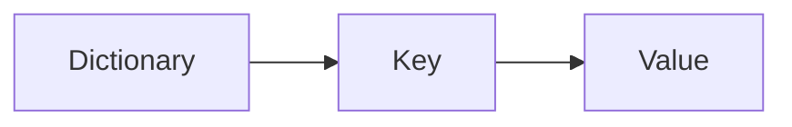
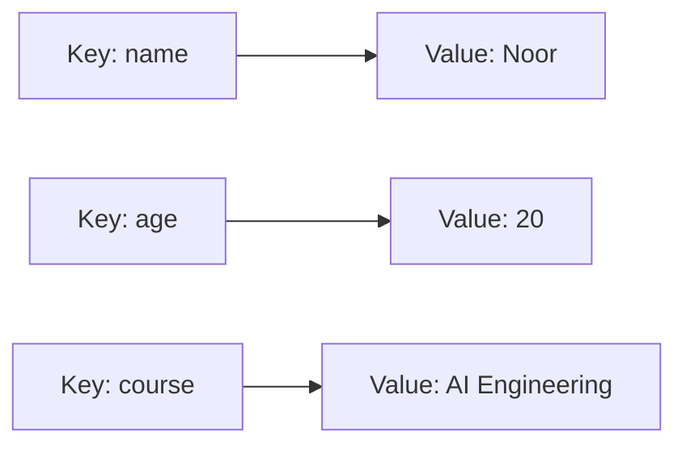
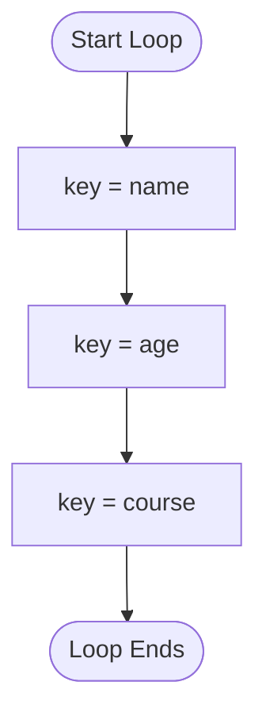
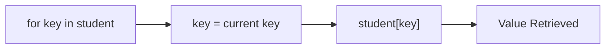
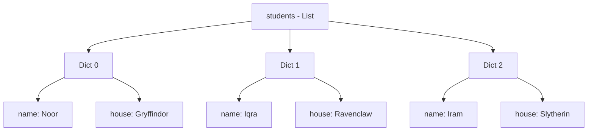
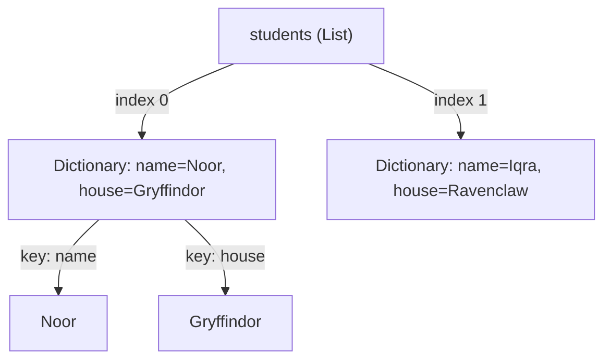
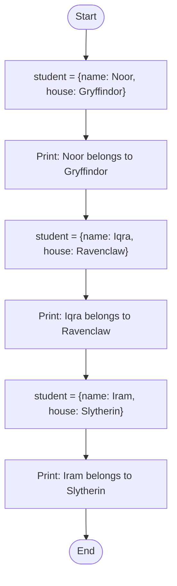

# Python Dictionaries

## Table of Contents

* Introduction
* What is a Dictionary?
* Creating a Dictionary
* Key-Value Pairs
* Accessing Values Using Keys
* Printing Values from a Dictionary
* Looping Through a Dictionary

  * Default Loop Behavior (Keys Only)
  * Printing Only Keys
  * Printing Both Keys and Values
  * Accessing Values Inside a Loop
  * Choosing Meaningful Loop Variable Names
* List vs Dictionary

  * List Indexing vs Dictionary Keys
* List of Dictionaries

  * Creating a List of Dictionaries
  * Storing Multiple Records
  * Accessing Dictionary Data Inside a List
  * Nested Data Structures
* `student` vs `students`: A Critical Distinction
* Using `None` as a Dictionary Value
* Printing Selected Values with the `sep` Parameter
* Practical Examples

  * Harry Potter House Example
  * Student Records Example
* Common Mistakes
* Best Practices
* Summary
* AI Engineering Connection

⋆˚꩜｡

## Introduction

A dictionary is one of Python's core data structures, used to store data as **key-value pairs** rather than as a sequence of ordered items. Dictionaries allow data to be retrieved by a meaningful identifier (the key) instead of a numeric position, making them suitable for representing structured records such as a student profile, a configuration object, or a JSON response from an API.

This chapter covers dictionary creation, access, iteration, nested structures such as lists of dictionaries, and common errors beginners encounter when transitioning from lists to dictionaries.

⋆˚꩜｡

## What is a Dictionary?

♡ Definition

A dictionary is an unordered, mutable collection of data stored as key-value pairs, where each key is unique and maps to a corresponding value.

♡ Explanation

* Each entry in a dictionary consists of two parts: a **key** and a **value**, separated by a colon (`:`).
* Keys must be unique and immutable (strings, numbers, or tuples are valid; lists are not, because lists are mutable).
* Values can be of any data type, including strings, numbers, lists, or even other dictionaries.
* Internally, Python dictionaries are implemented using a hash table, which allows key lookups to occur in constant average time, O(1), rather than requiring a linear scan as with a list.

♡ Syntax

```python
dictionary_name = {
    "key1": "value1",
    "key2": "value2"
}
```

♡ Key Points

* Declared using curly braces `{ }`.
* Each key is followed by a colon and then its value.
* Key-value pairs are separated by commas.
* Keys must be unique within a single dictionary.



⋆˚꩜｡

## Creating a Dictionary

♡ Syntax

```python
student = {
    "name": "Noor",
    "age": 20,
    "course": "AI Engineering"
}
```

♡ Explanation

* `student` is the variable name referencing the dictionary object.
* `"name"`, `"age"`, and `"course"` are keys.
* `"Noor"`, `20`, and `"AI Engineering"` are the corresponding values.

♡ Examples

```python
# Empty dictionary
empty_dict = {}

# Dictionary with mixed value types
student = {
    "name": "Noor",
    "age": 20,
    "is_enrolled": True
}
```

♡ Why It Matters

Dictionaries model real-world entities more naturally than lists because each piece of data is labeled with a descriptive key rather than an arbitrary numeric position.

⋆˚꩜｡

## Key-Value Pairs

♡ Definition

A key-value pair is a single unit of data storage within a dictionary, consisting of a unique identifier (key) mapped to associated data (value).

♡ Explanation

* The key acts as the label used to retrieve data.
* The value is the actual data being stored.
* This structure mirrors real-world lookups, such as looking up a word (key) in a dictionary to find its meaning (value) — the origin of the data structure's name.



♡ Key Points

* One key maps to exactly one value.
* A value can be duplicated across different keys, but a key cannot be duplicated within the same dictionary.
* If a key is repeated during dictionary creation, the last assigned value overwrites the earlier one.

♡ Common Errors

```python
student = {
    "name": "Noor",
    "name": "Iqra"
}
print(student)
```

**Output:**

```python
{'name': 'Iqra'}
```

The second `"name"` key overwrites the first because keys must be unique.

⋆˚꩜｡

## Accessing Values Using Keys

♡ Syntax

```python
dictionary_name["key"]
```

♡ Explanation

Values inside a dictionary are accessed using square bracket notation with the key placed inside the brackets, rather than a numeric index as used in lists.

♡ Examples

```python
student = {
    "name": "Noor",
    "age": 20
}

print(student["name"])
print(student["age"])
```

**Output:**

```python
Noor
20
```

♡ Common Errors

Accessing a key that does not exist in the dictionary raises a `KeyError`.

```python
print(student["grade"])
```

**Output:**

```python
KeyError: 'grade'
```

♡ Best Practices

* Use `dictionary_name.get("key")` when the existence of a key is uncertain, since `.get()` returns `None` instead of raising an error.

⋆˚꩜｡

## Printing Values from a Dictionary

♡ Explanation

A dictionary can be printed as a whole object, or individual values can be printed by first accessing them through their keys.

♡ Examples

```python
student = {
    "name": "Noor",
    "age": 20
}

# Printing the entire dictionary
print(student)

# Printing a single value
print(student["name"])
```

**Output:**

```python
{'name': 'Noor', 'age': 20}
Noor
```

♡ Notes

* Printing the dictionary directly displays all key-value pairs in insertion order (Python 3.7+ guarantees this ordering).
* Printing `student["name"]` displays only the value linked to that specific key.

⋆˚꩜｡

## Looping Through a Dictionary

### Default Loop Behavior (Keys Only)

♡ Definition

A `for` loop applied directly to a dictionary iterates over its keys by default, not its values.

♡ Explanation

When Python executes `for key in dictionary`, it treats the dictionary as an iterable of its keys. This is a deliberate design decision, since keys are the unique identifiers used to look up corresponding values.

♡ Syntax

```python
for key in dictionary_name:
    print(key)
```

♡ Examples

```python
student = {
    "name": "Noor",
    "age": 20,
    "course": "AI Engineering"
}

for key in student:
    print(key)
```

**Output:**

```python
name
age
course
```



| Iteration | Variable | Value     |
| --------- | -------- | --------- |
| 1         | key      | name      |
| 2         | key      | age       |
| 3         | key      | course    |

⋆˚꩜｡

### Printing Only Keys

♡ Syntax

```python
for key in student:
    print(key)
```

♡ Explanation

Since the default loop behavior already yields keys, this is the simplest way to print only the keys of a dictionary. No additional method call is required.

⋆˚꩜｡

### Printing Both Keys and Values

♡ Syntax

```python
for key, value in student.items():
    print(key, value)
```

♡ Explanation

* The `.items()` method returns each key-value pair as a tuple.
* Using `key, value` unpacks each tuple into two separate variables during iteration.
* This is the standard approach when both the label and the data are needed simultaneously.

♡ Examples

```python
student = {
    "name": "Noor",
    "age": 20,
    "course": "AI Engineering"
}

for key, value in student.items():
    print(key, ":", value)
```

**Output:**

```python
name : Noor
age : 20
course : AI Engineering
```

| Iteration | key     | value            |
| --------- | ------- | ---------------- |
| 1         | name    | Noor             |
| 2         | age     | 20                |
| 3         | course  | AI Engineering   |

⋆˚꩜｡

### Accessing Values Inside a Loop

♡ Syntax

```python
for key in student:
    print(student[key])
```

♡ Explanation

Since the loop yields only keys by default, the corresponding value must be retrieved manually inside the loop body using `dictionary_name[key]`. This achieves the same result as `.items()` but demonstrates explicit key-based lookup.

♡ Examples

```python
for key in student:
    print(key, ":", student[key])
```

**Output:**

```python
name : Noor
age : 20
course : AI Engineering
```



⋆˚꩜｡

### Choosing Meaningful Loop Variable Names

♡ Explanation

The loop variable name in `for key in student` can be any valid identifier. Python does not require the name to literally be `key`. However, using descriptive names such as `key`, `name`, or a term relevant to the dictionary's content improves readability and avoids confusion with the dictionary variable itself.

♡ Best Practices

* Use `key` and `value` for generic dictionaries.
* Use a more specific name (e.g., `student_key`) when working with multiple dictionaries in the same scope.
* Never name the loop variable identically to the dictionary variable, since this causes both readability issues and, in nested contexts, variable shadowing.

⋆˚꩜｡

### Why `for student in student` Works but Is a Bad Practice

♡ Explanation

```python
for student in student:
    print(student)
```

This code executes without error because Python allows a loop variable to share the same name as the iterable it loops over. During each iteration, `student` is reassigned to the current key, which temporarily overwrites the reference to the original dictionary within the loop body.

♡ Why It Fails Conceptually

* Before the loop, `student` refers to the dictionary object.
* After the first iteration begins, `student` is reassigned to refer to a key (a string), not the dictionary.
* Any attempt to access `student["some_key"]` inside this loop fails, because `student` no longer refers to the dictionary — it refers to a string.

♡ Common Errors

```python
student = {"name": "Noor", "age": 20}

for student in student:
    print(student["name"])
```

**Output:**

```python
TypeError: string indices must be integers
```

♡ Better Alternative

```python
student = {"name": "Noor", "age": 20}

for key in student:
    print(student[key])
```

♡ Best Practices

* Never reuse the dictionary's variable name as the loop variable.
* Reserve the original variable name for the full dictionary object throughout the entire scope.

⋆˚꩜｡

## List vs Dictionary

♡ Definition

A list is an ordered, index-based collection of items. A dictionary is an unordered (insertion-ordered as of Python 3.7+), key-based collection of items.

| Feature          | List                     | Dictionary                  |
| ---------------- | ------------------------ | ---------------------------- |
| Access method     | Numeric index (`0, 1, 2`) | Key (`"name"`, `"age"`)      |
| Syntax            | `[ ]`                    | `{ }`                        |
| Data organization | Sequential                | Key-value mapping            |
| Duplicate entries | Allowed                  | Keys must be unique           |
| Typical use case  | Ordered collection of similar items | Structured record with labeled fields |

### List Indexing vs Dictionary Keys

♡ Syntax

```python
# List indexing
students_list = ["Noor", "Iqra", "Iram"]
print(students_list[0])

# Dictionary key access
student_dict = {"name": "Noor"}
print(student_dict["name"])
```

**Output:**

```python
Noor
Noor
```

| Syntax               | Meaning                          |
| -------------------- | --------------------------------- |
| `students_list[0]`    | Access item at position 0         |
| `student_dict["name"]`| Access value linked to key "name" |

♡ Why It Matters

Lists are suited for ordered collections of similar, unlabeled items (e.g., a list of names). Dictionaries are suited for structured, labeled data (e.g., a single record describing one entity).

⋆˚꩜｡

## List of Dictionaries

### Creating a List of Dictionaries

♡ Definition

A list of dictionaries is a data structure where each element of the list is itself a dictionary, commonly used to represent multiple records of the same structure.

♡ Syntax

```python
students = [
    {"name": "Noor", "house": "Gryffindor"},
    {"name": "Iqra", "house": "Ravenclaw"},
    {"name": "Iram", "house": "Slytherin"}
]
```



⋆˚꩜｡

### Storing Multiple Records

♡ Explanation

Each dictionary within the list represents one independent record with the same set of keys, similar to a row in a spreadsheet or a document in a JSON array. This structure is the standard way to represent tabular or record-based data in Python before it is converted into other formats (such as a Pandas DataFrame).

♡ Why It Matters

Nearly all data retrieved from APIs, databases, or CSV files is eventually represented in Python as a list of dictionaries, making this pattern foundational for data processing tasks.

⋆˚꩜｡

### Accessing Dictionary Data Inside a List

♡ Syntax

```python
students[index]["key"]
```

♡ Explanation

* `students[index]` selects one dictionary from the list using its numeric position.
* `["key"]` then accesses a specific value from within that selected dictionary.
* Two separate access operations occur: list indexing followed by dictionary key access.

♡ Examples

```python
students = [
    {"name": "Noor", "house": "Gryffindor"},
    {"name": "Iqra", "house": "Ravenclaw"}
]

print(students[0]["name"])
print(students[1]["house"])
```

**Output:**

```python
Noor
Ravenclaw
```

| Syntax                  | Meaning                                          |
| ------------------------ | ------------------------------------------------- |
| `students[0]`             | Access the first dictionary in the list           |
| `students[0]["name"]`     | Access the value of "name" inside the first dictionary |

⋆˚꩜｡

### Nested Data Structures

♡ Definition

A nested data structure occurs when one data structure is stored inside another, such as a list containing dictionaries.

♡ Explanation

* The outer structure (`students`) is a list, accessed using integer indices.
* The inner structures (each dictionary) are accessed using string keys.
* Understanding which structure is being accessed at each step is essential to avoid indexing errors.



♡ Understanding `student["name"]` Inside a Loop

```python
students = [
    {"name": "Noor", "house": "Gryffindor"},
    {"name": "Iqra", "house": "Ravenclaw"}
]

for student in students:
    print(student["name"])
```

**Output:**

```python
Noor
Iqra
```

**Execution Trace:**

| Iteration | student (variable)                          | student["name"] |
| --------- | -------------------------------------------- | ---------------- |
| 1         | {"name": "Noor", "house": "Gryffindor"}       | Noor             |
| 2         | {"name": "Iqra", "house": "Ravenclaw"}        | Iqra             |

♡ Explanation of Execution

In this loop, `student` (singular) refers to a single dictionary during each iteration, because the outer structure `students` (plural) is a list of dictionaries. Each iteration reassigns `student` to the next dictionary in the list, allowing `student["name"]` to correctly access a key within that individual dictionary.

⋆˚꩜｡

## `student` vs `students`: A Critical Distinction

♡ Explanation

The naming convention of singular versus plural variable names reflects the structural difference between a single dictionary and a list of dictionaries. Using this convention consistently prevents a common category of errors.

| Variable    | Structure Type      | Correct Access Pattern         |
| ----------- | -------------------- | -------------------------------- |
| `student`   | Single dictionary     | `student["name"]`                |
| `students`  | List of dictionaries  | `students[0]["name"]`            |

### Why `students["name"]` Causes an Error

♡ Explanation

`students` refers to a list, not a dictionary. Lists do not support string-based key access; they only support integer-based positional access. Attempting to use a string key on a list raises a `TypeError`.

♡ Common Errors

```python
students = [
    {"name": "Noor"},
    {"name": "Iqra"}
]

print(students["name"])
```

**Output:**

```python
TypeError: list indices must be integers or slices, not str
```

♡ Correct Code

```python
print(students[0]["name"])
```

**Output:**

```python
Noor
```

### Difference Between `students[0]["name"]` and `student["name"]`

| Expression              | Structure Being Accessed        | Requires Index? | Requires Key? |
| ------------------------ | -------------------------------- | ---------------- | -------------- |
| `students[0]["name"]`     | List → Dictionary → Value        | Yes (index 0)     | Yes ("name")   |
| `student["name"]`         | Dictionary → Value                | No               | Yes ("name")   |

♡ Why It Matters

Confusing a list of dictionaries with a single dictionary is one of the most frequent sources of runtime errors for beginners. Correctly identifying the structure type before writing an access expression prevents both `TypeError` and `KeyError` exceptions.

⋆˚꩜｡

## Using `None` as a Dictionary Value

♡ Definition

`None` is a special Python value representing the absence of a value. It can be assigned as a dictionary value when data for a particular key is not yet available.

♡ Syntax

```python
student = {
    "name": "Noor",
    "grade": None
}
```

♡ Explanation

* `None` is distinct from an empty string `""`, the number `0`, or `False`. It explicitly represents "no value assigned" rather than a default or empty value.
* Checking for `None` is commonly done using `is None` rather than `== None`, since `is` checks for identity with the singleton `None` object.

♡ Examples

```python
student = {"name": "Noor", "grade": None}

if student["grade"] is None:
    print("Grade not available yet")
else:
    print(student["grade"])
```

**Output:**

```python
Grade not available yet
```

♡ Why It Matters

Using `None` to represent missing data is a standard convention in Python, and is especially relevant when working with real-world data that may contain incomplete records, such as data retrieved from APIs or CSV files.

⋆˚꩜｡

## Printing Selected Values with the `sep` Parameter

♡ Definition

The `sep` parameter of the `print()` function specifies the string used to separate multiple values passed to `print()`. It defaults to a single space.

♡ Syntax

```python
print(value1, value2, sep="separator_string")
```

♡ Examples

```python
student = {"name": "Noor", "house": "Gryffindor"}

print(student["name"], student["house"], sep=" - ")
```

**Output:**

```python
Noor - Gryffindor
```

```python
print(student["name"], student["house"], sep="\n")
```

**Output:**

```python
Noor
Gryffindor
```

♡ Key Points

* `sep` only affects the characters placed between multiple arguments, not the end of the printed line (which is controlled separately by the `end` parameter).
* Useful for formatting selected dictionary values into a single readable line without manual string concatenation.

⋆˚꩜｡

## Practical Examples

### Harry Potter House Example

♡ Code

```python
students = [
    {"name": "Noor", "house": "Gryffindor"},
    {"name": "Iqra", "house": "Ravenclaw"},
    {"name": "Iram", "house": "Slytherin"}
]

for student in students:
    print(student["name"], "belongs to", student["house"])
```

♡ Line-by-Line Explanation

| Line                                            | Explanation                                                      |
| ------------------------------------------------ | ------------------------------------------------------------------ |
| `students = [...]`                                | Creates a list containing three dictionaries, one per student.    |
| `for student in students:`                        | Iterates over the list; each iteration assigns one dictionary to `student`. |
| `print(student["name"], "belongs to", student["house"])` | Accesses the "name" and "house" keys of the current dictionary and prints them with connecting text. |

♡ Execution Trace

| Iteration | student                                      | Output                          |
| --------- | ---------------------------------------------- | -------------------------------- |
| 1         | {"name": "Noor", "house": "Gryffindor"}         | Noor belongs to Gryffindor       |
| 2         | {"name": "Iqra", "house": "Ravenclaw"}          | Iqra belongs to Ravenclaw        |
| 3         | {"name": "Iram", "house": "Slytherin"}          | Iram belongs to Slytherin        |

♡ Final Output

```python
Noor belongs to Gryffindor
Iqra belongs to Ravenclaw
Iram belongs to Slytherin
```



⋆˚꩜｡

### Student Records Example

♡ Code

```python
students = [
    {"name": "Noor", "age": 20, "course": "AI Engineering"},
    {"name": "Iqra", "age": 22, "course": "Data Science"}
]

for student in students:
    for key, value in student.items():
        print(key, ":", value)
    print("---")
```

♡ Line-by-Line Explanation

| Line                                 | Explanation                                                       |
| -------------------------------------- | --------------------------------------------------------------------- |
| `students = [...]`                     | List of two dictionaries, each representing one student's record.      |
| `for student in students:`             | Outer loop; iterates over each dictionary (record) in the list.        |
| `for key, value in student.items():`   | Inner loop; iterates over each key-value pair within the current dictionary. |
| `print(key, ":", value)`               | Prints each field label and its corresponding data.                    |
| `print("---")`                         | Prints a separator after all fields of one student have been printed.  |

♡ Execution Trace

| Outer Iteration | student                                                     | Inner key | Inner value      |
| ---------------- | -------------------------------------------------------------- | ---------- | ------------------ |
| 1                 | {"name": "Noor", "age": 20, "course": "AI Engineering"}          | name       | Noor               |
| 1                 |                                                                  | age        | 20                  |
| 1                 |                                                                  | course     | AI Engineering     |
| 2                 | {"name": "Iqra", "age": 22, "course": "Data Science"}            | name       | Iqra               |
| 2                 |                                                                  | age        | 22                  |
| 2                 |                                                                  | course     | Data Science       |

♡ Final Output

```python
name : Noor
age : 20
course : AI Engineering
---
name : Iqra
age : 22
course : Data Science
---
```

⋆˚꩜｡

## Common Mistakes

### Mistake 1: Using a String Key on a List

```python
students["name"]
```

**Why it fails:** `students` is a list, and lists only accept integer indices, not string keys.

**Correct code:**

```python
students[0]["name"]
```

**Explanation:** The list index must first select a specific dictionary before a key can be used to access a value within it.

⋆˚꩜｡

### Mistake 2: Reusing the Dictionary Name as the Loop Variable

```python
for student in student:
    print(student["name"])
```

**Why it fails:** The loop variable overwrites the original dictionary reference during iteration, causing `student` to become a string (a key) instead of the dictionary.

**Correct code:**

```python
for key in student:
    print(student[key])
```

⋆˚꩜｡

### Mistake 3: Accessing a Non-Existent Key Directly

```python
print(student["grade"])
```

**Why it fails:** Raises a `KeyError` if `"grade"` is not a key in the dictionary.

**Correct code:**

```python
print(student.get("grade"))
```

**Explanation:** `.get()` returns `None` instead of raising an error when the key is missing.

⋆˚꩜｡

### Mistake 4: Assuming a Dictionary Loop Yields Values

```python
for value in student:
    print(value)
```

**Why it fails:** This does not raise an error, but it is misleading — the variable named `value` actually holds each key, not each value, since dictionary loops default to iterating over keys.

**Correct code:**

```python
for key, value in student.items():
    print(value)
```

⋆˚꩜｡

## Best Practices

* Use `.items()` when both keys and values are needed in a loop.
* Use `.get("key")` instead of `["key"]` when a key's existence is not guaranteed.
* Never assign a loop variable the same name as the dictionary being iterated.
* Use singular variable names (`student`) for a single dictionary and plural names (`students`) for a list of dictionaries, to make the data structure evident from the variable name alone.
* Use `is None` rather than `== None` when checking for missing values.
* Verify whether a variable refers to a list or a dictionary before choosing between index-based and key-based access.

⋆˚꩜｡

## Summary

## Quick Recap

* A dictionary stores data as key-value pairs and is accessed using keys, not numeric indices.
* Looping directly over a dictionary (`for key in dictionary`) yields keys only, by default.
* `.items()` provides both keys and values simultaneously during iteration.
* Lists use integer indices; dictionaries use keys — the two access methods are not interchangeable.
* A list of dictionaries stores multiple records, each accessed first by index, then by key: `list[index]["key"]`.
* Reusing a dictionary's variable name as a loop variable temporarily overwrites that reference and leads to `TypeError`.
* `students["name"]` fails because `students` is a list; `students[0]["name"]` succeeds because it first selects a dictionary.
* `None` represents an intentionally missing value and should be checked using `is None`.
* The `sep` parameter customizes the separator between multiple items passed to `print()`.

⋆˚꩜｡

## AI Engineering Connection

* **Data Processing:** Dictionaries and lists of dictionaries are the standard in-memory representation of structured records before conversion into other formats.
* **Pandas:** A list of dictionaries can be directly converted into a Pandas DataFrame using `pd.DataFrame(list_of_dicts)`, where each dictionary becomes one row and each key becomes a column name.
* **JSON:** JSON objects map directly onto Python dictionaries, and JSON arrays of objects map directly onto Python lists of dictionaries — this correspondence is why dictionary and nested-structure fluency is essential when working with APIs.
* **APIs:** API responses are typically parsed into Python as nested dictionaries and lists, requiring the same key-based and index-based access patterns covered in this chapter.
* **Machine Learning:** Dataset records, model configuration parameters, and hyperparameter grids are frequently represented and manipulated as dictionaries before being passed into ML libraries.

⋆˚꩜｡

---

## Follow Me

If you enjoyed these notes, you'll probably enjoy the rest too.

Instagram: [@mehrunnisa.ai](https://www.instagram.com/mehrunnisa.ai/)
SubStack: [The Epoch](https://theepoch.substack.com/)
YouTube: [@mehrunnisa.ai](https://www.youtube.com/@Mehrunnisa-ai)

Thank you for respecting the time and effort that went into creating these notes. Happy learning! ♡