# Python Lecture 7: Exception Handling

## Table of Contents

- [What are Exceptions?](#what-are-exceptions)
- [SyntaxError](#syntaxerror)
- [ValueError](#valueerror)
- [Why Exception Handling is Important](#why-exception-handling-is-important)
- [try](#try)
- [except](#except)
- [Catching Specific Exceptions](#catching-specific-exceptions)
- [General except vs Specific except](#general-except-vs-specific-except)
- [Input Validation](#input-validation)
- [Exception Handling Inside for Loops](#exception-handling-inside-for-loops)
- [Limiting Attempts](#limiting-attempts)
- [break Statement](#break-statement)
- [Pythonic for Loop Version](#pythonic-for-loop-version)
- [for...else](#forelse)
- [Exception Handling Inside while Loops](#exception-handling-inside-while-loops)
- [try...except...else](#tryexceptelse)
- [Why else Exists](#why-else-exists)
- [pass Statement](#pass-statement)
- [Functions with try/except](#functions-with-tryexcept)
- [Putting It All Together: Loops + Functions + try/except + pass](#putting-it-all-together-loops--functions--tryexcept--pass)
- [Variable Scope](#variable-scope)
- [What Creates Scope in Python](#what-creates-scope-in-python)
- [NameError](#nameerror)
- [Variable Never Assigned vs Variable Out of Scope](#variable-never-assigned-vs-variable-out-of-scope)
- [Different Valid Ways of Writing Exception Handling](#different-valid-ways-of-writing-exception-handling)
- [Writing Cleaner and More Pythonic Code](#writing-cleaner-and-more-pythonic-code)
- [Key Takeaways](#key-takeaways)

---

## What are Exceptions?

An **exception** is what Python raises when something goes wrong *while the code is running* — not before, not while you're typing it, but during actual execution.

Python's way of saying: "I hit a problem, and I don't know how to continue unless you tell me what to do."

♡ Key Points

- An exception is an **error that happens during execution**.
- If it's not handled, the program **stops completely**.
- Python gives you a *traceback* so you know exactly where it broke.
- "Error" and "exception" are basically the same idea — exceptions are just errors that happen at runtime.

♡ Example

```python
print(10 / 0)
```

♡ Output

```
ZeroDivisionError: division by zero
```

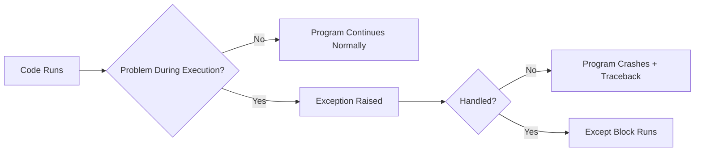

⋆˚꩜｡

## SyntaxError

A **SyntaxError** happens *before* execution — Python is saying "I can't even read this."

♡ Key Points

- Happens during **parsing**, not during execution.
- Usually caused by typos, missing colons, or bad indentation.
- Cannot be caught with try/except because the code never actually runs.

♡ Example

```python
if True
    print("Hello")
```

♡ Output

```
SyntaxError: expected ':'
```

♡ Notes

SyntaxError ≠ runtime exception. try/except will not save you here — you have to fix the code itself.

⋆˚꩜｡

## ValueError

A **ValueError** happens when a function gets the *right type* of input but the *wrong value*.

♡ Key Points

- Common with `int()`, `float()` conversions on bad strings.
- The type is correct (it's a string) but the content isn't valid.

♡ Example

```python
age = int("hello")
```

♡ Output

```
ValueError: invalid literal for int() with base 10: 'hello'
```

♡ Notes

`int("12")` works because `"12"` is a valid number string, but `int("twelve")` fails — same type, different value.

| Code | Result |
|---|---|
| `int("12")` | Works — value is a valid number string |
| `int("twelve")` | Fails — ValueError, value is not a valid number string |

⋆˚꩜｡

## Why Exception Handling is Important

Without exception handling, **one bad input can crash the entire program**. In a real app, a single wrong keystroke should not take down the whole thing.

♡ Key Points

- Keeps programs running smoothly instead of crashing.
- Lets you give the user a friendly message instead of a scary traceback.
- Makes code more **robust** and **professional**.

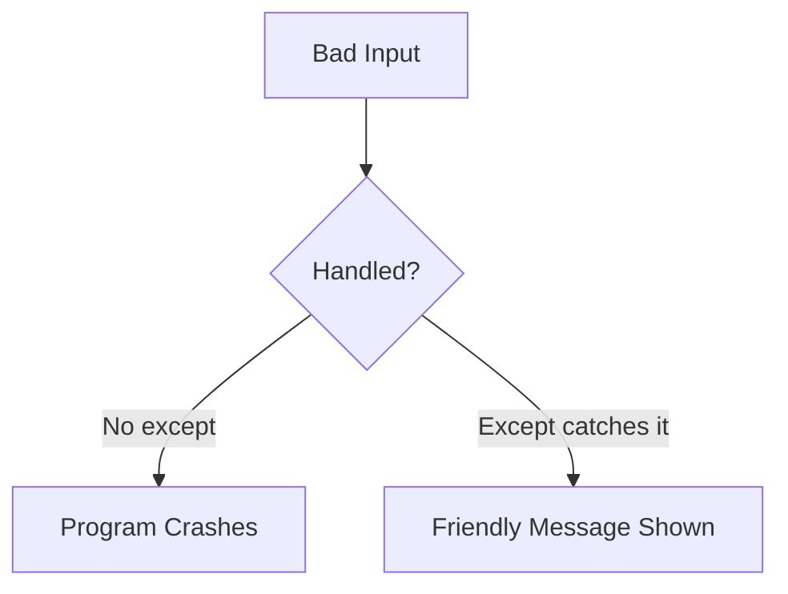

⋆˚꩜｡

## try

The `try` block holds the code that *might* cause a problem. It tells Python: "run this, but be ready to catch me if it fails."

♡ Key Points

- Code that might raise an exception goes inside `try`.
- If no error occurs, the rest of `try` runs normally.
- If an error occurs, Python immediately jumps to `except`.

♡ Syntax

```python
try:
    # risky code
    pass
except SomeError:
    # what to do if it fails
    pass
```

♡ Example

```python
try:
    number = int(input("Enter a number: "))
    print(number)
except ValueError:
    print("Invalid input")
```

♡ Notes

`try` on its own is incomplete — it always needs at least one `except` after it.

⋆˚꩜｡

## except

`except` is where the error is "caught" and handled instead of letting the program die.

♡ Key Points

- Runs **only if** an exception occurred in `try`.
- Skipped completely if there was no error.
- Can catch a specific exception type or a general one.

♡ Example

```python
try:
    number = int(input("Enter a number: "))
except ValueError:
    print("That's not a valid number!")
```

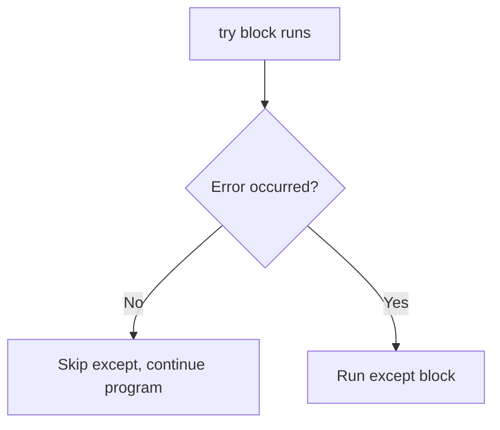

⋆˚꩜｡

## Catching Specific Exceptions

It's better to catch the **exact** exception expected rather than catching everything blindly.

♡ Key Points

- Write the exception type right after `except`.
- `except ValueError:` only catches ValueErrors — nothing else.
- Makes debugging easier because the exact problem is known.

♡ Example

```python
try:
    number = int(input("Enter a number: "))
except ValueError:
    print("Please enter digits only.")
```

⋆˚꩜｡

## General except vs Specific except

| | Specific except | General except |
|---|---|---|
| Catches | Only the exact error type | **Any** exception |
| Debugging | Easier — the issue is known | Harder — hides the real problem |
| Best Practice | Recommended | Use with caution |

♡ Example

```python
# Specific
try:
    x = int("abc")
except ValueError:
    print("Value error caught")

# General
try:
    x = int("abc")
except:
    print("Something went wrong")
```

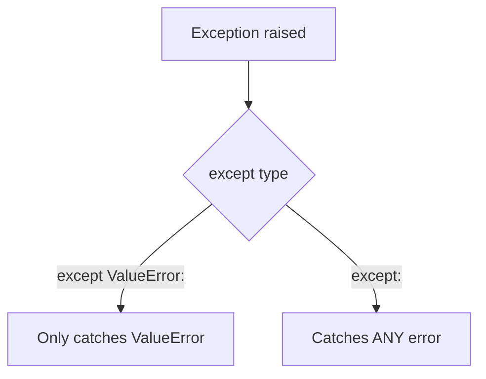

♡ Notes

A bare `except:` catches *everything*, even errors that weren't expected — which can hide real bugs. Avoid it unless it's really needed.

⋆˚꩜｡

## Input Validation

This uses everything above to make sure the user actually gives valid input before the program moves on.

♡ Key Points

- Combine `try`/`except` with loops to keep asking until input is valid.
- Prevents the program from crashing on bad input.

♡ Example

```python
try:
    age = int(input("Enter your age: "))
    print(f"You are {age} years old.")
except ValueError:
    print("Please enter a valid number.")
```

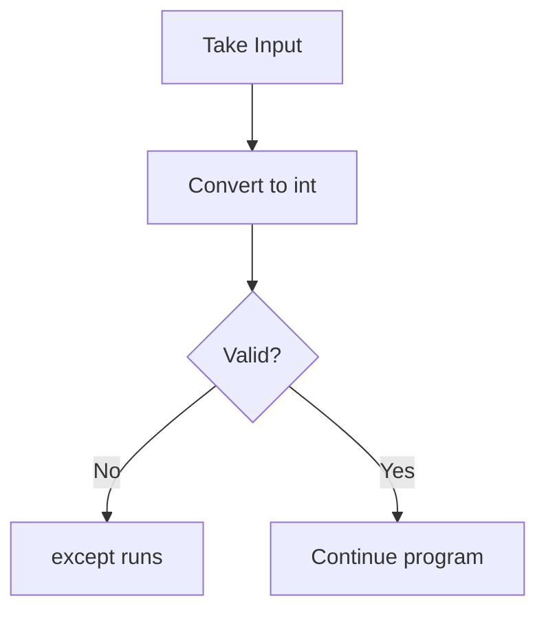

⋆˚꩜｡

## Exception Handling Inside for Loops

Putting `try`/`except` *inside* a `for` loop means bad input doesn't stop the whole loop — it just skips that one round.

♡ Key Points

- `try`/`except` goes **inside** the loop body.
- One bad input doesn't kill the entire loop.
- Useful for processing lists of user inputs.

♡ Example

```python
values = ["10", "abc", "5"]

for v in values:
    try:
        print(int(v))
    except ValueError:
        print(f"Skipping invalid value: {v}")
```

♡ Output

```
10
Skipping invalid value: abc
5
```

♡ Execution Trace

| Iteration | Value (v) | Result |
|---|---|---|
| 1 | "10" | Converts fine → prints 10 |
| 2 | "abc" | ValueError → "Skipping invalid value: abc" |
| 3 | "5" | Converts fine → prints 5 |

⋆˚꩜｡

## Limiting Attempts

Sometimes the user shouldn't be allowed to try forever — a counter can **limit attempts**.

♡ Key Points

- Use a variable to track how many tries have been made.
- Combine with a loop (`for` or `while`) to stop after a set number.

♡ Example

```python
attempts = 3

for i in range(attempts):
    try:
        number = int(input("Enter a number: "))
        print("Success:", number)
        break
    except ValueError:
        print("Invalid input, try again.")
```

⋆˚꩜｡

## break Statement

`break` **stops the loop early** once the goal is achieved — like getting a valid input.

♡ Key Points

- Immediately exits the nearest loop.
- Used once the goal (valid input, success, etc.) is achieved.
- Without it, the loop would keep going even after success.

♡ Example

```python
for i in range(5):
    if i == 3:
        break
    print(i)
```

♡ Output

```
0
1
2
```

⋆˚꩜｡

## Pythonic for Loop Version

Instead of manually counting attempts, `for i in range(attempts):` is already the Pythonic way — clean and readable without extra counter variables.

♡ Key Points

- `for i in range(attempts):` is cleaner than a manual `while` counter.
- No need to manually increment/decrement a variable.

♡ Example

```python
for attempt in range(3):
    try:
        num = int(input("Enter a number: "))
        print("Got it:", num)
        break
    except ValueError:
        print("Try again.")
```

⋆˚꩜｡

## for...else

The `else` in a `for` loop runs **only if the loop finished without hitting `break`**.

♡ Key Points

- `else` runs when the loop completes naturally.
- `else` is **skipped** if `break` was used.
- Useful for "did we succeed within the attempts?" checks.

♡ Example

```python
for attempt in range(3):
    try:
        num = int(input("Enter a number: "))
        break
    except ValueError:
        print("Invalid, try again.")
else:
    print("You failed all attempts.")
```

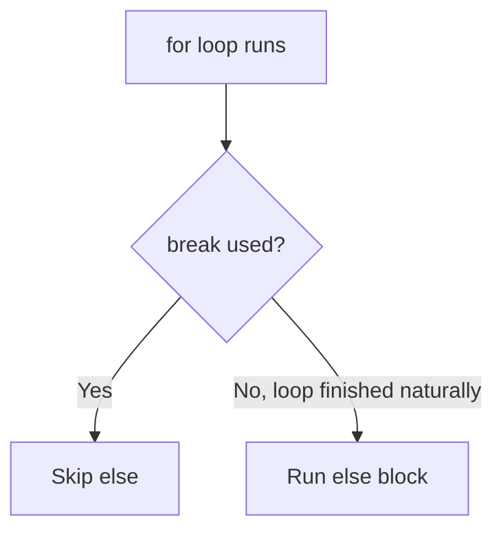

⋆˚꩜｡

## Exception Handling Inside while Loops

Same idea as `for` loops, but with `while` — the loop keeps going **until** the input is valid.

♡ Key Points

- Loop keeps running as long as the condition is `True`.
- `break` is used to exit once input is valid.

♡ Example

```python
while True:
    try:
        number = int(input("Enter a number: "))
        break
    except ValueError:
        print("Invalid input, try again.")

print("You entered:", number)
```

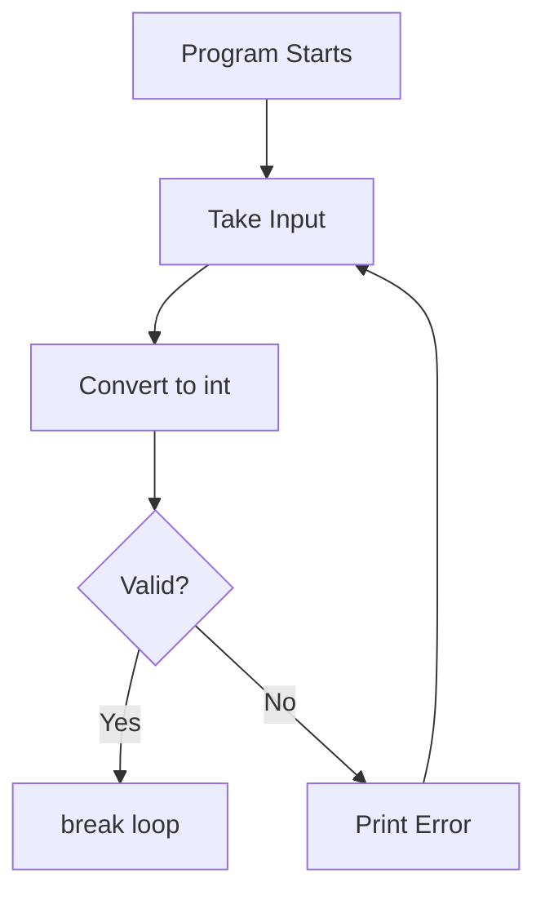

⋆˚꩜｡

## try...except...else

A THIRD block — `else` — runs only if the `try` block succeeds with **no errors at all**.

♡ Key Points

- `else` runs **only if** no exception was raised.
- Goes after all `except` blocks.
- Keeps "success code" separate from "risky code."

♡ Example

```python
try:
    number = int(input("Enter a number: "))
except ValueError:
    print("Invalid input.")
else:
    print("Great, you entered:", number)
```

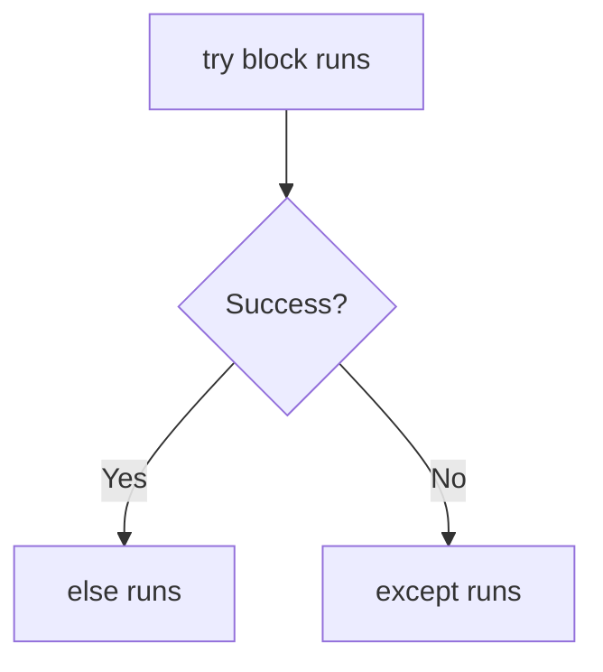

⋆˚꩜｡

## Why else Exists

Why not just put success code at the end of `try`? Here's the reasoning.

♡ Key Points

- Keeps the `try` block focused **only** on the risky line.
- `else` code won't accidentally get caught by `except` if it errors.
- Makes it clear which code is "risky" vs "safe to run after success."

♡ Notes

If success code is placed inside `try` itself, and that success code *also* throws an error, it gets swallowed by `except` — which can hide bugs. `else` avoids that trap.

⋆˚꩜｡

## pass Statement

The `pass` statement does **nothing** — it's a placeholder that lets code run without any action.

♡ Definition

`pass` is a null operation. When Python executes it, nothing happens. It exists purely to satisfy Python's requirement that a block cannot be empty.

♡ Key Points

- Used when a statement is syntactically required but no action is needed.
- Common inside `except`, `if`, loops, or empty functions/classes while still writing code.
- Does not stop a loop, does not raise anything, does not skip anything — it just moves on.

♡ Syntax

```python
if condition:
    pass  # placeholder, does nothing
```

♡ Example — Empty except block

```python
try:
    number = int(input("Enter a number: "))
except ValueError:
    pass  # silently ignore the error
```

♡ Example — Skeleton code while planning

```python
def calculate_total():
    pass  # will write logic later

for item in range(5):
    pass  # loop runs but does nothing yet
```

♡ Common Mistakes

| Mistake | Problem | Fix |
|---|---|---|
| Using `pass` where an error should be shown | Errors get silently swallowed, hiding bugs | Use `pass` only when silence is intentional |
| Confusing `pass` with `continue` | `pass` does nothing and moves to the next line; `continue` skips to the next loop iteration | Use `continue` inside loops to skip an iteration |
| Confusing `pass` with `break` | `pass` does not exit a loop | Use `break` to exit a loop early |

♡ Quick Recap

- `pass` = do nothing, just a placeholder.
- Needed because Python does not allow empty code blocks.
- Should be used carefully in `except` blocks — silencing every error is not good practice.

⋆˚꩜｡

## Functions with try/except

Exception handling can be placed **inside a function**, so the function protects itself from crashing the whole program when it's called.

♡ Definition

A function with try/except wraps its risky logic in a `try` block and defines its own recovery behavior in `except`, so any code calling the function does not need to repeat the same error handling.

♡ Key Points

- The `try`/`except` lives inside the function body.
- The function can `return` a safe value if something goes wrong, instead of crashing.
- Keeps error-handling logic in one place instead of repeating it everywhere the function is used.

♡ Syntax

```python
def function_name(parameter):
    try:
        # risky code using parameter
        pass
    except SomeError:
        # fallback behavior
        pass
```

♡ Example — Safe conversion function

```python
def safe_int(value):
    try:
        return int(value)
    except ValueError:
        print(f"'{value}' is not a valid number.")
        return None

print(safe_int("10"))    # 10
print(safe_int("abc"))   # None, with a message
```

♡ Output

```
10
'abc' is not a valid number.
None
```

♡ Example — Function with try/except/else

```python
def divide(a, b):
    try:
        result = a / b
    except ZeroDivisionError:
        print("Cannot divide by zero.")
        return None
    else:
        return result

print(divide(10, 2))  # 5.0
print(divide(10, 0))  # Cannot divide by zero. -> None
```

♡ Why It Matters

- Calling code stays clean — it just calls the function and checks the result.
- Error handling logic is written once, not repeated at every call site.
- Functions become more reusable and predictable.

♡ Quick Recap

- try/except can go inside a function body, wrapping the risky part.
- The function can return a safe fallback value instead of crashing.
- else can still be used inside a function's try block for "success only" logic.

⋆˚꩜｡

## Putting It All Together: Loops + Functions + try/except + pass

All the pieces — loops, functions, try/except, and pass — can be combined into one structure: a function that keeps asking for input in a loop, validates it with try/except, and uses pass where no action is needed.

♡ Key Points

- The function contains the loop.
- The loop contains the try/except.
- pass is used for cases that should be silently ignored (used carefully).
- break exits the loop once valid input is received.
- for...else or a return value confirms whether the attempts succeeded.

♡ Example — Full combined pattern

```python
def get_valid_number(max_attempts=3):
    for attempt in range(max_attempts):
        try:
            number = int(input("Enter a number: "))
        except ValueError:
            print("Invalid input, try again.")
            continue
        else:
            return number
    return None


result = get_valid_number()

if result is not None:
    print("You entered:", result)
else:
    print("No valid number was entered.")
```

♡ Line-by-Line Explanation

| Line | What Happens |
|---|---|
| `def get_valid_number(max_attempts=3):` | Defines a function with a default limit of 3 attempts |
| `for attempt in range(max_attempts):` | Loops up to `max_attempts` times |
| `try:` | Marks the risky line that follows |
| `number = int(input(...))` | Attempts to convert user input to an integer |
| `except ValueError:` | Catches only invalid number input |
| `continue` | Skips to the next loop attempt instead of stopping |
| `else:` | Runs only if the conversion succeeded |
| `return number` | Immediately exits the function with the valid number |
| `return None` | Runs if the loop finishes without ever returning (all attempts failed) |

♡ Example — Same pattern using while loop and pass

```python
def process_values(values):
    for v in values:
        try:
            num = int(v)
        except ValueError:
            pass  # silently skip invalid entries
        else:
            print(f"Processed: {num}")


process_values(["10", "abc", "20", "xyz", "5"])
```

♡ Output

```
Processed: 10
Processed: 20
Processed: 5
```

♡ Execution Trace

| Iteration | Value | try succeeds? | Action |
|---|---|---|---|
| 1 | "10" | Yes | else runs → "Processed: 10" |
| 2 | "abc" | No | except runs → pass (skipped silently) |
| 3 | "20" | Yes | else runs → "Processed: 20" |
| 4 | "xyz" | No | except runs → pass (skipped silently) |
| 5 | "5" | Yes | else runs → "Processed: 5" |

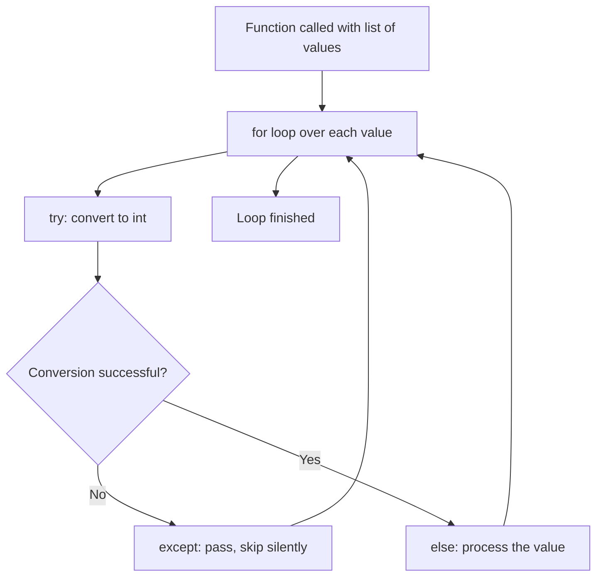

♡ Best Practices

- Use `continue` when a message should be shown before moving to the next attempt.
- Use `pass` only when skipping silently is genuinely the correct behavior.
- Use `else` inside the loop to separate "success" logic from the risky conversion line.
- Keep the function's return value clear — `None` (or similar) should represent failure so calling code can check it.

♡ Quick Recap

- A function can hold a loop, and that loop can hold a try/except.
- `pass` silently skips bad cases; `continue` skips but can still show a message; `break`/`return` exits early on success.
- This combined pattern is the standard shape of a robust input-validation function.

⋆˚꩜｡

## Variable Scope

Scope means **where a variable can be seen/used** in the code.

♡ Key Points

- A variable only exists within the "area" it was created in.
- Trying to use it outside that area causes an error.

⋆˚꩜｡

## What Creates Scope in Python

**Loops and if/else blocks do NOT create their own scope** in Python — unlike functions.

♡ Key Points

- `for`, `while`, `if`, `try/except` — none of these create a new scope.
- **Functions** are what create a new scope.
- A variable created inside a loop is still accessible outside it (as long as the loop ran at least once).

♡ Example

```python
for i in range(3):
    x = i

print(x)  # Works! x = 2
```

♡ Notes

This is different from many other languages, where loops do create their own scope. In Python, they don't.

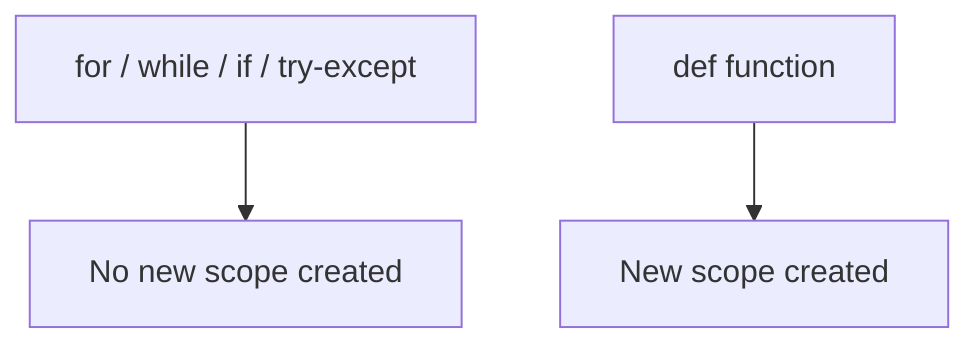

⋆˚꩜｡

## NameError

A **NameError** happens when a variable is used that Python has no record of at all.

♡ Key Points

- Means the variable was **never defined anywhere** Python can see.
- Different from just "empty" — it literally doesn't exist yet.

♡ Example

```python
print(total)
```

♡ Output

```
NameError: name 'total' is not defined
```

⋆˚꩜｡

## Variable Never Assigned vs Variable Out of Scope

This distinction is one of the trickier parts of exception handling and scope.

| Situation | What Happens | Example |
|---|---|---|
| Never assigned | Python has never seen this name anywhere | `print(total)` with no `total` defined ever |
| Out of scope | Variable exists, but only inside a function, so it's invisible outside | Variable created inside a function, used outside it |

♡ Example

```python
def my_func():
    y = 10

print(y)  # NameError — y only exists inside my_func
```

♡ Output

```
NameError: name 'y' is not defined
```

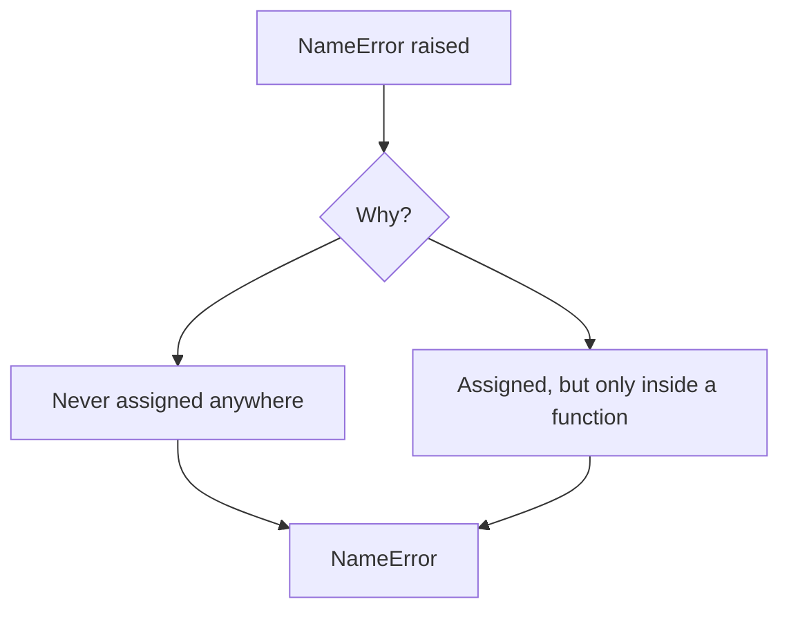

♡ Notes

Both cases raise the exact same `NameError`, but the *reason* is different — one never existed, the other exists but is hidden by function scope.

⋆˚꩜｡

## Different Valid Ways of Writing Exception Handling

There isn't just ONE "correct" way to structure try/except — several valid patterns exist depending on the situation.

♡ Key Points

- Single `except` for one error type.
- Multiple `except` blocks for different error types.
- `try/except/else` when "success-only" code is needed.
- `try/except` inside loops for repeated validation.
- `try/except` inside a function for reusable, self-contained validation.
- `pass` inside `except` when silently ignoring an error is genuinely correct.

♡ Example — Multiple except blocks

```python
try:
    num = int(input("Enter number: "))
    result = 10 / num
except ValueError:
    print("Not a valid number.")
except ZeroDivisionError:
    print("Can't divide by zero.")
```

♡ Comparison Table

| Pattern | When to Use |
|---|---|
| Single except | Only one type of error is expected |
| Multiple except | Different errors need different messages |
| try/except/else | Success code should run only if nothing failed |
| try/except in a loop | Repeated input validation, retry logic |
| try/except in a function | Reusable, self-contained error handling |
| except with pass | Errors that should be silently ignored on purpose |

⋆˚꩜｡

## Writing Cleaner and More Pythonic Code

"Pythonic" means: readable, simple, and using Python's own tools instead of overcomplicating things.

♡ Key Points

- Catch **specific** exceptions instead of bare `except:`.
- Use `for...else` instead of manual "success flag" variables.
- Keep `try` blocks small — only wrap the risky line, not everything.
- Use `else` in try/except to separate "safe" code from "risky" code.
- Wrap reusable validation logic inside a function instead of repeating it.
- Use `pass` sparingly and only when silence is the correct behavior.

⋆˚꩜｡

## Key Takeaways

- **Exceptions** happen at runtime; **SyntaxErrors** happen before code even runs.
- `try` = risky code, `except` = what to do if it fails, `else` = what to do if it succeeds.
- Always prefer **specific** except over a bare/general one.
- `break` exits a loop early; `for...else`'s `else` only runs if `break` was **never** hit.
- `pass` is a placeholder that does nothing — not the same as `continue` or `break`.
- Functions can contain their own try/except, returning a safe fallback value instead of crashing.
- Loops, functions, try/except, and pass can all be combined into one robust validation pattern.
- Loops and if/else do **not** create scope — only functions do.
- `NameError` can mean "never defined" OR "defined but out of scope" — same error, different cause.
- Combining try/except with loops + attempt limits = solid input validation.
- Pythonic code = specific exceptions + clean structure + minimal risky code inside `try`.