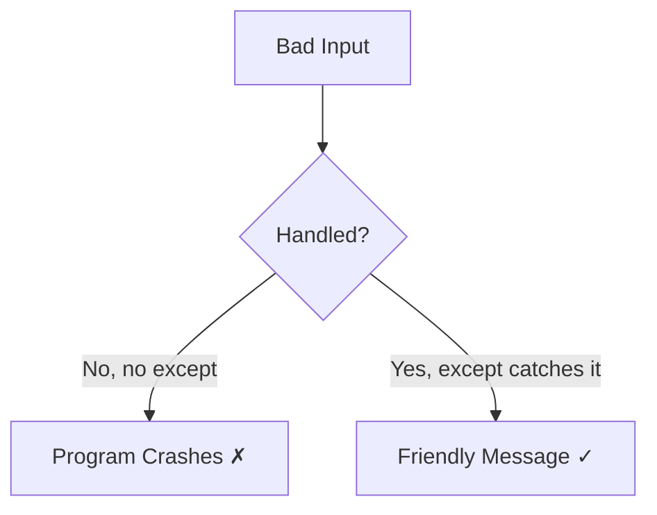
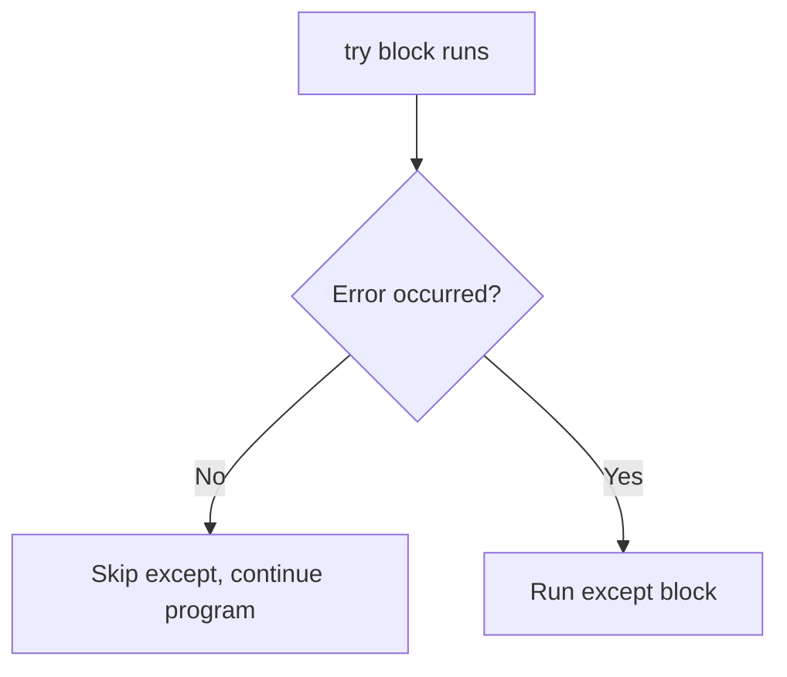
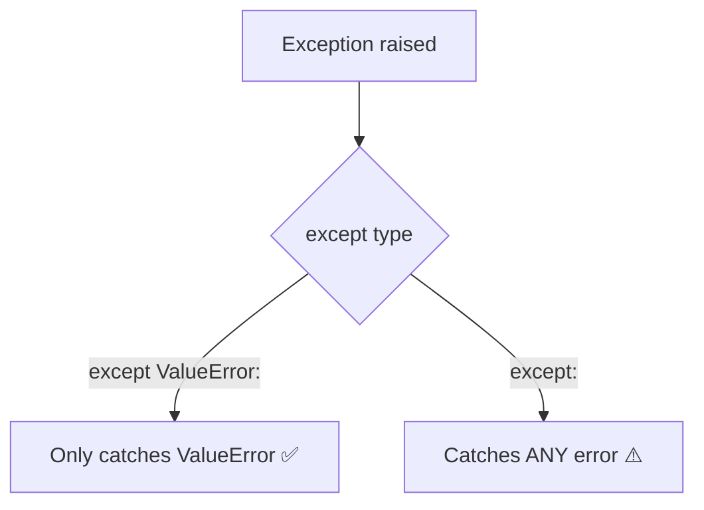
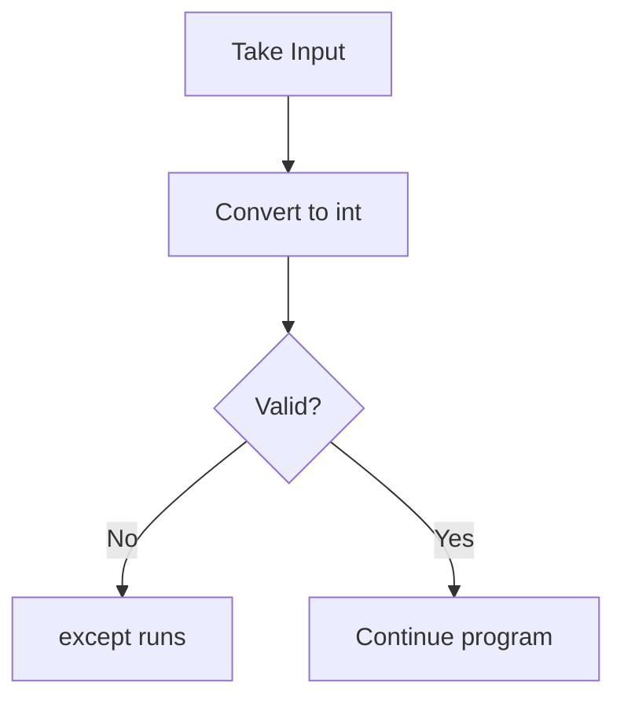
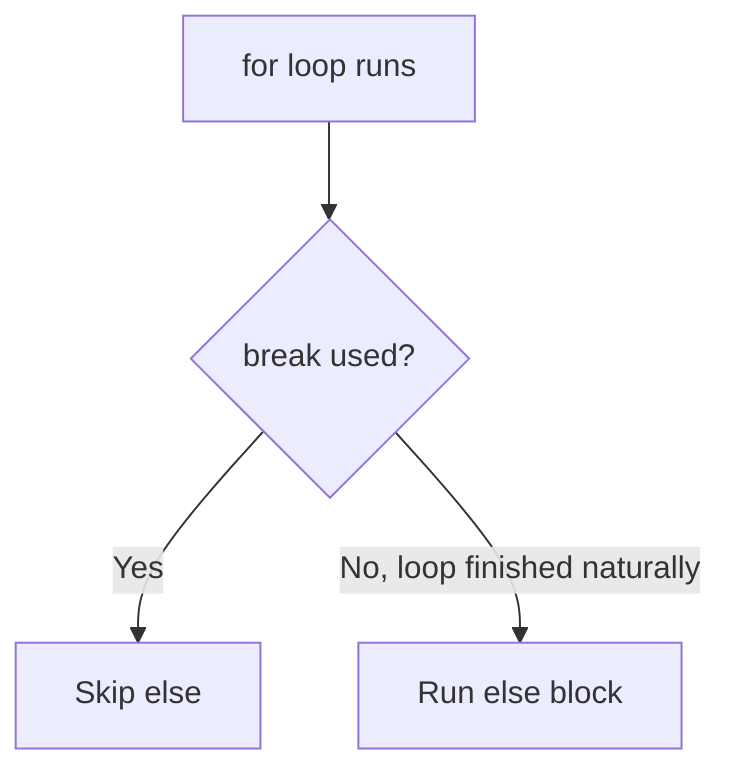
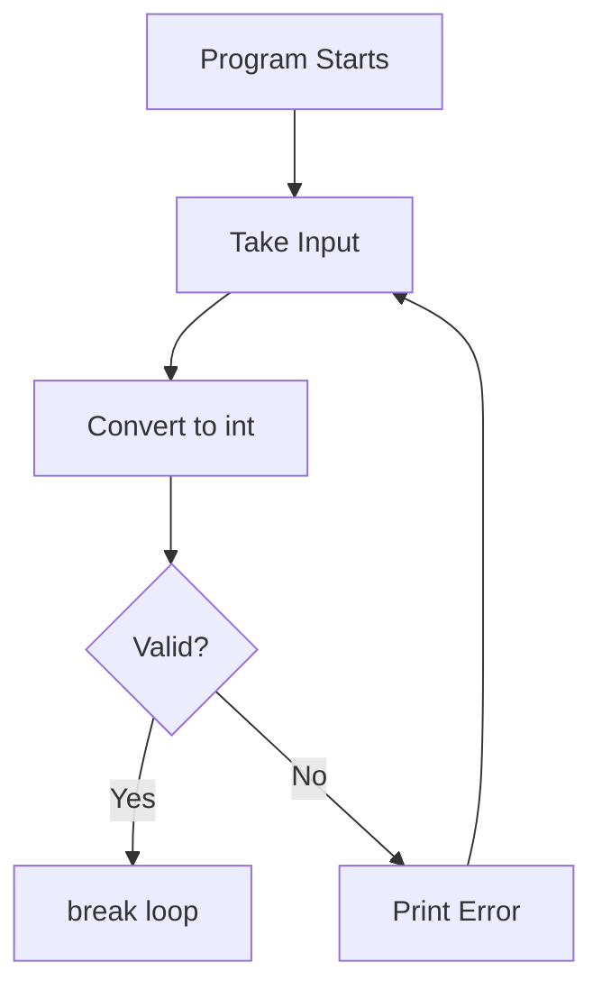
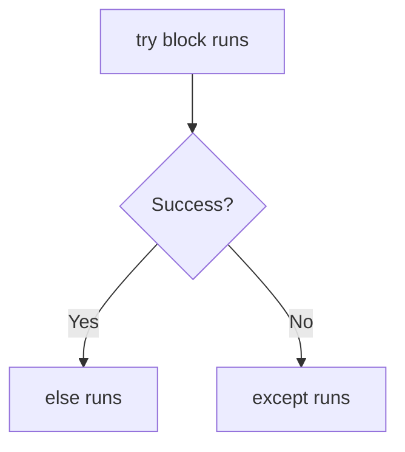
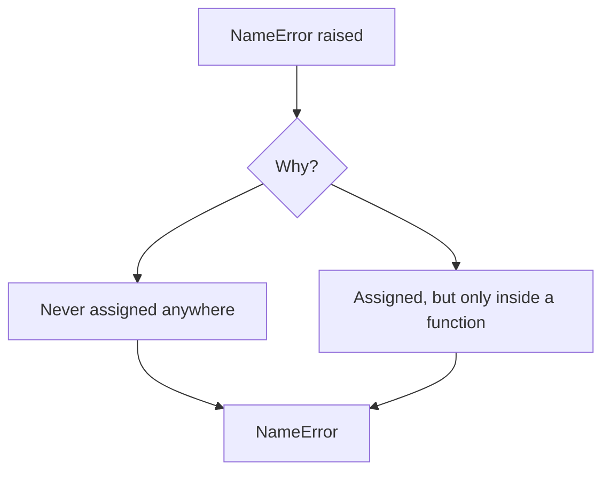

# Python Lecture 7: Exception Handling

Today's lecture was all about **exceptions** — what they are, why they happen, and how to actually handle them instead of letting your program crash. Honestly this topic felt scary at first (so many keywords: try, except, else...) but once I saw the flow, it clicked. Writing this down the way I'd explain it to a friend before an exam ♡

---

## Table of Contents

- [What are Exceptions?](#what-are-exceptions)
- [SyntaxError](#syntaxerror)
- [ValueError](#valueerror)
- [Why Exception Handling is Important](#why-exception-handling-is-important)
- [try](#try)
- [except](#except)
- [Catching Specific Exceptions](#catching-specific-exceptions)
- [General except vs Specific except](#general-except-vs-specific-except)
- [Input Validation](#input-validation)
- [Exception Handling Inside for Loops](#exception-handling-inside-for-loops)
- [Limiting Attempts](#limiting-attempts)
- [break Statement](#break-statement)
- [Pythonic for Loop Version](#pythonic-for-loop-version)
- [for...else](#forelse)
- [Exception Handling Inside while Loops](#exception-handling-inside-while-loops)
- [try...except...else](#tryexceptelse)
- [Why else Exists](#why-else-exists)
- [Variable Scope](#variable-scope)
- [What Creates Scope in Python](#what-creates-scope-in-python)
- [NameError](#nameerror)
- [Variable Never Assigned vs Variable Out of Scope](#variable-never-assigned-vs-variable-out-of-scope)
- [Different Valid Ways of Writing Exception Handling](#different-valid-ways-of-writing-exception-handling)
- [Writing Cleaner and More Pythonic Code](#writing-cleaner-and-more-pythonic-code)
- [Key Takeaways](#key-takeaways)

---

## What are Exceptions?

Okay so basically, an **exception** is what Python throws at you when something goes wrong *while the code is running*. Not before, not during "typing" — while it's actually executing.

I understood that exceptions are Python's way of saying "hey, I hit a problem, and I don't know how to continue unless you tell me what to do."

### Key Points

- An exception is an **error that happens during execution**.
- If it's not handled, the program **stops completely**.
- Python gives you a *traceback* so you know exactly where it broke.

### Example

```python
print(10 / 0)
```

### Output

```
ZeroDivisionError: division by zero
```

### Important Note

> ♡ A lot of beginners (me included) think "error" and "exception" are totally different things — they're basically the same idea, exceptions are just errors that happen at runtime.

---

## SyntaxError

This one confused me a bit at first because it doesn't even let your code run. A **SyntaxError** happens *before* execution — Python is basically saying "I can't even read this."

### Key Points

- Happens during **parsing**, not during execution.
- Usually caused by typos, missing colons, or bad indentation.
- You **cannot** catch a SyntaxError with try/except because the code never actually runs.

### Example

```python
if True
    print("Hello")
```

### Output

```
SyntaxError: expected ':'
```

### Important Note

> ꩜ SyntaxError ≠ runtime exception. try/except won't save you here — you just have to fix the code.

---

## ValueError

This is the one I ran into the most while practicing input validation. A **ValueError** happens when a function gets the *right type* of input but the *wrong value*.

### Key Points

- Common with `int()`, `float()` conversions on bad strings.
- The type is correct (it's a string) but the content isn't valid.

### Example

```python
age = int("hello")
```

### Output

```
ValueError: invalid literal for int() with base 10: 'hello'
```

### Important Note

> One thing that confused me: `int("12")` works fine because `"12"` is a valid number string, but `int("twelve")` fails — same type, different value.

---

## Why Exception Handling is Important

I realized that without exception handling, **one bad input can crash your entire program**. That's honestly wild when you think about real apps — imagine a banking app crashing just because someone typed a letter instead of a number.

### Key Points

- Keeps programs running smoothly instead of crashing.
- Lets you give the user a friendly message instead of a scary traceback.
- Makes code more **robust** and **professional**.



---

## try

The `try` block is where I put the code that *might* cause a problem. I'm basically telling Python: "try running this, but be ready to catch me if it fails."

### Key Points

- Code that might raise an exception goes inside `try`.
- If no error occurs, the rest of `try` runs normally.
- If an error occurs, Python immediately jumps to `except`.

### Example

```python
try:
    number = int(input("Enter a number: "))
    print(number)
```

### Important Note

> `try` on its own is incomplete — it always needs at least one `except` after it.

---

## except

`except` is where I "catch" the error and decide what to do about it instead of letting the program die.

### Key Points

- Runs **only if** an exception occurred in `try`.
- Skipped completely if there was no error.
- Can catch a specific exception type or a general one.

### Example

```python
try:
    number = int(input("Enter a number: "))
except ValueError:
    print("That's not a valid number!")
```

### Flow



---

## Catching Specific Exceptions

I learned it's way better to catch the **exact** exception you're expecting rather than catching everything blindly.

### Key Points

- Write the exception type right after `except`.
- `except ValueError:` only catches ValueErrors — nothing else.
- Makes debugging easier because you know exactly what you're guarding against.

### Example

```python
try:
    number = int(input("Enter a number: "))
except ValueError:
    print("Please enter digits only.")
```

---

## General except vs Specific except

This comparison finally made things click for me.

| | Specific except | General except |
|---|---|---|
| Catches | Only the exact error type | **Any** exception |
| Debugging | Easier — you know the issue | Harder — hides the real problem |
| Best Practice | ✅ Recommended | ⚠️ Use with caution |

### Example

```python
# Specific
try:
    x = int("abc")
except ValueError:
    print("Value error caught")

# General
try:
    x = int("abc")
except:
    print("Something went wrong")
```



### Important Note

> ᨳଓ A bare `except:` catches *everything*, even errors you didn't expect — which can hide real bugs in your code. I learned to avoid it unless I really need it.

---

## Input Validation

This is basically *using* everything above to make sure the user actually gives valid input before the program moves on.

### Key Points

- Combine `try`/`except` with loops to keep asking until input is valid.
- Prevents the program from crashing on bad input.

### Example

```python
try:
    age = int(input("Enter your age: "))
    print(f"You are {age} years old.")
except ValueError:
    print("Please enter a valid number.")
```



---

## Exception Handling Inside for Loops

I practiced putting `try`/`except` *inside* a `for` loop so bad input doesn't stop the whole loop — it just skips that one round.

### Key Points

- `try`/`except` goes **inside** the loop body.
- One bad input doesn't kill the entire loop.
- Great for processing lists of user inputs.

### Example

```python
values = ["10", "abc", "5"]

for v in values:
    try:
        print(int(v))
    except ValueError:
        print(f"Skipping invalid value: {v}")
```

### Output

```
10
Skipping invalid value: abc
5
```

---

## Limiting Attempts

After practicing, I realized sometimes you don't want to let the user try forever — so I learned how to **limit attempts** using a counter.

### Key Points

- Use a variable to track how many tries have been made.
- Combine with a loop (`for` or `while`) to stop after a set number.

### Example

```python
attempts = 3

for i in range(attempts):
    try:
        number = int(input("Enter a number: "))
        print("Success:", number)
        break
    except ValueError:
        print("Invalid input, try again.")
```

---

## break Statement

`break` is what actually **stops the loop early** once we get what we want — like a valid input.

### Key Points

- Immediately exits the nearest loop.
- Used once the goal (valid input, success, etc.) is achieved.
- Without it, the loop would keep going even after success.

### Example

```python
for i in range(5):
    if i == 3:
        break
    print(i)
```

### Output

```
0
1
2
```

---

## Pythonic for Loop Version

One thing I discovered: instead of manually counting attempts with `range(attempts)`, that pattern *is* already the Pythonic way — clean and readable without extra counter variables.

### Key Points

- `for i in range(attempts):` is cleaner than a manual `while` counter.
- No need to manually increment/decrement a variable.

### Example

```python
for attempt in range(3):
    try:
        num = int(input("Enter a number: "))
        print("Got it:", num)
        break
    except ValueError:
        print("Try again.")
```

---

## for...else

This one confused me the FIRST time I saw it. The `else` in a `for` loop runs **only if the loop finished without hitting `break`**.

### Key Points

- `else` runs when the loop completes naturally.
- `else` is **skipped** if `break` was used.
- Great for "did we succeed within the attempts?" checks.

### Example

```python
for attempt in range(3):
    try:
        num = int(input("Enter a number: "))
        break
    except ValueError:
        print("Invalid, try again.")
else:
    print("You failed all attempts.")
```

### Flow



---

## Exception Handling Inside while Loops

Same idea as `for` loops, but with `while` — I keep looping **until** the input is valid.

### Key Points

- Loop keeps running as long as the condition is `True`.
- `break` is used to exit once input is valid.

### Example

```python
while True:
    try:
        number = int(input("Enter a number: "))
        break
    except ValueError:
        print("Invalid input, try again.")

print("You entered:", number)
```



---

## try...except...else

I discovered there's a THIRD block — `else` — that runs only if the `try` block succeeds with **no errors at all**.

### Key Points

- `else` runs **only if** no exception was raised.
- Goes after all `except` blocks.
- Keeps "success code" separate from "risky code."

### Example

```python
try:
    number = int(input("Enter a number: "))
except ValueError:
    print("Invalid input.")
else:
    print("Great, you entered:", number)
```

### Flow



---

## Why else Exists

At first I thought "why not just put that code at the end of try?" — but I understood the reasoning now.

### Key Points

- Keeps the `try` block focused **only** on the risky line.
- `else` code won't accidentally get caught by `except` if it errors.
- Makes it clear which code is "risky" vs "safe to run after success."

### Important Note

> ♡ If you put success code inside `try` itself, and that success code *also* throws an error, it'll get swallowed by `except` — which can hide bugs. `else` avoids that trap.

---

## Variable Scope

Scope basically means **where a variable can be seen/used** in your code. This part took me a minute to fully get.

### Key Points

- A variable only exists within the "area" it was created in.
- Trying to use it outside that area causes an error.

---

## What Creates Scope in Python

I learned something that genuinely surprised me: **loops and if/else blocks do NOT create their own scope** in Python (unlike functions).

### Key Points

- `for`, `while`, `if`, `try/except` — none of these create a new scope.
- **Functions** are what create a new scope.
- A variable created inside a loop is still accessible outside it (as long as the loop ran at least once).

### Example

```python
for i in range(3):
    x = i

print(x)  # Works! x = 2
```

### Important Note

> ᨳଓ This is different from a lot of other languages — coming from that mindset, I assumed loops made their own scope. In Python, they don't!

---

## NameError

A **NameError** happens when you try to use a variable that Python has no record of at all.

### Key Points

- Means the variable was **never defined anywhere** Python can see.
- Different from just "empty" — it literally doesn't exist yet.

### Example

```python
print(total)
```

### Output

```
NameError: name 'total' is not defined
```

---

## Variable Never Assigned vs Variable Out of Scope

This distinction was honestly the most confusing part of today's lecture, but I finally get it now.

| Situation | What Happens | Example |
|---|---|---|
| Never assigned | Python has never seen this name anywhere | `print(total)` with no `total` defined ever |
| Out of scope | Variable exists, but only inside a function, so it's invisible outside | Variable created inside a function, used outside it |

### Example

```python
def my_func():
    y = 10

print(y)  # NameError — y only exists inside my_func
```

### Output

```
NameError: name 'y' is not defined
```



### Important Note

> Both cases raise the exact same `NameError`, but the *reason* is different — one never existed, the other exists but is hidden by function scope.

---

## Different Valid Ways of Writing Exception Handling

One thing I discovered is there isn't just ONE "correct" way to structure try/except — there are several valid patterns depending on the situation.

### Key Points

- Single `except` for one error type.
- Multiple `except` blocks for different error types.
- `try/except/else` when you need "success-only" code.
- `try/except` inside loops for repeated validation.

### Example

```python
# Multiple except blocks
try:
    num = int(input("Enter number: "))
    result = 10 / num
except ValueError:
    print("Not a valid number.")
except ZeroDivisionError:
    print("Can't divide by zero.")
```

---

## Writing Cleaner and More Pythonic Code

After practicing all of this, I realized "Pythonic" basically means: readable, simple, and using Python's own tools instead of overcomplicating things.

### Key Points

- Catch **specific** exceptions instead of bare `except:`.
- Use `for...else` instead of manual "success flag" variables.
- Keep `try` blocks small — only wrap the risky line, not everything.
- Use `else` in try/except to separate "safe" code from "risky" code.

---

## Key Takeaways

> ♡ Quick revision before the exam!

- **Exceptions** happen at runtime; **SyntaxErrors** happen before code even runs.
- `try` = risky code, `except` = what to do if it fails, `else` = what to do if it succeeds.
- Always prefer **specific** except over a bare/general one.
- `break` exits a loop early; `for...else`'s `else` only runs if `break` was **never** hit.
- Loops and if/else do **not** create scope — only functions do.
- `NameError` can mean "never defined" OR "defined but out of scope" — same error, different cause.
- Combining try/except with loops + attempt limits = solid input validation.
- Pythonic code = specific exceptions + clean structure + minimal risky code inside `try`.

---

## Follow Me

If you enjoyed these notes, you'll probably enjoy the rest too.

Instagram: [@mehrunnisa.ai](https://www.instagram.com/mehrunnisa.ai/)

SubStack: [The Epoch](https://theepoch.substack.com/)

YouTube: [@mehrunnisa.ai](https://www.youtube.com/@Mehrunnisa-ai)

Thank you for respecting the time and effort that went into creating these notes. Happy learning! ♡

Love You all!!!