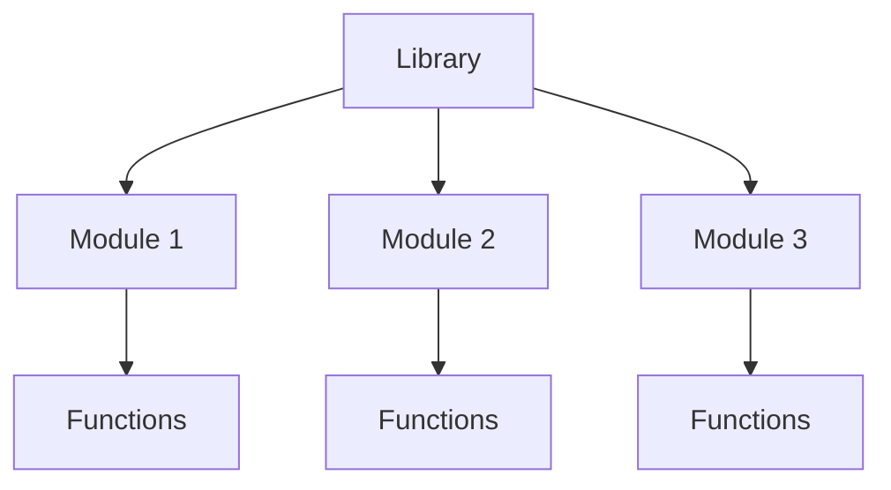
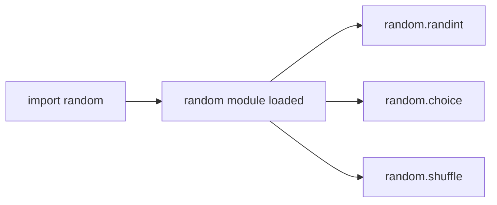
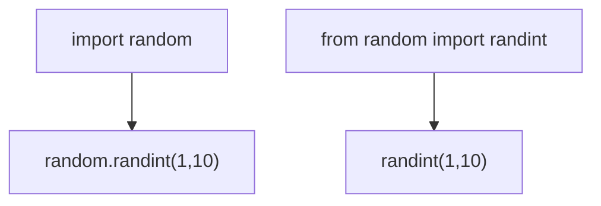
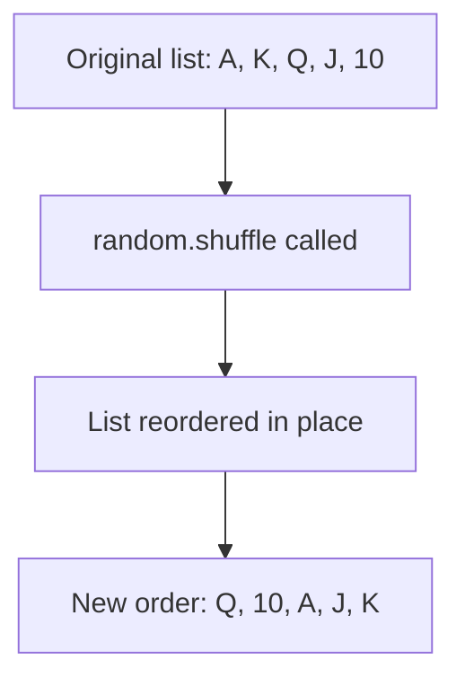
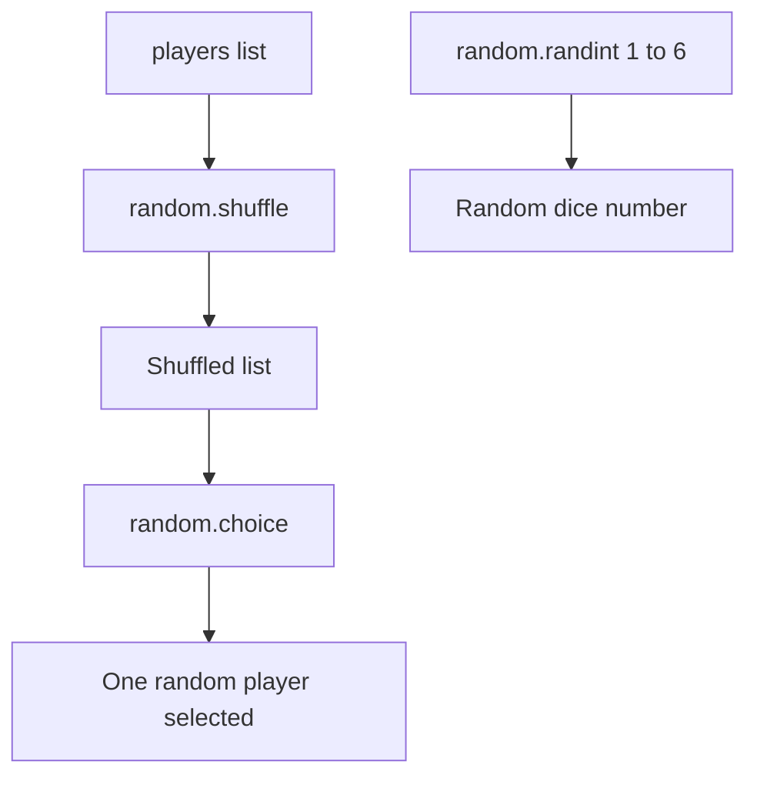
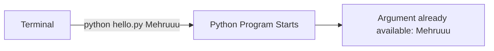
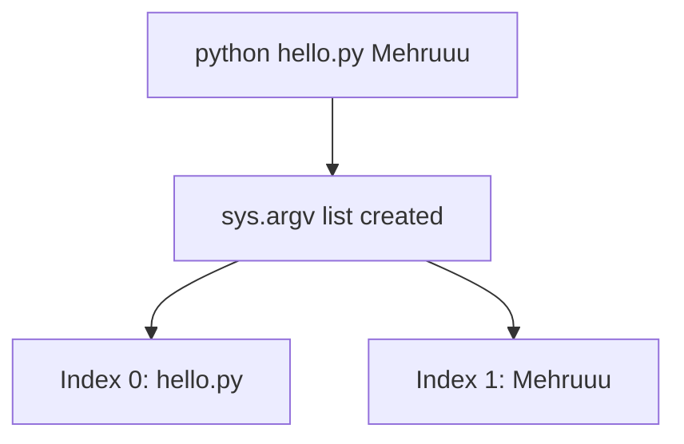
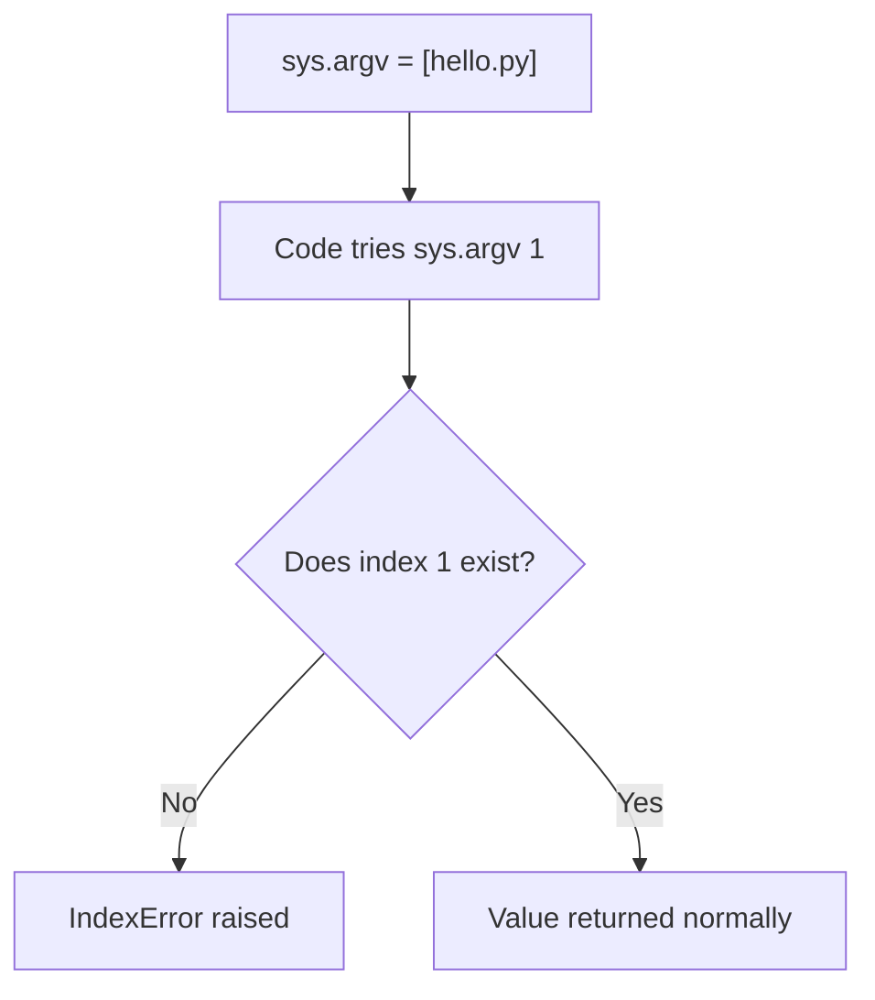
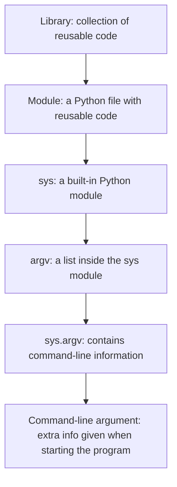

# Python Lecture 8: Libraries, Modules, random & Command-Line Arguments

## Table of Contents

**Part 1 — Libraries, Modules & random**

- [What are Libraries?](#what-are-libraries)
- [What are Modules?](#what-are-modules)
- [Library vs Module](#library-vs-module)
- [import Statement](#import-statement)
- [from Import](#from-import)
- [import vs from Import](#import-vs-from-import)
- [The random Module](#the-random-module)
- [choice()](#choice)
- [randint()](#randint)
- [shuffle()](#shuffle)
- [Comparing random Functions](#comparing-random-functions)
- [Common Mistakes (random)](#common-mistakes-random)
- [Key Takeaways — Libraries, Modules & random](#key-takeaways--libraries-modules--random)

**Part 2 — Command-Line Arguments & sys.argv**

- [What are Command-Line Arguments?](#what-are-command-line-arguments)
- [input() vs Command-Line Arguments](#input-vs-command-line-arguments)
- [The sys Module and argv](#the-sys-module-and-argv)
- [How sys.argv Works](#how-sysargv-works)
- [Accessing sys.argv Elements](#accessing-sysargv-elements)
- [Multiple Command-Line Arguments](#multiple-command-line-arguments)
- [Quotes and Multi-Word Arguments](#quotes-and-multi-word-arguments)
- [Joining Arguments with join()](#joining-arguments-with-join)
- [Slicing sys.argv](#slicing-sysargv)
- [sys.argv Values Are Strings](#sysargv-values-are-strings)
- [Checking Argument Count with len()](#checking-argument-count-with-len)
- [Missing Arguments and IndexError](#missing-arguments-and-indexerror)
- [input() vs sys.argv — Full Comparison](#input-vs-sysargv--full-comparison)
- [Why Use Command-Line Arguments?](#why-use-command-line-arguments)
- [The Complete Relationship](#the-complete-relationship)
- [Common Mistakes (sys.argv)](#common-mistakes-sysargv)
- [Key Takeaways — Command-Line Arguments & sys.argv](#key-takeaways--command-line-arguments--sysargv)

---

## What are Libraries?

A **library** is a collection of pre-written code (modules and functions) that can be reused instead of writing everything from scratch.

♡ Key Points

- Saves time — someone already wrote and tested this code.
- Python comes with a **standard library** built in (no installation needed).
- Extra libraries can also be installed separately (like `numpy`, `pandas`).
- A library is usually made up of many smaller **modules** grouped together.



⋆˚꩜｡

## What are Modules?

A **module** is a single Python file containing code — functions, variables, or classes — that can be imported and used in another file.

♡ Key Points

- A module is basically a `.py` file with reusable code inside it.
- `random` is an example of a built-in module.
- Modules keep code organized instead of writing everything in one giant file.
- One library can contain many modules.

♡ Syntax

```python
import module_name
```

⋆˚꩜｡

## Library vs Module

| | Library | Module |
|---|---|---|
| Size | Larger — can contain many modules | Smaller — a single file |
| Contains | Multiple modules | Functions, variables, classes |
| Example | Python Standard Library | `random`, `math`, `os` |

⋆˚꩜｡

## import Statement

`import` is how a module is brought into a Python file so its functions can be used.

♡ Definition

`import` loads an entire module, making everything inside it accessible using `module_name.function_name()`.

♡ Key Points

- Must be written at the top of the file (by convention).
- Without importing, Python has no idea the module exists.
- After importing, functions are accessed with **dot notation**.

♡ Syntax

```python
import random
```

♡ Example

```python
import random

print(random.randint(1, 10))
```



⋆˚꩜｡

## from Import

`from` allows importing **specific** parts of a module instead of the whole thing.

♡ Definition

`from module_name import function_name` brings in only the named function (or variable/class), so it can be used directly without the module prefix.

♡ Key Points

- Useful when only one or two functions from a module are needed.
- No need to write `module_name.` before the function anymore.
- Can import multiple items at once, separated by commas.

♡ Syntax

```python
from module_name import function_name
```

♡ Example

```python
from random import randint

print(randint(1, 10))  # no need to write random.randint
```

♡ Example — Importing multiple functions

```python
from random import randint, choice, shuffle

print(randint(1, 6))
print(choice(["red", "blue", "green"]))
```

⋆˚꩜｡

## import vs from Import

| | import module | from module import function |
|---|---|---|
| Access | `module.function()` | `function()` |
| Loads | The whole module | Only the named part |
| Best for | Using many functions from a module | Using one or two specific functions |



⋆˚꩜｡

## The random Module

The **random** module is a built-in Python module used to generate random numbers, make random selections, and shuffle data.

♡ Key Points

- Must be imported before use — it is not available by default.
- Commonly used for games, simulations, quizzes, and testing.
- Includes functions like `choice()`, `randint()`, and `shuffle()`.

♡ Syntax

```python
import random
```

⋆˚꩜｡

## choice()

`random.choice()` picks **one random item** from a sequence (like a list).

♡ Definition

`choice(sequence)` returns a single randomly selected element from the given sequence, without modifying the original sequence.

♡ Key Points

- Works on lists, tuples, and strings.
- Does not remove the chosen item — the original sequence stays the same.
- Returns a different result each time the program runs (usually).

♡ Syntax

```python
random.choice(sequence)
```

♡ Example

```python
import random

colors = ["red", "blue", "green", "yellow"]
print(random.choice(colors))
```

♡ Output

```
blue
```

*(Output changes each time the code runs — this is just one possible result.)*

⋆˚꩜｡

## randint()

`random.randint()` returns a random **whole number** between two given numbers.

♡ Definition

`randint(a, b)` returns a random integer `n` such that `a <= n <= b` — both endpoints are included.

♡ Key Points

- Both the starting and ending number are included in the possible results.
- Only works with integers.
- Common for dice rolls, random scores, random IDs, etc.

♡ Syntax

```python
random.randint(a, b)
```

♡ Example

```python
import random

dice_roll = random.randint(1, 6)
print(dice_roll)
```

♡ Output

```
4
```

*(Output changes each time — any number from 1 to 6 is possible.)*

♡ Notes

`randint(1, 6)` can return `1` or `6` — both are included, unlike some ranges in Python that exclude the last number.

⋆˚꩜｡

## shuffle()

`random.shuffle()` randomly rearranges the items of a list **in place**.

♡ Definition

`shuffle(list)` changes the order of the elements inside the given list randomly. It modifies the original list directly and does not return a new list.

♡ Key Points

- Only works on **lists** (mutable sequences).
- Changes the original list — nothing is returned (`shuffle()` returns `None`).
- Cannot be used directly on tuples or strings because they are immutable.

♡ Syntax

```python
random.shuffle(list_name)
```

♡ Example

```python
import random

cards = ["A", "K", "Q", "J", "10"]
random.shuffle(cards)
print(cards)
```

♡ Output

```
['Q', '10', 'A', 'J', 'K']
```

*(Order changes each time the code runs.)*

♡ Common Mistakes

| Mistake | Problem | Fix |
|---|---|---|
| `cards = random.shuffle(cards)` | `shuffle()` returns `None`, so `cards` becomes `None` | Just call `random.shuffle(cards)` without reassigning |
| Using `shuffle()` on a tuple | Tuples are immutable — cannot be shuffled | Convert to a list first with `list(tuple_name)` |



⋆˚꩜｡

## Comparing random Functions

| Function | Purpose | Works On | Returns |
|---|---|---|---|
| `choice()` | Pick one random item | List, tuple, string | The chosen item |
| `randint(a, b)` | Random whole number in a range (inclusive) | Integers only | A single integer |
| `shuffle()` | Randomly reorder a list | List only | Nothing (`None`) — changes list in place |

♡ Execution Trace — Using all three together

```python
import random

players = ["Ali", "Sara", "John", "Mia"]

random.shuffle(players)          # reorders the list in place
first_player = random.choice(players)   # picks one random player
dice = random.randint(1, 6)      # random dice roll

print(players)
print(first_player)
print(dice)
```

| Step | Function Called | Effect |
|---|---|---|
| 1 | `random.shuffle(players)` | `players` list order is randomly changed |
| 2 | `random.choice(players)` | One random name is picked from the shuffled list |
| 3 | `random.randint(1, 6)` | A random number between 1 and 6 (inclusive) is generated |



⋆˚꩜｡

## Common Mistakes (random)

| Mistake | Why it Fails | Fix |
|---|---|---|
| Using `random.randint()` without `import random` | Python doesn't know what `random` is | Always `import random` at the top of the file |
| Writing `randint()` after `import random` (without `from`) | `randint` alone isn't recognized — it needs the module prefix | Use `random.randint()` or `from random import randint` |
| Expecting `shuffle()` to return a new list | `shuffle()` modifies the list in place and returns `None` | Just call it — don't assign it to a variable |
| Using `choice()` on an empty list | Nothing to choose from — raises an `IndexError` | Make sure the list has at least one item |

⋆˚꩜｡

## Key Takeaways — Libraries, Modules & random

- A **library** is a large collection of code; a **module** is a single file inside it.
- `import module_name` loads the whole module — access items with `module_name.function()`.
- `from module_name import function_name` loads only the specific part needed — no prefix required.
- `random` is a built-in module for randomness — must be imported before use.
- `choice()` picks one random item from a sequence.
- `randint(a, b)` returns a random integer between `a` and `b`, inclusive of both.
- `shuffle()` randomly reorders a list in place and returns nothing.
- `shuffle()` only works on lists — not tuples or strings.

⋆˚꩜｡

## What are Command-Line Arguments?

**Command-line arguments** are extra pieces of information given to a program when it is started from the terminal, instead of being asked for while the program runs.

♡ Definition

A command-line argument is text passed to a Python script right after its filename on the command line, which Python collects and makes available inside the program.

♡ Example

```bash
python hello.py Mehruuu
```

| Part | Meaning |
|---|---|
| `python` | Runs Python |
| `hello.py` | The Python program |
| `Mehruuu` | The command-line argument |

♡ Key Points

- The program receives the information **at startup**, not while running.
- No need to pause and use `input()` to ask the user something.
- Useful for automation, scripts, developer tools, running the same program with different inputs, and processing files.
- For a small program meant for a normal user to interact with, `input()` is often easier.



⋆˚꩜｡

## input() vs Command-Line Arguments

| | `input()` | Command-Line Argument |
|---|---|---|
| When information is given | While the program is running | When the program is started |
| Program behavior | Pauses and waits for the user | Starts already knowing the value |
| Best for | Normal interactive programs | Automation, scripts, developer tools |

♡ Example — input()

```python
name = input("Enter your name: ")
print(name)
```

```
Enter your name:
```

♡ Example — Command-Line Argument

```bash
python hello.py Mehruuu
```

The information is given the moment the program starts — no waiting, no prompt.

⋆˚꩜｡

## The sys Module and argv

`sys` is a **built-in Python module** that provides tools related to Python and the system it is running on. One of those tools is `sys.argv`.

♡ Key Points

- `sys` must be imported before use, like any other module.
- `argv` stands for **argument vector**.
- `argv` is a **list** containing the command-line arguments given to the program.
- `sys.argv` means: get the `argv` list from the `sys` module.

♡ Syntax

```python
import sys

print(sys.argv)
```

⋆˚꩜｡

## How sys.argv Works

Given the file:

```python
import sys

print(sys.argv)
```

Running:

```bash
python hello.py Mehruuu
```

produces:

```python
["hello.py", "Mehruuu"]
```



⋆˚꩜｡

## Accessing sys.argv Elements

Since `sys.argv` is a list, its items are accessed using indexes — the same as any other list.

♡ Key Points

- `sys.argv[0]` is usually the name of the program/script itself.
- The actual command-line arguments start from `sys.argv[1]`.

♡ Example

```python
import sys

print(sys.argv[0])  # hello.py
print(sys.argv[1])  # Mehruuu
```

| Expression | Value |
|---|---|
| `sys.argv[0]` | `"hello.py"` |
| `sys.argv[1]` | `"Mehruuu"` |

♡ Example — Storing an Argument in a Variable

```python
import sys

name = sys.argv[1]

print("Hello, My name is", name)
```

Running:

```bash
python hello.py Mehruuu
```

produces:

```
Hello, My name is Mehruuu
```

⋆˚꩜｡

## Multiple Command-Line Arguments

Several arguments can be passed at once, and each one gets its own index in the list.

♡ Example

```bash
python hello.py Mehruuu Khan
```

```python
sys.argv  # ["hello.py", "Mehruuu", "Khan"]
```

| Index | Value |
|---|---|
| `sys.argv[0]` | `"hello.py"` |
| `sys.argv[1]` | `"Mehruuu"` |
| `sys.argv[2]` | `"Khan"` |

⋆˚꩜｡

## Quotes and Multi-Word Arguments

By default, spaces separate arguments. To pass multiple words as **one single argument**, wrap them in quotes.

♡ Comparison

| Command | Result |
|---|---|
| `python hello.py "Mehruuu Khan"` | `["hello.py", "Mehruuu Khan"]` — one argument |
| `python hello.py Mehruuu Khan` | `["hello.py", "Mehruuu", "Khan"]` — two arguments |

♡ Example

```bash
python hello.py "Mehruuu Khan"
```

```python
sys.argv[1]  # "Mehruuu Khan"
```

⋆˚꩜｡

## Joining Arguments with join()

When multiple separate arguments need to be combined back into one string, `" ".join()` can be used together with slicing.

♡ Example

```python
import sys

name = " ".join(sys.argv[1:])

print("Hello, My name is", name)
```

Running:

```bash
python hello.py Mehruuu Khan
```

♡ Line-by-Line Explanation

| Step | Expression | Result |
|---|---|---|
| 1 | `sys.argv` | `["hello.py", "Mehruuu", "Khan"]` |
| 2 | `sys.argv[1:]` | `["Mehruuu", "Khan"]` — everything from index 1 onward |
| 3 | `" ".join(["Mehruuu", "Khan"])` | `"Mehruuu Khan"` |

♡ Output

```
Hello, My name is Mehruuu Khan
```

⋆˚꩜｡

## Slicing sys.argv

`sys.argv` can be sliced exactly like any other list.

♡ Syntax

```python
list[start:stop]
```

The `stop` index is **not included**.

♡ Example

Given:

```python
sys.argv = ["hello.py", "Mehruuu", "Khan"]
```

| Slice | Result | Meaning |
|---|---|---|
| `sys.argv[1:2]` | `["Mehruuu"]` | Start at index 1, stop before index 2 |
| `sys.argv[1:3]` | `["Mehruuu", "Khan"]` | Start at index 1, stop before index 3 |
| `sys.argv[1:]` | `["Mehruuu", "Khan"]` | Everything from index 1 to the end |

⋆˚꩜｡

## sys.argv Values Are Strings

Every command-line argument is stored as a **string**, even if it looks like a number.

♡ Example — The Problem

```bash
python calculator.py 10 20
```

```python
sys.argv  # ["calculator.py", "10", "20"]

print(sys.argv[1] + sys.argv[2])
```

♡ Output

```
1020
```

This happens because `"10"` and `"20"` are strings, and `+` **joins strings** instead of adding numbers.

♡ Example — The Fix

```python
import sys

x = int(sys.argv[1])
y = int(sys.argv[2])

print(x + y)
```

♡ Output

```
30
```

| Version | `sys.argv[1] + sys.argv[2]` | Result |
|---|---|---|
| Without conversion | `"10" + "20"` | `"1020"` (string joining) |
| With `int()` conversion | `10 + 20` | `30` (number addition) |

⋆˚꩜｡

## Checking Argument Count with len()

Since `sys.argv` is a list, `len(sys.argv)` gives the total number of items in it — including the program name.

♡ Example

```bash
python hello.py Mehruuu
```

```python
sys.argv       # ["hello.py", "Mehruuu"]
len(sys.argv)  # 2
```

♡ Notes

The program name itself counts as one item, so `len(sys.argv)` is always one more than the number of actual arguments given.

⋆˚꩜｡

## Missing Arguments and IndexError

If code expects an argument that was never given, Python raises an `IndexError`.

♡ Example

```python
import sys

name = sys.argv[1]

print(name)
```

Running:

```bash
python hello.py
```

Here `sys.argv` only contains `["hello.py"]` — there is no index `1`.

♡ Output

```
IndexError: list index out of range
```



⋆˚꩜｡

## input() vs sys.argv — Full Comparison

| | `input()` | `sys.argv` |
|---|---|---|
| When value is provided | While the program runs | When the program is started |
| User experience | Program asks a question, user types an answer | Value is typed directly in the terminal command |
| Program flow | Pauses to wait | Starts already knowing the value |
| Common use | Everyday interactive programs | Automation, scripts, developer tools |

♡ Example Side by Side

```python
# input()
name = input("Enter your name: ")
```

```python
# sys.argv
name = sys.argv[1]
```

⋆˚꩜｡

## Why Use Command-Line Arguments?

Command-line arguments avoid stopping the program to ask the same question every time it runs.

♡ Example

```bash
python process.py file1.csv
python process.py file2.csv
python process.py file3.csv
```

The same program processes different files without ever showing:

```
Enter the filename:
```

♡ Key Points

- Especially useful in automation, scripts, data processing, developer tools, AI/ML scripts, file processing, and programs communicating with other programs.
- Not a replacement for `input()` — just another way to provide information to a program.
- For a normal interactive program, `input()` can still be easier for the end user.

⋆˚꩜｡

## The Complete Relationship



♡ Walkthrough Example

```bash
python hello.py Mehruuu
```

| Step | What Happens |
|---|---|
| 1 | `Mehruuu` is the command-line argument |
| 2 | Python puts the command-line information into `sys.argv` |
| 3 | `sys.argv` becomes `["hello.py", "Mehruuu"]` |
| 4 | `sys.argv[1]` gives `"Mehruuu"` |
| 5 | The program can now use that value |

⋆˚꩜｡

## Common Mistakes (sys.argv)

| Mistake | Why it Fails | Fix |
|---|---|---|
| Using `sys.argv` without `import sys` | Python doesn't know what `sys` is | Always `import sys` at the top of the file |
| Accessing `sys.argv[1]` when no argument was given | Index doesn't exist | Raises `IndexError` — check `len(sys.argv)` first |
| Adding `sys.argv[1] + sys.argv[2]` expecting a sum | Arguments are strings, so `+` joins them instead of adding | Convert with `int()` or `float()` first |
| Forgetting quotes for a multi-word argument | Python splits it into multiple separate arguments | Wrap the phrase in quotes: `"Mehruuu Khan"` |
| Forgetting `sys.argv[0]` is the script name | Miscounts the actual arguments | Real arguments start at index `1`, not `0` |

⋆˚꩜｡

## Key Takeaways — Command-Line Arguments & sys.argv

- **Command-line arguments** are extra information given to a program at startup, instead of through `input()` while it runs.
- **`sys`** is a built-in module; **`argv`** is a list inside it; **`sys.argv`** holds the command-line arguments.
- `sys.argv[0]` is usually the script name; actual arguments start from `sys.argv[1]`.
- Multiple arguments each get their own index; quotes combine multiple words into one argument.
- `" ".join(sys.argv[1:])` combines multiple arguments back into one string.
- `sys.argv` can be sliced like any list: `sys.argv[1:2]`, `sys.argv[1:3]`, `sys.argv[1:]`.
- All values inside `sys.argv` are **strings** — convert with `int()`/`float()` for math.
- `len(sys.argv)` gives the total argument count, including the script name.
- Accessing an index that wasn't provided raises an `IndexError`.
- Command-line arguments are not a replacement for `input()` — they are another way to pass information into a program, most useful for automation, scripts, and developer tools.