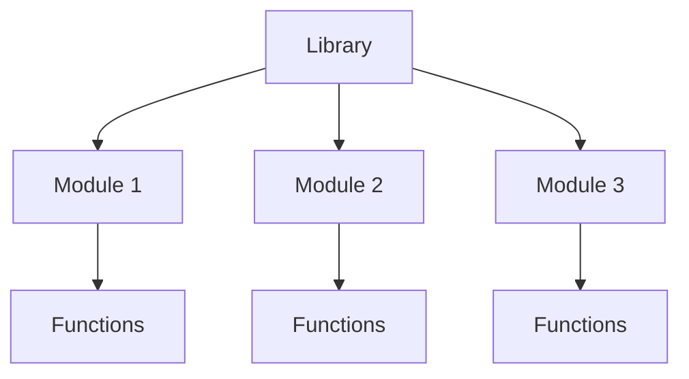
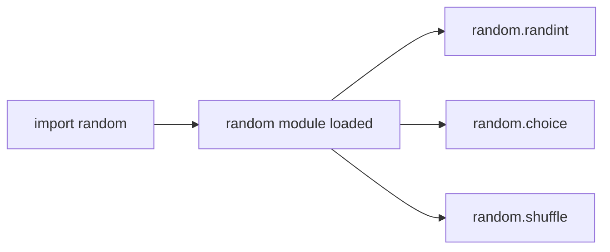
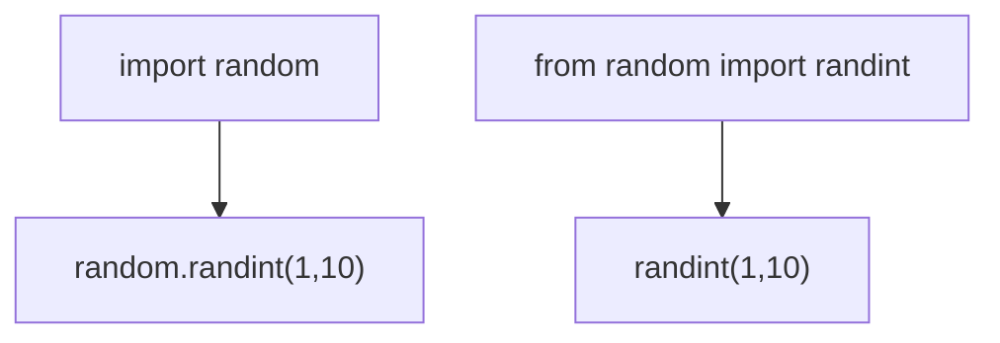
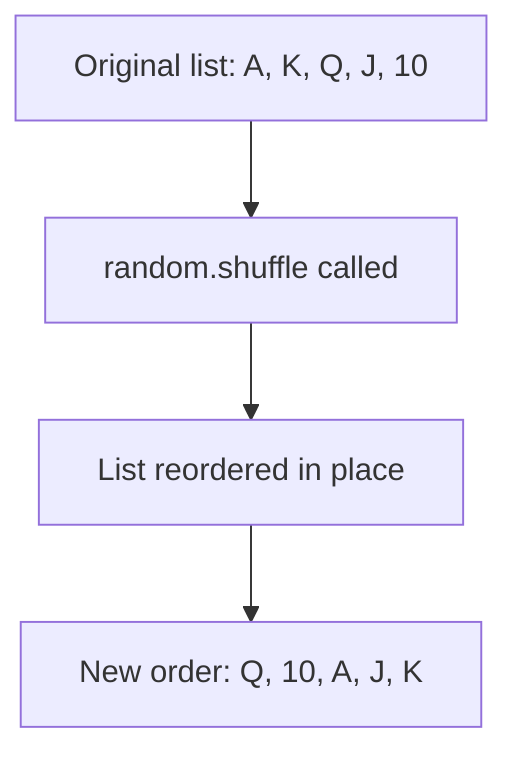
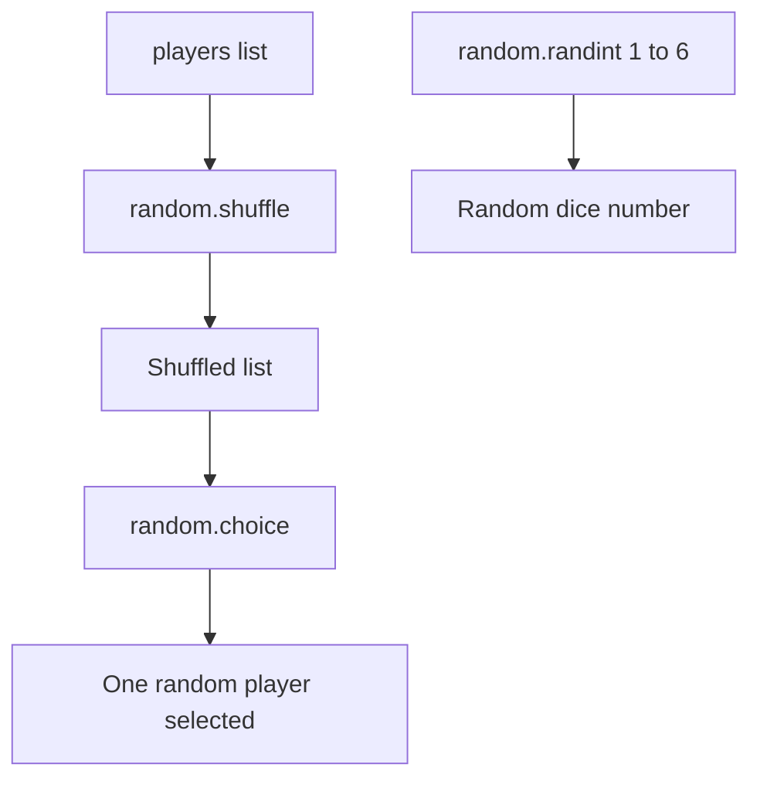

# Python Lecture 8: Libraries, Modules & the random Module

## Table of Contents

- [What are Libraries?](#what-are-libraries)
- [What are Modules?](#what-are-modules)
- [Library vs Module](#library-vs-module)
- [import Statement](#import-statement)
- [from Import](#from-import)
- [import vs from Import](#import-vs-from-import)
- [The random Module](#the-random-module)
- [choice()](#choice)
- [randint()](#randint)
- [shuffle()](#shuffle)
- [Comparing random Functions](#comparing-random-functions)
- [Common Mistakes](#common-mistakes)
- [Key Takeaways](#key-takeaways)

---

## What are Libraries?

A **library** is a collection of pre-written code (modules and functions) that can be reused instead of writing everything from scratch.

♡ Key Points

- Saves time — someone already wrote and tested this code.
- Python comes with a **standard library** built in (no installation needed).
- Extra libraries can also be installed separately (like `numpy`, `pandas`).
- A library is usually made up of many smaller **modules** grouped together.



⋆˚꩜｡

## What are Modules?

A **module** is a single Python file containing code — functions, variables, or classes — that can be imported and used in another file.

♡ Key Points

- A module is basically a `.py` file with reusable code inside it.
- `random` is an example of a built-in module.
- Modules keep code organized instead of writing everything in one giant file.
- One library can contain many modules.

♡ Syntax

```python
import module_name
```

⋆˚꩜｡

## Library vs Module

| | Library | Module |
|---|---|---|
| Size | Larger — can contain many modules | Smaller — a single file |
| Contains | Multiple modules | Functions, variables, classes |
| Example | Python Standard Library | `random`, `math`, `os` |

⋆˚꩜｡

## import Statement

`import` is how a module is brought into a Python file so its functions can be used.

♡ Definition

`import` loads an entire module, making everything inside it accessible using `module_name.function_name()`.

♡ Key Points

- Must be written at the top of the file (by convention).
- Without importing, Python has no idea the module exists.
- After importing, functions are accessed with **dot notation**.

♡ Syntax

```python
import random
```

♡ Example

```python
import random

print(random.randint(1, 10))
```



⋆˚꩜｡

## from Import

`from` allows importing **specific** parts of a module instead of the whole thing.

♡ Definition

`from module_name import function_name` brings in only the named function (or variable/class), so it can be used directly without the module prefix.

♡ Key Points

- Useful when only one or two functions from a module are needed.
- No need to write `module_name.` before the function anymore.
- Can import multiple items at once, separated by commas.

♡ Syntax

```python
from module_name import function_name
```

♡ Example

```python
from random import randint

print(randint(1, 10))  # no need to write random.randint
```

♡ Example — Importing multiple functions

```python
from random import randint, choice, shuffle

print(randint(1, 6))
print(choice(["red", "blue", "green"]))
```

⋆˚꩜｡

## import vs from Import

| | import module | from module import function |
|---|---|---|
| Access | `module.function()` | `function()` |
| Loads | The whole module | Only the named part |
| Best for | Using many functions from a module | Using one or two specific functions |



⋆˚꩜｡

## The random Module

The **random** module is a built-in Python module used to generate random numbers, make random selections, and shuffle data.

♡ Key Points

- Must be imported before use — it is not available by default.
- Commonly used for games, simulations, quizzes, and testing.
- Includes functions like `choice()`, `randint()`, and `shuffle()`.

♡ Syntax

```python
import random
```

⋆˚꩜｡

## choice()

`random.choice()` picks **one random item** from a sequence (like a list).

♡ Definition

`choice(sequence)` returns a single randomly selected element from the given sequence, without modifying the original sequence.

♡ Key Points

- Works on lists, tuples, and strings.
- Does not remove the chosen item — the original sequence stays the same.
- Returns a different result each time the program runs (usually).

♡ Syntax

```python
random.choice(sequence)
```

♡ Example

```python
import random

colors = ["red", "blue", "green", "yellow"]
print(random.choice(colors))
```

♡ Output

```
blue
```

*(Output changes each time the code runs — this is just one possible result.)*

⋆˚꩜｡

## randint()

`random.randint()` returns a random **whole number** between two given numbers.

♡ Definition

`randint(a, b)` returns a random integer `n` such that `a <= n <= b` — both endpoints are included.

♡ Key Points

- Both the starting and ending number are included in the possible results.
- Only works with integers.
- Common for dice rolls, random scores, random IDs, etc.

♡ Syntax

```python
random.randint(a, b)
```

♡ Example

```python
import random

dice_roll = random.randint(1, 6)
print(dice_roll)
```

♡ Output

```
4
```

*(Output changes each time — any number from 1 to 6 is possible.)*

♡ Notes

`randint(1, 6)` can return `1` or `6` — both are included, unlike some ranges in Python that exclude the last number.

⋆˚꩜｡

## shuffle()

`random.shuffle()` randomly rearranges the items of a list **in place**.

♡ Definition

`shuffle(list)` changes the order of the elements inside the given list randomly. It modifies the original list directly and does not return a new list.

♡ Key Points

- Only works on **lists** (mutable sequences).
- Changes the original list — nothing is returned (`shuffle()` returns `None`).
- Cannot be used directly on tuples or strings because they are immutable.

♡ Syntax

```python
random.shuffle(list_name)
```

♡ Example

```python
import random

cards = ["A", "K", "Q", "J", "10"]
random.shuffle(cards)
print(cards)
```

♡ Output

```
['Q', '10', 'A', 'J', 'K']
```

*(Order changes each time the code runs.)*

♡ Common Mistakes

| Mistake | Problem | Fix |
|---|---|---|
| `cards = random.shuffle(cards)` | `shuffle()` returns `None`, so `cards` becomes `None` | Just call `random.shuffle(cards)` without reassigning |
| Using `shuffle()` on a tuple | Tuples are immutable — cannot be shuffled | Convert to a list first with `list(tuple_name)` |



⋆˚꩜｡

## Comparing random Functions

| Function | Purpose | Works On | Returns |
|---|---|---|---|
| `choice()` | Pick one random item | List, tuple, string | The chosen item |
| `randint(a, b)` | Random whole number in a range (inclusive) | Integers only | A single integer |
| `shuffle()` | Randomly reorder a list | List only | Nothing (`None`) — changes list in place |

♡ Execution Trace — Using all three together

```python
import random

players = ["Ali", "Sara", "John", "Mia"]

random.shuffle(players)          # reorders the list in place
first_player = random.choice(players)   # picks one random player
dice = random.randint(1, 6)      # random dice roll

print(players)
print(first_player)
print(dice)
```

| Step | Function Called | Effect |
|---|---|---|
| 1 | `random.shuffle(players)` | `players` list order is randomly changed |
| 2 | `random.choice(players)` | One random name is picked from the shuffled list |
| 3 | `random.randint(1, 6)` | A random number between 1 and 6 (inclusive) is generated |



⋆˚꩜｡

## Common Mistakes

| Mistake | Why it Fails | Fix |
|---|---|---|
| Using `random.randint()` without `import random` | Python doesn't know what `random` is | Always `import random` at the top of the file |
| Writing `randint()` after `import random` (without `from`) | `randint` alone isn't recognized — it needs the module prefix | Use `random.randint()` or `from random import randint` |
| Expecting `shuffle()` to return a new list | `shuffle()` modifies the list in place and returns `None` | Just call it — don't assign it to a variable |
| Using `choice()` on an empty list | Nothing to choose from — raises an `IndexError` | Make sure the list has at least one item |

⋆˚꩜｡

## Key Takeaways

- A **library** is a large collection of code; a **module** is a single file inside it.
- `import module_name` loads the whole module — access items with `module_name.function()`.
- `from module_name import function_name` loads only the specific part needed — no prefix required.
- `random` is a built-in module for randomness — must be imported before use.
- `choice()` picks one random item from a sequence.
- `randint(a, b)` returns a random integer between `a` and `b`, inclusive of both.
- `shuffle()` randomly reorders a list in place and returns nothing.
- `shuffle()` only works on lists — not tuples or strings.