# Python Lecture 8: Libraries, Modules, random, Command-Line Arguments, sys.exit() & Slicing

## Table of Contents

**Part 1 — Libraries, Modules & random**

- [What are Libraries?](#what-are-libraries)
- [What are Modules?](#what-are-modules)
- [Library vs Module](#library-vs-module)
- [import Statement](#import-statement)
- [from Import](#from-import)
- [import vs from Import](#import-vs-from-import)
- [The random Module](#the-random-module)
- [choice()](#choice)
- [randint()](#randint)
- [shuffle()](#shuffle)
- [Comparing random Functions](#comparing-random-functions)
- [Common Mistakes (random)](#common-mistakes-random)
- [Key Takeaways — Libraries, Modules & random](#key-takeaways--libraries-modules--random)

**Part 2 — Command-Line Arguments & sys.argv**

- [What are Command-Line Arguments?](#what-are-command-line-arguments)
- [input() vs Command-Line Arguments](#input-vs-command-line-arguments)
- [The sys Module and argv](#the-sys-module-and-argv)
- [How sys.argv Works](#how-sysargv-works)
- [Accessing sys.argv Elements](#accessing-sysargv-elements)
- [Multiple Command-Line Arguments](#multiple-command-line-arguments)
- [Quotes and Multi-Word Arguments](#quotes-and-multi-word-arguments)
- [Joining Arguments with join()](#joining-arguments-with-join)
- [Slicing sys.argv](#slicing-sysargv)
- [sys.argv Indexing vs Slicing — Worked Example](#sysargv-indexing-vs-slicing--worked-example)
- [sys.argv Values Are Strings](#sysargv-values-are-strings)
- [Checking Argument Count with len()](#checking-argument-count-with-len)
- [Missing Arguments and IndexError](#missing-arguments-and-indexerror)
- [input() vs sys.argv — Full Comparison](#input-vs-sysargv--full-comparison)
- [Why Use Command-Line Arguments?](#why-use-command-line-arguments)
- [The Complete Relationship](#the-complete-relationship)
- [Common Mistakes (sys.argv)](#common-mistakes-sysargv)
- [Key Takeaways — Command-Line Arguments & sys.argv](#key-takeaways--command-line-arguments--sysargv)

**Part 3 — sys.exit(), Slicing & Positive/Negative Indexing**

- [What is sys.exit()?](#what-is-sysexit)
- [sys.exit() Syntax](#sysexit-syntax)
- [sys.exit() Without a Message](#sysexit-without-a-message)
- [sys.exit() With a Message](#sysexit-with-a-message)
- [sys.exit() With Exit Codes](#sysexit-with-exit-codes)
- [How sys.exit() Stops a Program](#how-sysexit-stops-a-program)
- [sys.exit() vs return vs break](#sysexit-vs-return-vs-break)
- [Common Uses of sys.exit()](#common-uses-of-sysexit)
- [What is Slicing?](#what-is-slicing)
- [Slicing Syntax Recap](#slicing-syntax-recap)
- [Positive Indexing](#positive-indexing)
- [Negative Indexing](#negative-indexing)
- [Positive vs Negative Indexing Table](#positive-vs-negative-indexing-table)
- [Positive Slicing — Examples](#positive-slicing--examples)
- [Negative Slicing — Examples](#negative-slicing--examples)
- [Mixing Positive and Negative Slicing](#mixing-positive-and-negative-slicing)
- [Step in Slicing](#step-in-slicing)
- [Common Slicing Patterns Cheat Sheet](#common-slicing-patterns-cheat-sheet)
- [Code Walkthrough — Validating Argument Count](#code-walkthrough--validating-argument-count)
- [Step-by-Step Trace of the Code](#step-by-step-trace-of-the-code)
- [Why the Output is []](#why-the-output-is-)
- [Fixing the Code to Get the Actual Name](#fixing-the-code-to-get-the-actual-name)
- [Common Mistakes (sys.exit & Slicing)](#common-mistakes-sysexit--slicing)
- [Key Takeaways — sys.exit() & Slicing](#key-takeaways--sysexit--slicing)

---

## What are Libraries?

A **library** is a collection of pre-written code (modules and functions) that can be reused instead of writing everything from scratch.

♡ Key Points

- Saves time — someone already wrote and tested this code.
- Python comes with a **standard library** built in (no installation needed).
- Extra libraries can also be installed separately (like `numpy`, `pandas`).
- A library is usually made up of many smaller **modules** grouped together.

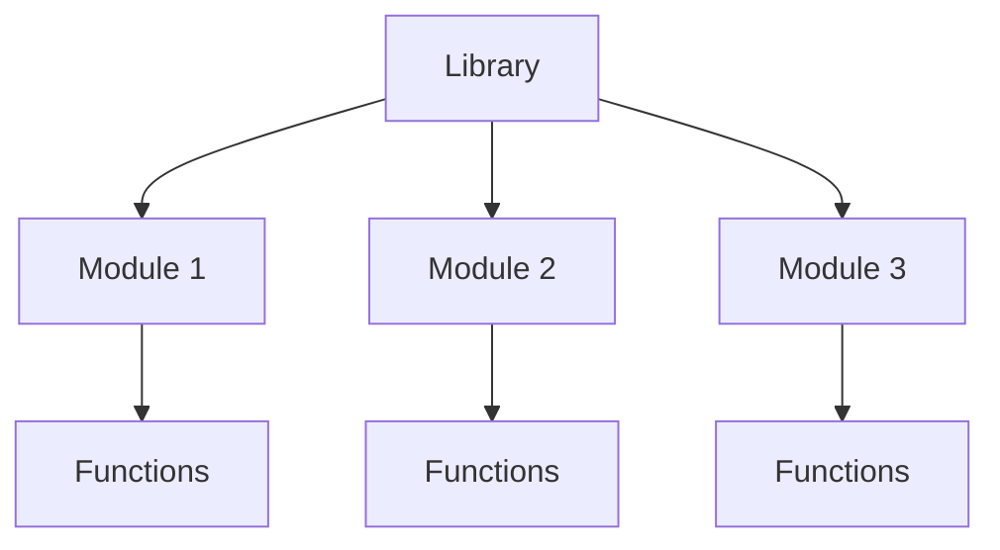

⋆˚꩜｡

## What are Modules?

A **module** is a single Python file containing code — functions, variables, or classes — that can be imported and used in another file.

♡ Key Points

- A module is basically a `.py` file with reusable code inside it.
- `random` is an example of a built-in module.
- Modules keep code organized instead of writing everything in one giant file.
- One library can contain many modules.

♡ Syntax

```python
import module_name
```

⋆˚꩜｡

## Library vs Module

| | Library | Module |
|---|---|---|
| Size | Larger — can contain many modules | Smaller — a single file |
| Contains | Multiple modules | Functions, variables, classes |
| Example | Python Standard Library | `random`, `math`, `os` |

⋆˚꩜｡

## import Statement

`import` is how a module is brought into a Python file so its functions can be used.

♡ Definition

`import` loads an entire module, making everything inside it accessible using `module_name.function_name()`.

♡ Key Points

- Must be written at the top of the file (by convention).
- Without importing, Python has no idea the module exists.
- After importing, functions are accessed with **dot notation**.

♡ Syntax

```python
import random
```

♡ Example

```python
import random

print(random.randint(1, 10))
```

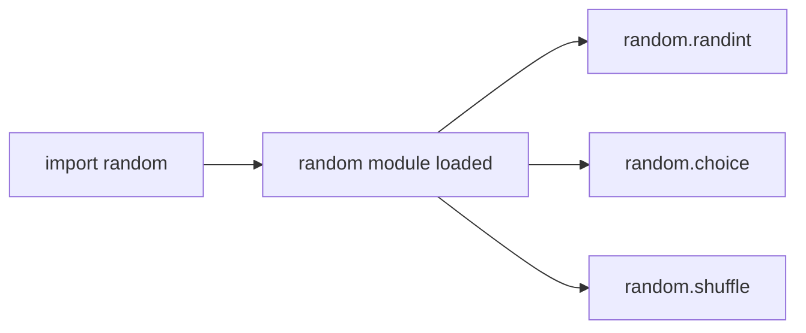

⋆˚꩜｡

## from Import

`from` allows importing **specific** parts of a module instead of the whole thing.

♡ Definition

`from module_name import function_name` brings in only the named function (or variable/class), so it can be used directly without the module prefix.

♡ Key Points

- Useful when only one or two functions from a module are needed.
- No need to write `module_name.` before the function anymore.
- Can import multiple items at once, separated by commas.

♡ Syntax

```python
from module_name import function_name
```

♡ Example

```python
from random import randint

print(randint(1, 10))  # no need to write random.randint
```

♡ Example — Importing multiple functions

```python
from random import randint, choice, shuffle

print(randint(1, 6))
print(choice(["red", "blue", "green"]))
```

⋆˚꩜｡

## import vs from Import

| | import module | from module import function |
|---|---|---|
| Access | `module.function()` | `function()` |
| Loads | The whole module | Only the named part |
| Best for | Using many functions from a module | Using one or two specific functions |

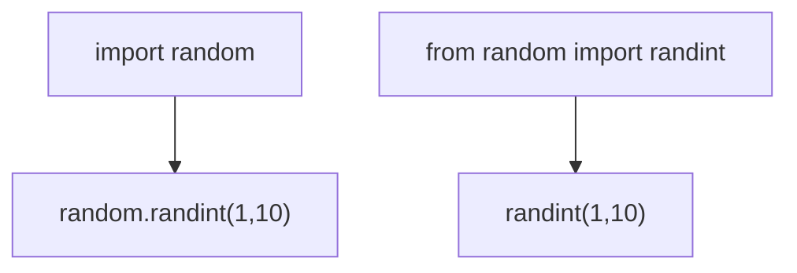

⋆˚꩜｡

## The random Module

The **random** module is a built-in Python module used to generate random numbers, make random selections, and shuffle data.

♡ Key Points

- Must be imported before use — it is not available by default.
- Commonly used for games, simulations, quizzes, and testing.
- Includes functions like `choice()`, `randint()`, and `shuffle()`.

♡ Syntax

```python
import random
```

⋆˚꩜｡

## choice()

`random.choice()` picks **one random item** from a sequence (like a list).

♡ Definition

`choice(sequence)` returns a single randomly selected element from the given sequence, without modifying the original sequence.

♡ Key Points

- Works on lists, tuples, and strings.
- Does not remove the chosen item — the original sequence stays the same.
- Returns a different result each time the program runs (usually).

♡ Syntax

```python
random.choice(sequence)
```

♡ Example

```python
import random

colors = ["red", "blue", "green", "yellow"]
print(random.choice(colors))
```

♡ Output

```
blue
```

*(Output changes each time the code runs — this is just one possible result.)*

⋆˚꩜｡

## randint()

`random.randint()` returns a random **whole number** between two given numbers.

♡ Definition

`randint(a, b)` returns a random integer `n` such that `a <= n <= b` — both endpoints are included.

♡ Key Points

- Both the starting and ending number are included in the possible results.
- Only works with integers.
- Common for dice rolls, random scores, random IDs, etc.

♡ Syntax

```python
random.randint(a, b)
```

♡ Example

```python
import random

dice_roll = random.randint(1, 6)
print(dice_roll)
```

♡ Output

```
4
```

*(Output changes each time — any number from 1 to 6 is possible.)*

♡ Notes

`randint(1, 6)` can return `1` or `6` — both are included, unlike some ranges in Python that exclude the last number.

⋆˚꩜｡

## shuffle()

`random.shuffle()` randomly rearranges the items of a list **in place**.

♡ Definition

`shuffle(list)` changes the order of the elements inside the given list randomly. It modifies the original list directly and does not return a new list.

♡ Key Points

- Only works on **lists** (mutable sequences).
- Changes the original list — nothing is returned (`shuffle()` returns `None`).
- Cannot be used directly on tuples or strings because they are immutable.

♡ Syntax

```python
random.shuffle(list_name)
```

♡ Example

```python
import random

cards = ["A", "K", "Q", "J", "10"]
random.shuffle(cards)
print(cards)
```

♡ Output

```
['Q', '10', 'A', 'J', 'K']
```

*(Order changes each time the code runs.)*

♡ Common Mistakes

| Mistake | Problem | Fix |
|---|---|---|
| `cards = random.shuffle(cards)` | `shuffle()` returns `None`, so `cards` becomes `None` | Just call `random.shuffle(cards)` without reassigning |
| Using `shuffle()` on a tuple | Tuples are immutable — cannot be shuffled | Convert to a list first with `list(tuple_name)` |

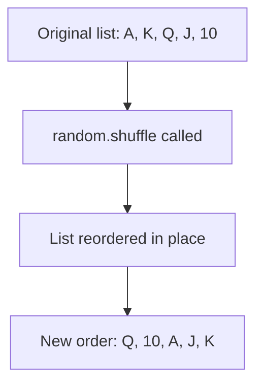

⋆˚꩜｡

## Comparing random Functions

| Function | Purpose | Works On | Returns |
|---|---|---|---|
| `choice()` | Pick one random item | List, tuple, string | The chosen item |
| `randint(a, b)` | Random whole number in a range (inclusive) | Integers only | A single integer |
| `shuffle()` | Randomly reorder a list | List only | Nothing (`None`) — changes list in place |

♡ Execution Trace — Using all three together

```python
import random

players = ["Ali", "Sara", "John", "Mia"]

random.shuffle(players)          # reorders the list in place
first_player = random.choice(players)   # picks one random player
dice = random.randint(1, 6)      # random dice roll

print(players)
print(first_player)
print(dice)
```

| Step | Function Called | Effect |
|---|---|---|
| 1 | `random.shuffle(players)` | `players` list order is randomly changed |
| 2 | `random.choice(players)` | One random name is picked from the shuffled list |
| 3 | `random.randint(1, 6)` | A random number between 1 and 6 (inclusive) is generated |

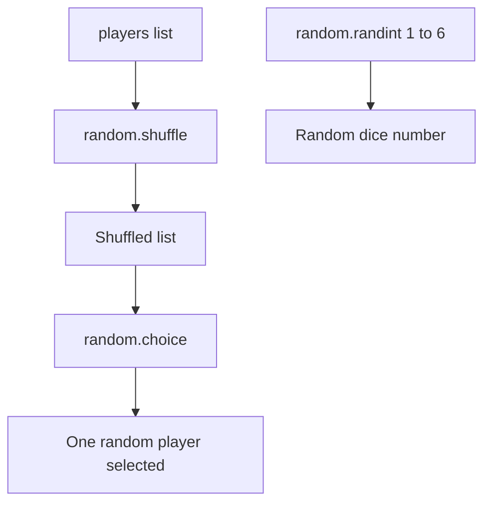

⋆˚꩜｡

## Common Mistakes (random)

| Mistake | Why it Fails | Fix |
|---|---|---|
| Using `random.randint()` without `import random` | Python doesn't know what `random` is | Always `import random` at the top of the file |
| Writing `randint()` after `import random` (without `from`) | `randint` alone isn't recognized — it needs the module prefix | Use `random.randint()` or `from random import randint` |
| Expecting `shuffle()` to return a new list | `shuffle()` modifies the list in place and returns `None` | Just call it — don't assign it to a variable |
| Using `choice()` on an empty list | Nothing to choose from — raises an `IndexError` | Make sure the list has at least one item |

⋆˚꩜｡

## Key Takeaways — Libraries, Modules & random

- A **library** is a large collection of code; a **module** is a single file inside it.
- `import module_name` loads the whole module — access items with `module_name.function()`.
- `from module_name import function_name` loads only the specific part needed — no prefix required.
- `random` is a built-in module for randomness — must be imported before use.
- `choice()` picks one random item from a sequence.
- `randint(a, b)` returns a random integer between `a` and `b`, inclusive of both.
- `shuffle()` randomly reorders a list in place and returns nothing.
- `shuffle()` only works on lists — not tuples or strings.

⋆˚꩜｡

## What are Command-Line Arguments?

**Command-line arguments** are extra pieces of information given to a program when it is started from the terminal, instead of being asked for while the program runs.

♡ Definition

A command-line argument is text passed to a Python script right after its filename on the command line, which Python collects and makes available inside the program.

♡ Example

```bash
python hello.py Mehruuu
```

| Part | Meaning |
|---|---|
| `python` | Runs Python |
| `hello.py` | The Python program |
| `Mehruuu` | The command-line argument |

♡ Key Points

- The program receives the information **at startup**, not while running.
- No need to pause and use `input()` to ask the user something.
- Useful for automation, scripts, developer tools, running the same program with different inputs, and processing files.
- For a small program meant for a normal user to interact with, `input()` is often easier.

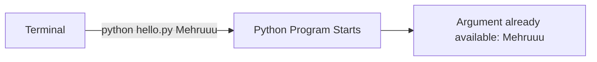

⋆˚꩜｡

## input() vs Command-Line Arguments

| | `input()` | Command-Line Argument |
|---|---|---|
| When information is given | While the program is running | When the program is started |
| Program behavior | Pauses and waits for the user | Starts already knowing the value |
| Best for | Normal interactive programs | Automation, scripts, developer tools |

♡ Example — input()

```python
name = input("Enter your name: ")
print(name)
```

```
Enter your name:
```

♡ Example — Command-Line Argument

```bash
python hello.py Mehruuu
```

The information is given the moment the program starts — no waiting, no prompt.

⋆˚꩜｡

## The sys Module and argv

`sys` is a **built-in Python module** that provides tools related to Python and the system it is running on. One of those tools is `sys.argv`.

♡ Key Points

- `sys` must be imported before use, like any other module.
- `argv` stands for **argument vector**.
- `argv` is a **list** containing the command-line arguments given to the program.
- `sys.argv` means: get the `argv` list from the `sys` module.

♡ Syntax

```python
import sys

print(sys.argv)
```

⋆˚꩜｡

## How sys.argv Works

Given the file:

```python
import sys

print(sys.argv)
```

Running:

```bash
python hello.py Mehruuu
```

produces:

```python
["hello.py", "Mehruuu"]
```

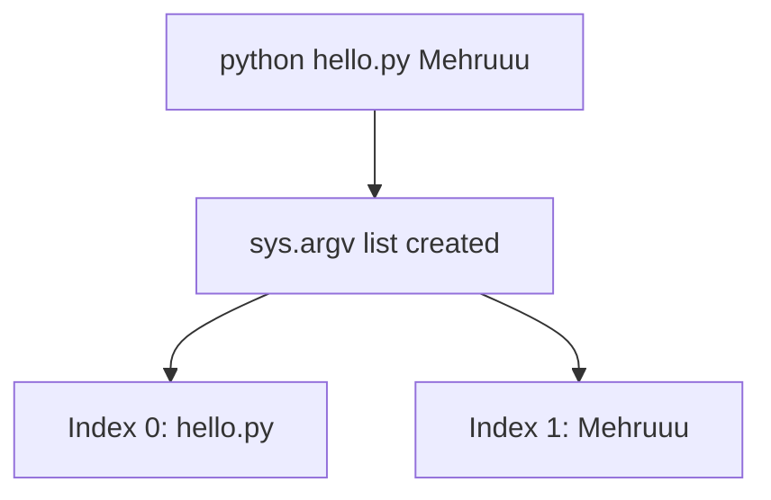

⋆˚꩜｡

## Accessing sys.argv Elements

Since `sys.argv` is a list, its items are accessed using indexes — the same as any other list.

♡ Key Points

- `sys.argv[0]` is usually the name of the program/script itself.
- The actual command-line arguments start from `sys.argv[1]`.

♡ Example

```python
import sys

print(sys.argv[0])  # hello.py
print(sys.argv[1])  # Mehruuu
```

| Expression | Value |
|---|---|
| `sys.argv[0]` | `"hello.py"` |
| `sys.argv[1]` | `"Mehruuu"` |

♡ Example — Storing an Argument in a Variable

```python
import sys

name = sys.argv[1]

print("Hello, My name is", name)
```

Running:

```bash
python hello.py Mehruuu
```

produces:

```
Hello, My name is Mehruuu
```

⋆˚꩜｡

## Multiple Command-Line Arguments

Several arguments can be passed at once, and each one gets its own index in the list.

♡ Example

```bash
python hello.py Mehruuu Khan
```

```python
sys.argv  # ["hello.py", "Mehruuu", "Khan"]
```

| Index | Value |
|---|---|
| `sys.argv[0]` | `"hello.py"` |
| `sys.argv[1]` | `"Mehruuu"` |
| `sys.argv[2]` | `"Khan"` |

⋆˚꩜｡

## Quotes and Multi-Word Arguments

By default, spaces separate arguments. To pass multiple words as **one single argument**, wrap them in quotes.

♡ Comparison

| Command | Result |
|---|---|
| `python hello.py "Mehruuu Khan"` | `["hello.py", "Mehruuu Khan"]` — one argument |
| `python hello.py Mehruuu Khan` | `["hello.py", "Mehruuu", "Khan"]` — two arguments |

♡ Example

```bash
python hello.py "Mehruuu Khan"
```

```python
sys.argv[1]  # "Mehruuu Khan"
```

⋆˚꩜｡

## Joining Arguments with join()

When multiple separate arguments need to be combined back into one string, `" ".join()` can be used together with slicing.

♡ Example

```python
import sys

name = " ".join(sys.argv[1:])

print("Hello, My name is", name)
```

Running:

```bash
python hello.py Mehruuu Khan
```

♡ Line-by-Line Explanation

| Step | Expression | Result |
|---|---|---|
| 1 | `sys.argv` | `["hello.py", "Mehruuu", "Khan"]` |
| 2 | `sys.argv[1:]` | `["Mehruuu", "Khan"]` — everything from index 1 onward |
| 3 | `" ".join(["Mehruuu", "Khan"])` | `"Mehruuu Khan"` |

♡ Output

```
Hello, My name is Mehruuu Khan
```

⋆˚꩜｡

## Slicing sys.argv

`sys.argv` can be sliced exactly like any other list.

♡ Syntax

```python
list[start:stop]
```

The `stop` index is **not included**.

♡ Example

Given:

```python
sys.argv = ["hello.py", "Mehruuu", "Khan"]
```

| Slice | Result | Meaning |
|---|---|---|
| `sys.argv[1:2]` | `["Mehruuu"]` | Start at index 1, stop before index 2 |
| `sys.argv[1:3]` | `["Mehruuu", "Khan"]` | Start at index 1, stop before index 3 |
| `sys.argv[1:]` | `["Mehruuu", "Khan"]` | Everything from index 1 to the end |

⋆˚꩜｡

## sys.argv Indexing vs Slicing — Worked Example

This example is worth walking through slowly because it mixes **indexing** and **slicing** in one place — a very common source of confusion. 🐍🧠

Assume this was run:

```bash
python name.py Noor afshan mehrunnisa khan baby
```

Python creates `sys.argv` like this:

```python
sys.argv = ['name.py', 'Noor', 'afshan', 'mehrunnisa', 'khan', 'baby']
```

```text
index:       0          1          2             3       4        5
             ↓          ↓          ↓             ↓       ↓        ↓
sys.argv = ['name.py', 'Noor', 'afshan', 'mehrunnisa', 'khan', 'baby']
```

### 1️⃣ `sys.argv[1]` — indexing

```python
print(f"Hello, My name is {sys.argv[1]}")
```

`[1]` means:

> **Give me the element at index 1.**

Indexing starts at `0`, so `sys.argv[1]` gives:

```text
'Noor'
```

Output:

```text
Hello, My name is Noor
```

No brackets show up in the output because `sys.argv[1]` returns **one element** — a plain string, not a list.

### 2️⃣ `sys.argv[1:]` — slicing to the end

```python
print(f"Hello, My name is {sys.argv[1:]}")
```

The `:` changes everything — this is **slicing**, not indexing.

```python
sys.argv[1:]
```

means:

> Start at index `1` and take **everything until the end**.

```text
index:       0          1          2             3       4        5
             ↓          ↓          ↓             ↓       ↓        ↓
sys.argv = ['name.py', 'Noor', 'afshan', 'mehrunnisa', 'khan', 'baby']
                        └───────────────────────────────────────┘
                                  take everything
```

Result — a **new list**:

```python
['Noor', 'afshan', 'mehrunnisa', 'khan', 'baby']
```

Output:

```text
Hello, My name is ['Noor', 'afshan', 'mehrunnisa', 'khan', 'baby']
```

The `[]` appear because the result is a **list**, not a single string.

### 3️⃣ `sys.argv[1:3]` — the tricky one

```python
print(f"Hello, My name is {sys.argv[1:3]}")
```

It's easy to expect:

```text
['Noor', 'afshan', 'mehrunnisa']
```

but the actual result is:

```text
['Noor', 'afshan']
```

That's because of one very important rule:

> **In slicing, the ending index is NOT included.**

`sys.argv[1:3]` means:

> Start at index `1`, stop **before** index `3`.

```text
index:       0          1          2             3       4        5
             ↓          ↓          ↓             ↓       ↓        ↓
sys.argv = ['name.py', 'Noor', 'afshan', 'mehrunnisa', 'khan', 'baby']
                        ↑          ↑             ↑
                      START      TAKE         STOP
                                  this        here
```

Only index `1` and index `2` are taken. Index `3` (`'mehrunnisa'`) is **not** included.

```python
sys.argv[1:3]  # ['Noor', 'afshan']
```

### 🧠 The golden rule of slicing

```python
list[start:stop]
```

means:

> **Start at `start`, go up to but NOT including `stop`.**

So `sys.argv[1:3]` means `1 ≤ index < 3`:

```text
1 → Noor       ✅
2 → afshan     ✅
3 → mehrunnisa ❌
```

### Getting Noor, afshan AND mehrunnisa

To include index `3`, the stop index needs to be `4` (since `4` is excluded):

```python
sys.argv[1:4]
```

```text
index:       0          1          2             3       4        5
             ↓          ↓          ↓             ↓       ↓        ↓
sys.argv = ['name.py', 'Noor', 'afshan', 'mehrunnisa', 'khan', 'baby']
                        └──────────────────────┘
                           1       2       3
                           included
```

Result:

```python
['Noor', 'afshan', 'mehrunnisa']
```

### 🔥 The distinction to remember

| Form | Example | Returns | Result |
|---|---|---|---|
| Indexing `[n]` | `sys.argv[1]` | One element | `'Noor'` |
| Slicing `[start:]` | `sys.argv[1:]` | List from `start` to the end | `['Noor', 'afshan', 'mehrunnisa', 'khan', 'baby']` |
| Slicing `[start:stop]` | `sys.argv[1:4]` | List from `start` up to, not including, `stop` | `['Noor', 'afshan', 'mehrunnisa']` |

**`[n]` → one item.**
**`[start:]` → multiple items, to the end.**
**`[start:stop]` → multiple items, stop index excluded.**

⋆˚꩜｡

## sys.argv Values Are Strings

Every command-line argument is stored as a **string**, even if it looks like a number.

♡ Example — The Problem

```bash
python calculator.py 10 20
```

```python
sys.argv  # ["calculator.py", "10", "20"]

print(sys.argv[1] + sys.argv[2])
```

♡ Output

```
1020
```

This happens because `"10"` and `"20"` are strings, and `+` **joins strings** instead of adding numbers.

♡ Example — The Fix

```python
import sys

x = int(sys.argv[1])
y = int(sys.argv[2])

print(x + y)
```

♡ Output

```
30
```

| Version | `sys.argv[1] + sys.argv[2]` | Result |
|---|---|---|
| Without conversion | `"10" + "20"` | `"1020"` (string joining) |
| With `int()` conversion | `10 + 20` | `30` (number addition) |

⋆˚꩜｡

## Checking Argument Count with len()

Since `sys.argv` is a list, `len(sys.argv)` gives the total number of items in it — including the program name.

♡ Example

```bash
python hello.py Mehruuu
```

```python
sys.argv       # ["hello.py", "Mehruuu"]
len(sys.argv)  # 2
```

♡ Notes

The program name itself counts as one item, so `len(sys.argv)` is always one more than the number of actual arguments given.

⋆˚꩜｡

## Missing Arguments and IndexError

If code expects an argument that was never given, Python raises an `IndexError`.

♡ Example

```python
import sys

name = sys.argv[1]

print(name)
```

Running:

```bash
python hello.py
```

Here `sys.argv` only contains `["hello.py"]` — there is no index `1`.

♡ Output

```
IndexError: list index out of range
```

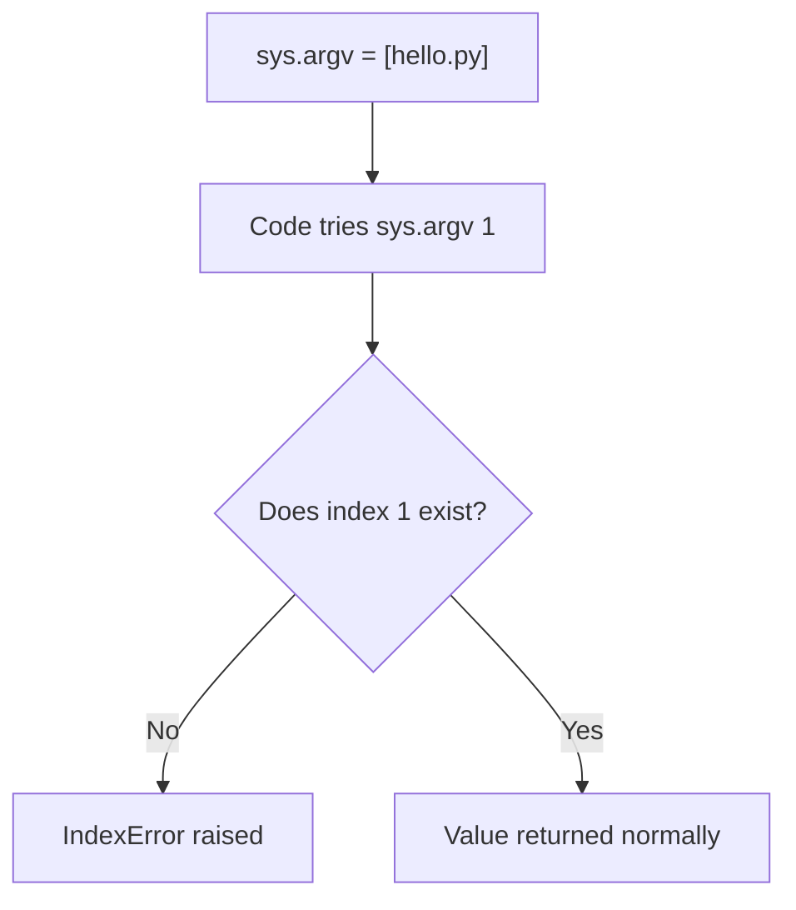

⋆˚꩜｡

## input() vs sys.argv — Full Comparison

| | `input()` | `sys.argv` |
|---|---|---|
| When value is provided | While the program runs | When the program is started |
| User experience | Program asks a question, user types an answer | Value is typed directly in the terminal command |
| Program flow | Pauses to wait | Starts already knowing the value |
| Common use | Everyday interactive programs | Automation, scripts, developer tools |

♡ Example Side by Side

```python
# input()
name = input("Enter your name: ")
```

```python
# sys.argv
name = sys.argv[1]
```

⋆˚꩜｡

## Why Use Command-Line Arguments?

Command-line arguments avoid stopping the program to ask the same question every time it runs.

♡ Example

```bash
python process.py file1.csv
python process.py file2.csv
python process.py file3.csv
```

The same program processes different files without ever showing:

```
Enter the filename:
```

♡ Key Points

- Especially useful in automation, scripts, data processing, developer tools, AI/ML scripts, file processing, and programs communicating with other programs.
- Not a replacement for `input()` — just another way to provide information to a program.
- For a normal interactive program, `input()` can still be easier for the end user.

⋆˚꩜｡

## The Complete Relationship

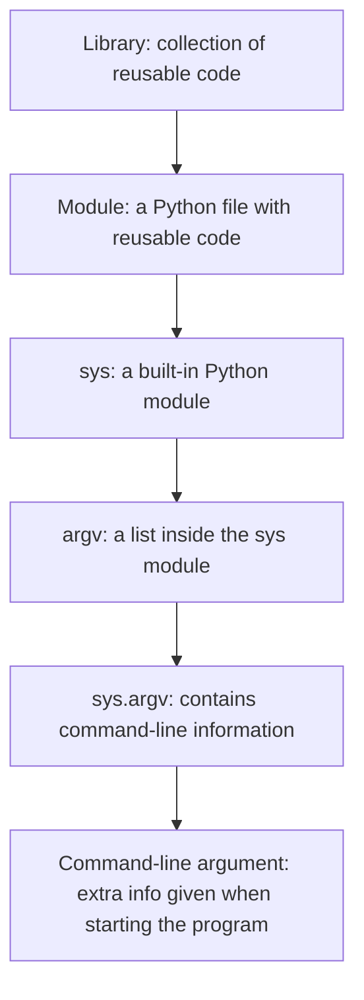

♡ Walkthrough Example

```bash
python hello.py Mehruuu
```

| Step | What Happens |
|---|---|
| 1 | `Mehruuu` is the command-line argument |
| 2 | Python puts the command-line information into `sys.argv` |
| 3 | `sys.argv` becomes `["hello.py", "Mehruuu"]` |
| 4 | `sys.argv[1]` gives `"Mehruuu"` |
| 5 | The program can now use that value |

⋆˚꩜｡

## Common Mistakes (sys.argv)

| Mistake | Why it Fails | Fix |
|---|---|---|
| Using `sys.argv` without `import sys` | Python doesn't know what `sys` is | Always `import sys` at the top of the file |
| Accessing `sys.argv[1]` when no argument was given | Index doesn't exist | Raises `IndexError` — check `len(sys.argv)` first |
| Adding `sys.argv[1] + sys.argv[2]` expecting a sum | Arguments are strings, so `+` joins them instead of adding | Convert with `int()` or `float()` first |
| Forgetting quotes for a multi-word argument | Python splits it into multiple separate arguments | Wrap the phrase in quotes: `"Mehruuu Khan"` |
| Forgetting `sys.argv[0]` is the script name | Miscounts the actual arguments | Real arguments start at index `1`, not `0` |
| Confusing `sys.argv[n]` (one item) with `sys.argv[n:]` (a list) | Indexing and slicing look similar but return different types | Remember: `[n]` → single item, `[start:stop]` → list, stop excluded |

⋆˚꩜｡

## Key Takeaways — Command-Line Arguments & sys.argv

- **Command-line arguments** are extra information given to a program at startup, instead of through `input()` while it runs.
- **`sys`** is a built-in module; **`argv`** is a list inside it; **`sys.argv`** holds the command-line arguments.
- `sys.argv[0]` is usually the script name; actual arguments start from `sys.argv[1]`.
- Multiple arguments each get their own index; quotes combine multiple words into one argument.
- `" ".join(sys.argv[1:])` combines multiple arguments back into one string.
- `sys.argv` can be sliced like any list: `sys.argv[1:2]`, `sys.argv[1:3]`, `sys.argv[1:]`.
- Indexing `sys.argv[n]` returns **one element**; slicing `sys.argv[start:stop]` returns a **list**, and the stop index is always excluded.
- All values inside `sys.argv` are **strings** — convert with `int()`/`float()` for math.
- `len(sys.argv)` gives the total argument count, including the script name.
- Accessing an index that wasn't provided raises an `IndexError`.
- Command-line arguments are not a replacement for `input()` — they are another way to pass information into a program, most useful for automation, scripts, and developer tools.

<br/>

# Part 3 — sys.exit(), Slicing & Positive/Negative Indexing

## What is sys.exit()?

`sys.exit()` is a function from the `sys` module that **immediately stops a running Python program**.

♡ Definition

`sys.exit()` raises a special exception called `SystemExit`. If nothing catches that exception, Python ends the program right there — no more lines run after it.

♡ Key Points

- Must `import sys` before using it.
- Stops the program **immediately** at the point it's called — nothing after it runs.
- Commonly used to stop a script early when something is wrong (bad input, missing arguments, invalid conditions).
- Can optionally take a message or an exit code.

⋆˚꩜｡

## sys.exit() Syntax

```python
sys.exit()
sys.exit(message)
sys.exit(exit_code)
```

| Form | Example | Effect |
|---|---|---|
| No argument | `sys.exit()` | Exits with status code `0` (success), no message |
| String argument | `sys.exit("Something went wrong")` | Prints the message to the terminal, exits with status code `1` (error) |
| Integer argument | `sys.exit(1)` | Exits with that specific status code, no message printed |

⋆˚꩜｡

## sys.exit() Without a Message

```python
import sys

print("Starting program...")
sys.exit()
print("This line never runs")
```

♡ Output

```
Starting program...
```

♡ Bullet Breakdown

- `"Starting program..."` prints normally.
- `sys.exit()` is called — the program stops immediately.
- `"This line never runs"` is **never reached**, because the program already ended.

⋆˚꩜｡

## sys.exit() With a Message

```python
import sys

sys.exit("Something went wrong!")
```

♡ Output (printed to the terminal, not with `print()`)

```
Something went wrong!
```

♡ Bullet Breakdown

- The string passed to `sys.exit()` is shown as an **error message** in the terminal.
- Behind the scenes, this message goes to `stderr` (the error output stream), not the normal output stream.
- The program's exit code becomes `1`, signaling to the operating system that it exited with an error.

⋆˚꩜｡

## sys.exit() With Exit Codes

Every program returns a **status code** to the operating system when it finishes — `0` normally means success, and any non-zero number means something went wrong.

```python
import sys

sys.exit(0)   # success
sys.exit(1)   # general error
sys.exit(2)   # a different kind of error, chosen by the programmer
```

♡ Key Points

- `0` = program finished successfully.
- Any non-zero integer = program finished with some kind of error.
- These codes matter mainly for **automation** — other programs or scripts can check the exit code to decide what to do next.
- A string argument automatically behaves like exit code `1` with that string printed as the error message.

♡ Example — Checking Exit Codes in the Terminal

```bash
python check.py
echo $?
```

`echo $?` (on Mac/Linux) or `echo %errorlevel%` (on Windows) shows the exit code of the last program that ran.

⋆˚꩜｡

## How sys.exit() Stops a Program

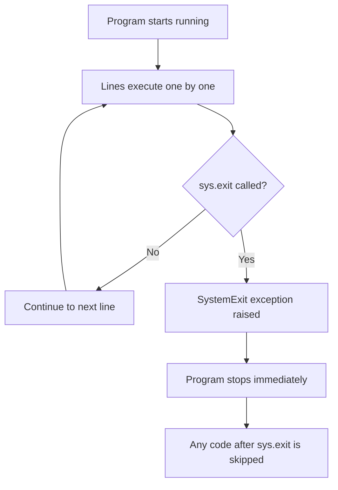

♡ Key Points

- `sys.exit()` doesn't just stop the current function — it stops the **entire program**, no matter how deep inside functions or loops it's called from.
- Anything scheduled to run **after** the `sys.exit()` line, in the same block or afterward, is skipped entirely.

⋆˚꩜｡

## sys.exit() vs return vs break

| | `sys.exit()` | `return` | `break` |
|---|---|---|---|
| Stops | The **entire program** | Only the **current function** | Only the **current loop** |
| Needs import | Yes (`import sys`) | No | No |
| Common use | Exiting due to bad input/arguments, fatal errors | Sending a value back and ending a function | Ending a loop early |

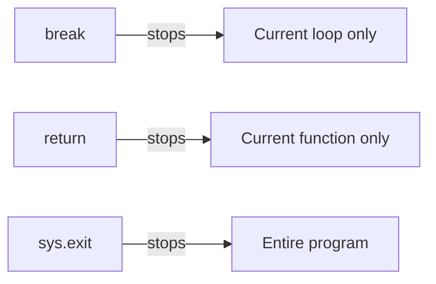

⋆˚꩜｡

## Common Uses of sys.exit()

♡ Key Points

- Validating **command-line arguments** before the rest of the script runs.
- Stopping a script early if a required file, input, or condition is missing.
- Exiting cleanly from deeply nested code without needing multiple `return` statements.
- Signaling success/failure to other programs or automation tools via the exit code.

♡ Example — Guarding a Script

```python
import sys

if len(sys.argv) < 2:
    sys.exit("Usage: python script.py <filename>")

filename = sys.argv[1]
print(f"Processing {filename}...")
```

- If no filename is given, the program prints a usage message and stops.
- If a filename **is** given, the program continues normally.

⋆˚꩜｡

## What is Slicing?

**Slicing** is a way to grab a **portion (sub-part)** of a sequence — like a list, string, or tuple — instead of just one item.

♡ Definition

Slicing uses the `[start:stop:step]` syntax to extract a range of elements from a sequence, returning a **new sequence** of the same type.

♡ Key Points

- Works on any sequence type: lists, strings, tuples.
- Always returns a **new object** — the original sequence is not changed (unless using slice assignment, which is a separate topic).
- `start`, `stop`, and `step` are all optional.

⋆˚꩜｡

## Slicing Syntax Recap

```python
sequence[start:stop:step]
```

| Part | Meaning | Default if omitted |
|---|---|---|
| `start` | Index to begin at (included) | `0` (the beginning) |
| `stop` | Index to stop before (excluded) | end of the sequence |
| `step` | How many indices to move each time | `1` |

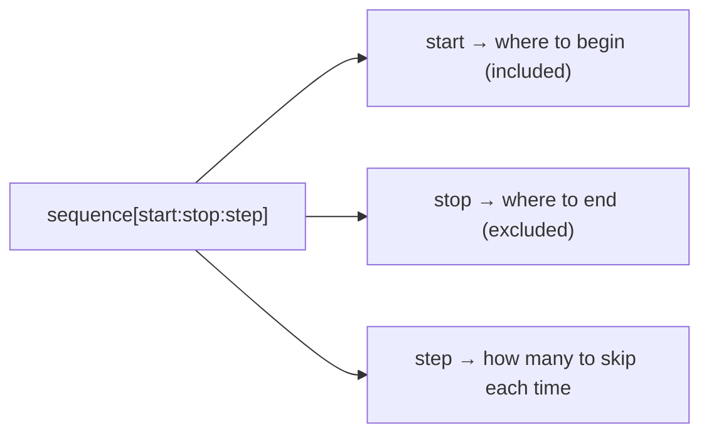

⋆˚꩜｡

## Positive Indexing

Positive indexes count **from the beginning**, starting at `0`.

```text
value:        'N'    'o'    'o'    'r'
index:         0      1      2      3
```

♡ Key Points

- The **first** item is always index `0`, never `1`.
- Counting increases left to right.
- Indexing out of range (too high) raises an `IndexError`.

⋆˚꩜｡

## Negative Indexing

Negative indexes count **from the end**, starting at `-1`.

```text
value:        'N'    'o'    'o'    'r'
pos index:     0      1      2      3
neg index:    -4     -3     -2     -1
```

♡ Key Points

- `-1` always refers to the **last** item.
- `-2` is the second-to-last item, and so on.
- Negative indexing is useful when the length of the sequence isn't known, but you still need to reach the end.

♡ Example

```python
name = "Noor"

print(name[-1])   # 'r'
print(name[-4])   # 'N'
```

⋆˚꩜｡

## Positive vs Negative Indexing Table

Given `word = "Noor"`:

| Character | `'N'` | `'o'` | `'o'` | `'r'` |
|---|---|---|---|---|
| Positive index | `0` | `1` | `2` | `3` |
| Negative index | `-4` | `-3` | `-2` | `-1` |

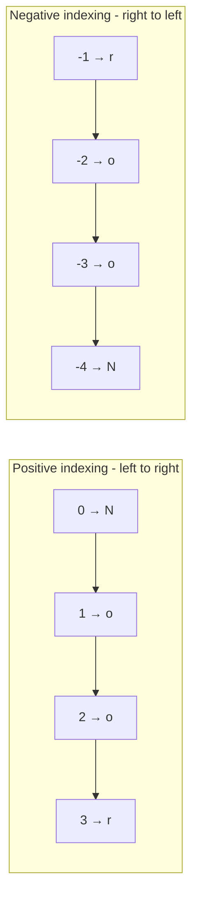

⋆˚꩜｡

## Positive Slicing — Examples

Given:

```python
nums = [10, 20, 30, 40, 50]
#index:  0   1   2   3   4
```

| Slice | Meaning | Result |
|---|---|---|
| `nums[1:3]` | index 1 up to (not including) index 3 | `[20, 30]` |
| `nums[0:2]` | index 0 up to (not including) index 2 | `[10, 20]` |
| `nums[2:]` | index 2 to the end | `[30, 40, 50]` |
| `nums[:3]` | start to index 3 (not including index 3) | `[10, 20, 30]` |
| `nums[:]` | everything (a full copy of the list) | `[10, 20, 30, 40, 50]` |

♡ Bullet Breakdown

- Leaving `start` empty means "start from the very beginning."
- Leaving `stop` empty means "go all the way to the end."
- `nums[:]` is a common way to make a **shallow copy** of a list.

⋆˚꩜｡

## Negative Slicing — Examples

Given the same list:

```python
nums = [10, 20, 30, 40, 50]
#index:  0   1   2   3   4
# neg :  -5  -4  -3  -2  -1
```

| Slice | Meaning | Result |
|---|---|---|
| `nums[-3:]` | from the 3rd-last item to the end | `[30, 40, 50]` |
| `nums[:-2]` | from the start up to (not including) the 2nd-last item | `[10, 20, 30]` |
| `nums[-4:-1]` | from the 4th-last up to (not including) the last | `[20, 30, 40]` |
| `nums[-1:]` | just the last item, as a list | `[50]` |

♡ Bullet Breakdown

- `nums[:-2]` is a very common pattern for **"everything except the last two items."**
- `nums[-1:]` gives a **list** containing the last item — different from `nums[-1]`, which gives just the value `50` directly.

⋆˚꩜｡

## Mixing Positive and Negative Slicing

Positive and negative indexes can be **mixed** in the same slice, but Python still applies the same rule underneath: **start included, stop excluded**, always moving left to right (unless a negative step is used).

Given:

```python
letters = ['a', 'b', 'c', 'd', 'e']
#  index:    0    1    2    3    4
#  neg  :   -5   -4   -3   -2   -1
```

| Slice | Meaning | Result |
|---|---|---|
| `letters[1:-1]` | from index 1 up to (not including) the last item | `['b', 'c', 'd']` |
| `letters[-4:3]` | from the 4th-last item up to (not including) index 3 | `['b', 'c']` |
| `letters[0:-2]` | from the start up to (not including) the 2nd-last item | `['a', 'b', 'c']` |

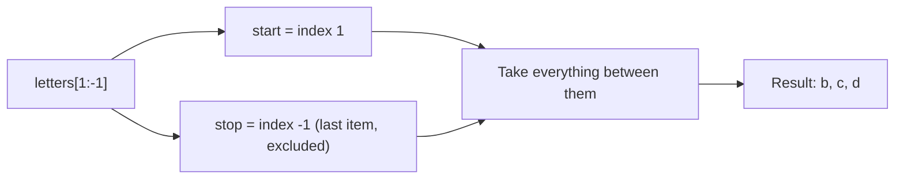

♡ Important Edge Case

If `start` and `stop` end up pointing to the **same position** (or `start` comes after `stop` in the sequence), the result is an **empty list** — not an error.

```python
letters = ['a', 'b']
print(letters[1:-1])   # []
```

Here, index `1` and index `-1` both point to the **same item** (`'b'`), so there is nothing *between* them to include, and the slice is empty.

⋆˚꩜｡

## Step in Slicing

The third part of a slice, `step`, controls how many positions to move each time.

```python
nums = [0, 1, 2, 3, 4, 5, 6, 7, 8, 9]
```

| Slice | Meaning | Result |
|---|---|---|
| `nums[::2]` | every 2nd item, start to end | `[0, 2, 4, 6, 8]` |
| `nums[1::2]` | every 2nd item, starting at index 1 | `[1, 3, 5, 7, 9]` |
| `nums[::-1]` | the whole sequence, reversed | `[9, 8, 7, 6, 5, 4, 3, 2, 1, 0]` |
| `nums[::-2]` | every 2nd item, moving backward | `[9, 7, 5, 3, 1]` |

♡ Key Points

- A **negative step** reverses the direction — Python then reads `start` and `stop` from right to left.
- `nums[::-1]` is the most common Python idiom for reversing a sequence.

⋆˚꩜｡

## Common Slicing Patterns Cheat Sheet

| Goal | Slice |
|---|---|
| Copy the whole list | `list[:]` |
| First `n` items | `list[:n]` |
| Last `n` items | `list[-n:]` |
| Everything except the first item | `list[1:]` |
| Everything except the last item | `list[:-1]` |
| Everything except first and last | `list[1:-1]` |
| Reverse the whole list | `list[::-1]` |
| Every other item | `list[::2]` |

⋆˚꩜｡

## Code Walkthrough — Validating Argument Count

```python
import sys

if len(sys.argv) < 2:
    sys.exit("Too few argument")
elif len(sys.argv) > 2:
    sys.exit("Too many argument")
print(f"Hello, My name is {sys.argv[1:-1]}")
```

Run in the terminal as:

```bash
python 8_lecture.py "Noor Afshan Baby"
```

Output:

```
Hello, My name is []
```

♡ Bullet Breakdown of What the Code Does

- `import sys` loads the `sys` module so `sys.argv` and `sys.exit()` can be used.
- `len(sys.argv) < 2` checks: **is there no argument at all** (only the script name)? If so, exit with `"Too few argument"`.
- `len(sys.argv) > 2` checks: **are there more than one argument**? If so, exit with `"Too many argument"`.
- If neither condition is true, exactly **one argument** was given — the code continues to the `print()` line.
- The `print()` line uses `sys.argv[1:-1]` — a **slice**, not a single index — inside the f-string.

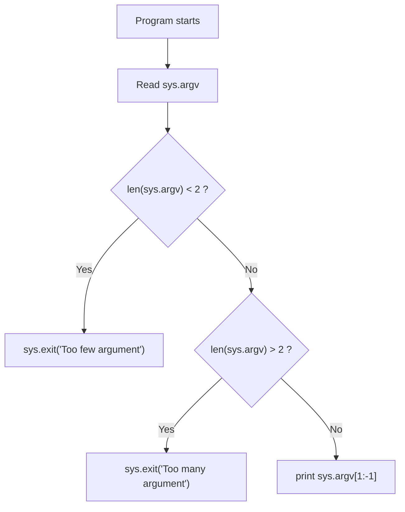

⋆˚꩜｡

## Step-by-Step Trace of the Code

Command run:

```bash
python 8_lecture.py "Noor Afshan Baby"
```

- Because `"Noor Afshan Baby"` is wrapped in **quotes**, the terminal treats it as **one single argument** — not three separate ones.

| Step | Expression | Value |
|---|---|---|
| 1 | `sys.argv` | `['8_lecture.py', 'Noor Afshan Baby']` |
| 2 | `len(sys.argv)` | `2` |
| 3 | `len(sys.argv) < 2` | `False` → first `sys.exit()` is skipped |
| 4 | `len(sys.argv) > 2` | `False` → second `sys.exit()` is skipped |
| 5 | Program reaches the `print()` line | continues normally |
| 6 | `sys.argv[1:-1]` | evaluated next |

```text
index:        0                     1
              ↓                     ↓
sys.argv = ['8_lecture.py', 'Noor Afshan Baby']
neg index:    -2                    -1
```

⋆˚꩜｡

## Why the Output is []

- `sys.argv[1:-1]` means: **start at index `1`, stop before index `-1`.**
- Index `1` and index `-1` refer to the **same element** here — `'Noor Afshan Baby'` — since the list only has 2 items (`index 1` **is** the last item, and `-1` **is** the last item too).
- Because the `stop` index is **excluded**, and `start` already points to the very last item, there is nothing left **between** `start` and `stop` to include.
- Python doesn't raise an error for this — it simply returns an **empty list**: `[]`.

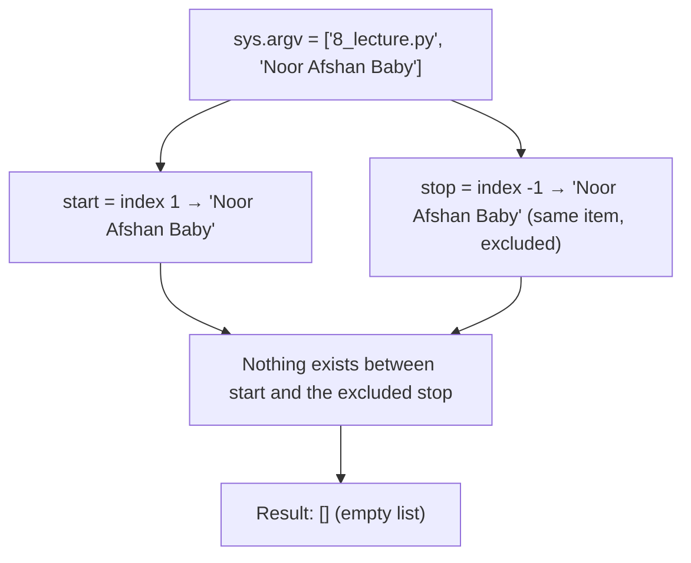

♡ The Core Confusion This Highlights

- `sys.argv[1:-1]` is **not** the same as `sys.argv[1]`.
- `sys.argv[1]` → indexing → returns the actual string `'Noor Afshan Baby'`.
- `sys.argv[1:-1]` → slicing → returns everything **strictly between** index `1` and the last index, which in a 2-item list is **nothing**.
- This pattern (`[1:-1]`) is only useful for **trimming off a first and last item** when there are **more than 2 items** in the list — with exactly one real argument, it always produces `[]`.

⋆˚꩜｡

## Fixing the Code to Get the Actual Name

If the goal is to print the actual name that was passed in, **indexing** should be used instead of slicing:

```python
import sys

if len(sys.argv) < 2:
    sys.exit("Too few argument")
elif len(sys.argv) > 2:
    sys.exit("Too many argument")
print(f"Hello, My name is {sys.argv[1]}")
```

Running:

```bash
python 8_lecture.py "Noor Afshan Baby"
```

Output:

```
Hello, My name is Noor Afshan Baby
```

| Version | Expression | Returns | Output |
|---|---|---|---|
| Original (buggy for this use case) | `sys.argv[1:-1]` | A slice — empty here | `Hello, My name is []` |
| Fixed | `sys.argv[1]` | A single element | `Hello, My name is Noor Afshan Baby` |

⋆˚꩜｡

## Common Mistakes (sys.exit & Slicing)

| Mistake | Why it Fails | Fix |
|---|---|---|
| Using `sys.exit()` without `import sys` | Python doesn't know what `sys` is | Always `import sys` at the top |
| Expecting code after `sys.exit()` to run | The program has already stopped | Put important code **before** `sys.exit()`, or restructure with `if/else` |
| Using `sys.argv[1:-1]` expecting one name | It's a slice, not an index — excludes the stop position | Use `sys.argv[1]` for a single value |
| Assuming `[start:stop]` includes `stop` | Slicing always **excludes** the stop index | Remember: stop is exclusive |
| Forgetting quotes around multi-word arguments | Each word becomes a **separate** argument, changing `len(sys.argv)` | Wrap multi-word input in quotes: `"Noor Afshan Baby"` |
| Confusing `list[-1]` with `list[-1:]` | `[-1]` returns one item, `[-1:]` returns a list containing that item | Use `[-1]` for the value itself, `[-1:]` when a list is needed |

⋆˚꩜｡

## Key Takeaways — sys.exit() & Slicing

- `sys.exit()` immediately stops the **entire program** — nothing after it runs.
- `sys.exit()` can take no argument (silent, code `0`), a string (printed as an error, code `1`), or an integer exit code.
- Slicing uses `[start:stop:step]` — `start` is included, `stop` is always **excluded**.
- Positive indexes count from `0` at the start; negative indexes count from `-1` at the end.
- Slicing can mix positive and negative indexes freely — Python resolves them to positions internally.
- If `start` and `stop` point to the same position (or `start` is after `stop`), the slice result is an **empty list**, not an error.
- `sys.argv[1:-1]` trims the first and last arguments — with only one real argument, this always produces `[]`.
- Use **indexing** (`sys.argv[1]`) to get a single value, and **slicing** (`sys.argv[1:]`, `sys.argv[1:-1]`) to get a sub-list.