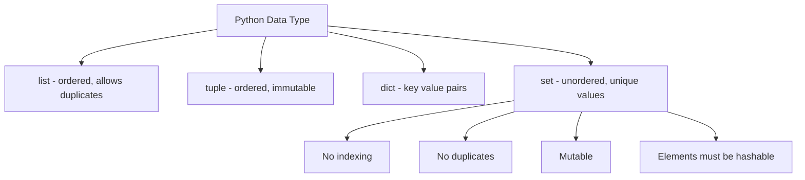
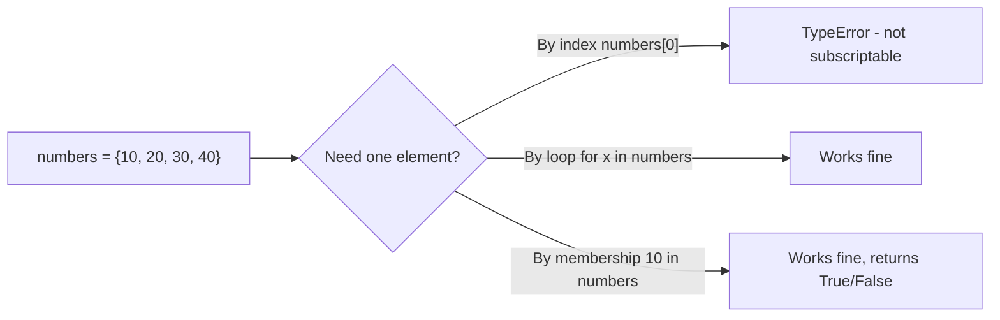
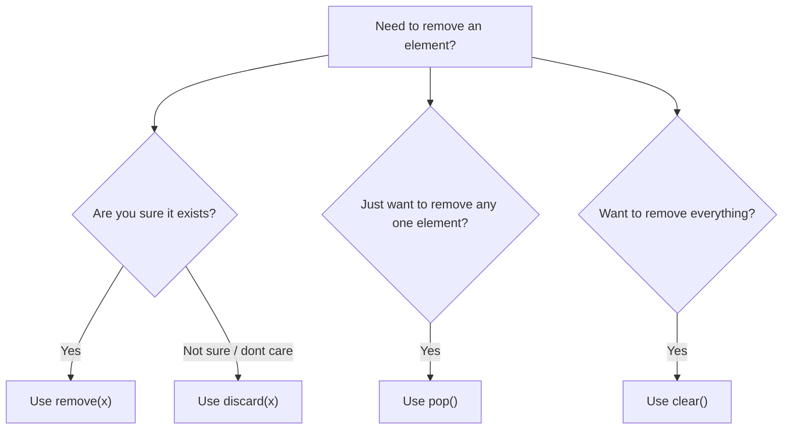
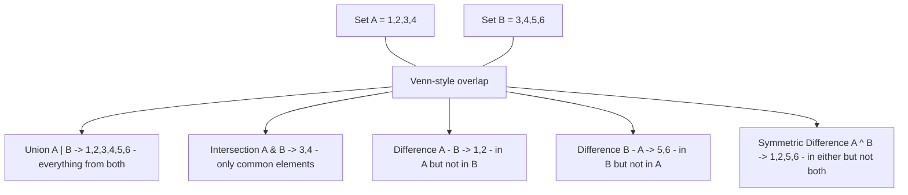
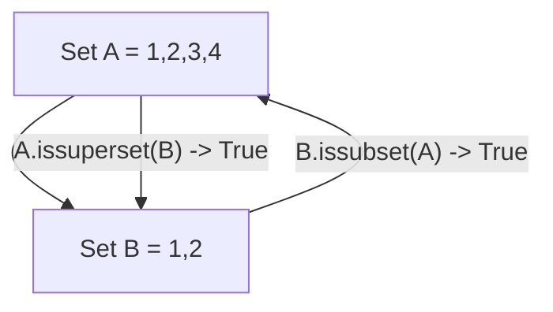
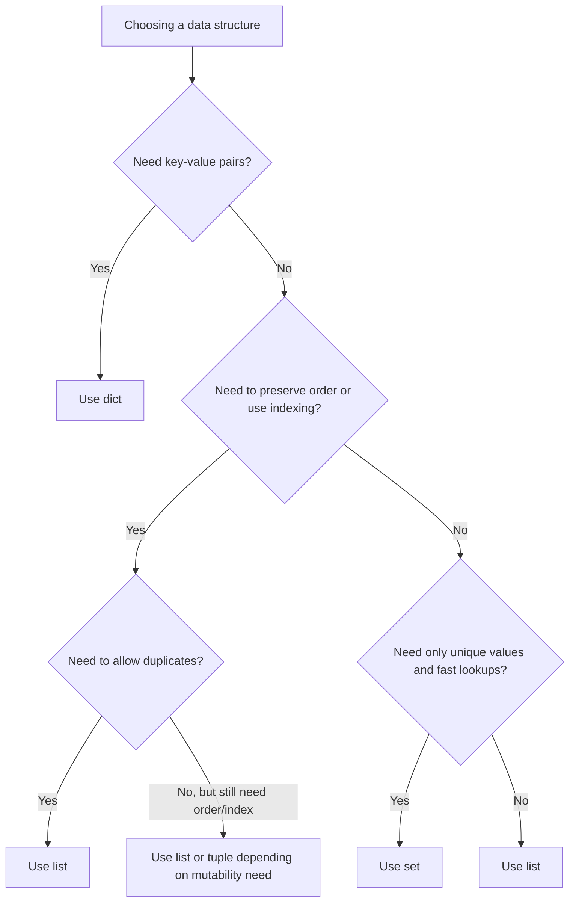

# Python Sets - Complete Notes

## Table of Contents

- [1. What is a Set](#1-what-is-a-set)
- [2. Creating a Set](#2-creating-a-set)
- [3. Sets Remove Duplicates Automatically](#3-sets-remove-duplicates-automatically)
- [4. Creating a Set from a List](#4-creating-a-set-from-a-list)
- [5. Sets are Unordered](#5-sets-are-unordered)
- [6. Sets are Mutable](#6-sets-are-mutable)
- [7. Adding Elements](#7-adding-elements)
- [8. Removing Elements](#8-removing-elements)
- [9. Membership Checking](#9-membership-checking)
- [10. Length of a Set](#10-length-of-a-set)
- [11. Set Operations (Union, Intersection, Difference, Symmetric Difference)](#11-set-operations-union-intersection-difference-symmetric-difference)
- [12. Subset and Superset](#12-subset-and-superset)
- [13. Disjoint Sets](#13-disjoint-sets)
- [14. Frozenset (Immutable Sets)](#14-frozenset-immutable-sets)
- [15. Set Comprehension](#15-set-comprehension)
- [16. Time Complexity of Set Operations](#16-time-complexity-of-set-operations)
- [17. Common Mistakes](#17-common-mistakes)
- [18. When to Use a Set](#18-when-to-use-a-set)
- [19. Quick Summary Cheat Sheet](#19-quick-summary-cheat-sheet)

---

## 1. What is a Set

A set is a built-in Python data type that stores an **unordered collection of unique, hashable values**.

Key properties:
- No duplicate values are allowed.
- No indexing (elements are not stored in a fixed order).
- Mutable (you can add and remove elements after creation).
- Elements must be hashable (numbers, strings, tuples), not lists or dictionaries.



---

## 2. Creating a Set

There are two main ways to create a set: using curly braces `{}` or using the `set()` constructor.

```python
# Using curly braces
numbers = {1, 2, 3, 4}
print(numbers)
# Output: {1, 2, 3, 4}

# Using set() constructor with a list
numbers = set([1, 2, 3])
print(numbers)
# Output: {1, 2, 3}

# Using set() constructor with a string (splits into characters)
letters = set("hello")
print(letters)
# Output: {'h', 'e', 'l', 'o'}   (order may vary)

# Empty set
empty_set = set()
print(type(empty_set))
# Output: <class 'set'>
```

### Important Trap: `{}` is NOT an empty set

```python
empty_dict = {}
print(type(empty_dict))
# Output: <class 'dict'>

empty_set = set()
print(type(empty_set))
# Output: <class 'set'>
```

`{}` always creates an empty **dictionary**. To create an empty set, you must use `set()`.

```mermaid
flowchart TD
    A["Want an empty collection?"] --> B{"Using curly braces {}?"}
    B -->|Yes| C["Creates an empty DICT, not a set"]
    B -->|No, using set()| D["Creates an empty SET"]
```

---

## 3. Sets Remove Duplicates Automatically

```python
numbers = {1, 2, 2, 3, 3, 3}
print(numbers)
# Output: {1, 2, 3}

names = {"Amit", "Amit", "Riya", "Riya", "Zara"}
print(names)
# Output: {'Amit', 'Riya', 'Zara'}
```

This behavior makes sets extremely useful for quickly removing duplicate values from a collection.

---

## 4. Creating a Set from a List

A very common real-world use case is de-duplicating a list.

```python
numbers = [1, 2, 2, 3, 3, 5, 5, 5]

unique_numbers = set(numbers)
print(unique_numbers)
# Output: {1, 2, 3, 5}

# Converting back to a list if order/indexing is needed
unique_list = list(unique_numbers)
print(unique_list)
# Output: [1, 2, 3, 5]   (order not guaranteed)
```

Example with real data (removing duplicate emails):

```python
emails = [
    "a@test.com",
    "b@test.com",
    "a@test.com",
    "c@test.com",
    "b@test.com"
]

unique_emails = set(emails)
print(unique_emails)
# Output: {'a@test.com', 'b@test.com', 'c@test.com'}
```

---

## 5. Sets are Unordered

Because sets are unordered, you cannot access elements using an index, and the printed order is not guaranteed to match insertion order.

```python
numbers = {10, 20, 30, 40}

# This will raise an error:
# print(numbers[0])
# TypeError: 'set' object is not subscriptable

# Correct way to access elements: loop through the set
for number in numbers:
    print(number)
```



---

## 6. Sets are Mutable

Even though set elements must be hashable (immutable types), the set itself can be changed after creation - you can add or remove elements.

```python
numbers = {1, 2, 3}
numbers.add(4)
print(numbers)
# Output: {1, 2, 3, 4}
```

Note: You cannot put a mutable object like a list inside a set.

```python
# This will raise an error:
# bad_set = {1, 2, [3, 4]}
# TypeError: unhashable type: 'list'

# This works, because tuples are hashable:
good_set = {1, 2, (3, 4)}
print(good_set)
# Output: {1, 2, (3, 4)}
```

---

## 7. Adding Elements

### `add()` - add a single element

```python
numbers = {1, 2, 3}
numbers.add(4)
print(numbers)
# Output: {1, 2, 3, 4}

# Adding a duplicate does nothing (no error, no change)
numbers.add(2)
print(numbers)
# Output: {1, 2, 3, 4}
```

### `update()` - add multiple elements at once

```python
numbers = {1, 2, 3}
numbers.update([4, 5, 6])
print(numbers)
# Output: {1, 2, 3, 4, 5, 6}

# update() also accepts other sets, tuples, or strings
numbers.update((7, 8), {9, 10})
print(numbers)
# Output: {1, 2, 3, 4, 5, 6, 7, 8, 9, 10}
```

---

## 8. Removing Elements

There are four ways to remove elements, and each behaves differently.

```python
numbers = {1, 2, 3, 4}

# remove() - raises KeyError if element is missing
numbers.remove(3)
print(numbers)
# Output: {1, 2, 4}

# numbers.remove(10)
# KeyError: 10

# discard() - does NOT raise an error if element is missing
numbers.discard(10)
print(numbers)
# Output: {1, 2, 4}   (unchanged, no error)

# pop() - removes and returns an arbitrary element
removed = numbers.pop()
print("Removed:", removed)
print("Remaining:", numbers)

# clear() - removes everything
numbers.clear()
print(numbers)
# Output: set()
```



---

## 9. Membership Checking

Sets are optimized for very fast membership checks using `in` and `not in`.

```python
numbers = {1, 2, 3, 4}

print(2 in numbers)
# Output: True

print(10 in numbers)
# Output: False

print(10 not in numbers)
# Output: True
```

Example - checking valid usernames quickly:

```python
registered_users = {"amit", "riya", "zara", "karan"}

username = "riya"

if username in registered_users:
    print("Username already taken")
else:
    print("Username available")
# Output: Username already taken
```

Why is this fast? A set uses a hash table internally, so checking membership is on average O(1) (constant time), compared to O(n) for a list, where Python has to check every element one by one.

---

## 10. Length of a Set

```python
numbers = {10, 20, 30}
print(len(numbers))
# Output: 3

empty_set = set()
print(len(empty_set))
# Output: 0
```

---

## 11. Set Operations (Union, Intersection, Difference, Symmetric Difference)

```python
A = {1, 2, 3, 4}
B = {3, 4, 5, 6}
```



### Union - all unique elements from both sets

```python
print(A | B)
# Output: {1, 2, 3, 4, 5, 6}

print(A.union(B))
# Output: {1, 2, 3, 4, 5, 6}
```

### Intersection - elements common to both sets

```python
print(A & B)
# Output: {3, 4}

print(A.intersection(B))
# Output: {3, 4}
```

### Difference - elements in A but not in B

```python
print(A - B)
# Output: {1, 2}

print(B - A)
# Output: {5, 6}
```

### Symmetric Difference - elements in either set, but not in both

```python
print(A ^ B)
# Output: {1, 2, 5, 6}

print(A.symmetric_difference(B))
# Output: {1, 2, 5, 6}
```

### Real-world example: comparing two friend lists

```python
your_friends = {"Amit", "Riya", "Zara", "Karan"}
their_friends = {"Riya", "Zara", "Farhan", "Simran"}

mutual_friends = your_friends & their_friends
print("Mutual friends:", mutual_friends)
# Output: Mutual friends: {'Riya', 'Zara'}

only_yours = your_friends - their_friends
print("Only your friends:", only_yours)
# Output: Only your friends: {'Amit', 'Karan'}

all_friends = your_friends | their_friends
print("All friends combined:", all_friends)
# Output: All friends combined: {'Amit', 'Riya', 'Zara', 'Karan', 'Farhan', 'Simran'}
```

---

## 12. Subset and Superset

```python
A = {1, 2, 3, 4}
B = {1, 2}

# B is a subset of A: every element of B is also in A
print(B.issubset(A))
# Output: True

print(B <= A)
# Output: True

# A is a superset of B: A contains every element of B
print(A.issuperset(B))
# Output: True

print(A >= B)
# Output: True
```



Proper subset (strictly smaller, using `<`):

```python
A = {1, 2, 3}
B = {1, 2, 3}

print(A < B)
# Output: False (A equals B, not a proper subset)

C = {1, 2}
print(C < A)
# Output: True (C is smaller and fully contained in A)
```

---

## 13. Disjoint Sets

Two sets are disjoint if they share no common elements at all.

```python
A = {1, 2, 3}
B = {4, 5, 6}

print(A.isdisjoint(B))
# Output: True

C = {3, 4, 5}
print(A.isdisjoint(C))
# Output: False   (they share the element 3)
```

---

## 14. Frozenset (Immutable Sets)

A `frozenset` behaves like a set, but it is immutable - you cannot add or remove elements after it is created. This also makes it hashable, so a `frozenset` can be used as a dictionary key or stored inside another set.

```python
fs = frozenset([1, 2, 3])
print(fs)
# Output: frozenset({1, 2, 3})

# fs.add(4)
# AttributeError: 'frozenset' object has no attribute 'add'

# Using frozenset as a dictionary key
data = {
    frozenset([1, 2]): "pair one",
    frozenset([3, 4]): "pair two"
}
print(data[frozenset([1, 2])])
# Output: pair one
```

---

## 15. Set Comprehension

Similar to list comprehension, sets can also be built using comprehension syntax. Duplicates are automatically removed.

```python
squares = {x * x for x in range(1, 6)}
print(squares)
# Output: {1, 4, 9, 16, 25}

# With a condition
even_squares = {x * x for x in range(1, 11) if x % 2 == 0}
print(even_squares)
# Output: {4, 16, 36, 64, 100}

words = ["apple", "banana", "apple", "cherry", "banana"]
unique_lengths = {len(word) for word in words}
print(unique_lengths)
# Output: {5, 6, 6} -> becomes {5, 6} since duplicates collapse
```

---

## 16. Time Complexity of Set Operations

| Operation           | Average Case | Notes                              |
|----------------------|--------------|-------------------------------------|
| `x in s`             | O(1)         | Membership check (hash lookup)      |
| `s.add(x)`           | O(1)         | Insert element                      |
| `s.remove(x)`        | O(1)         | Raises KeyError if missing          |
| `s.discard(x)`       | O(1)         | Safe removal                        |
| `s.pop()`            | O(1)         | Removes an arbitrary element        |
| Union `s1 \| s2`      | O(len(s1) + len(s2)) | Combines both sets          |
| Intersection `s1 & s2` | O(min(len(s1), len(s2))) | Compares smaller set    |

This is the main reason sets are chosen over lists when doing frequent membership checks or removing duplicates from large collections.

---

## 17. Common Mistakes

```python
# Mistake 1: assuming {} makes an empty set
wrong = {}
print(type(wrong))
# Output: <class 'dict'>   -> should have used set()

# Mistake 2: trying to index a set
numbers = {1, 2, 3}
# print(numbers[0])
# TypeError: 'set' object is not subscriptable

# Mistake 3: putting a mutable object (list) inside a set
# bad = {1, 2, [3, 4]}
# TypeError: unhashable type: 'list'

# Mistake 4: expecting insertion order to be preserved
numbers = {5, 1, 4, 2, 3}
print(numbers)
# Output order is not guaranteed to be 5,1,4,2,3

# Mistake 5: using remove() when the element might not exist
numbers = {1, 2, 3}
# numbers.remove(10)
# KeyError: 10   -> use discard(10) instead if unsure
```

---

## 18. When to Use a Set

Use a set when:
- You need to store only unique values.
- You need very fast membership checking (`in`).
- You need to perform mathematical set operations like union, intersection, or difference.
- Order of elements does not matter.

Avoid a set when:
- You need to preserve the order of elements (use a `list` instead).
- You need indexing/slicing (use a `list` or `tuple` instead).
- You need key-value pairs (use a `dict` instead).
- You need duplicate values to be preserved (use a `list` instead).



---

## 19. Quick Summary Cheat Sheet

```python
# Create
numbers = {1, 2, 3}
numbers = set([1, 2, 3])

# Empty set
numbers = set()

# Add
numbers.add(4)

# Add multiple
numbers.update([5, 6])

# Remove (raises error if missing)
numbers.remove(4)

# Safe remove (no error if missing)
numbers.discard(4)

# Remove and return arbitrary element
numbers.pop()

# Remove everything
numbers.clear()

# Membership check
4 in numbers

# Length
len(numbers)

# Union
A | B

# Intersection
A & B

# Difference
A - B

# Symmetric difference
A ^ B

# Subset check
A.issubset(B)

# Superset check
A.issuperset(B)

# Disjoint check
A.isdisjoint(B)

# Immutable version
frozenset([1, 2, 3])

# Set comprehension
{x * x for x in range(5)}
```