# Lecture 9: Unit Testing in Python
### A Complete Beginner's Guide (using the `unittest` module)

---
A unit test tests one small, independent piece of your program.
## Welcome

Today we learn how to make sure our code actually works — not by staring at it and hoping, but by **testing it automatically**. As always, we build every idea from zero.

---

## Table of Contents

1. [What is Unit Testing?](#1-what-is-unit-testing)
2. [Unit Testing vs Integration Testing](#2-unit-testing-vs-integration-testing)
3. [The `unittest` Module](#3-the-unittest-module)
4. [`unittest.TestCase`](#4-unittesttestcase)
5. [Writing Test Methods & the `test_` Naming Convention](#5-writing-test-methods--the-test_-naming-convention)
6. [`unittest.main()` and `if __name__ == "__main__":`](#6-unittestmain-and-if-__name__--__main__)
7. [Assertion Methods](#7-assertion-methods)
8. [Testing Normal, Edge, and Invalid Cases](#8-testing-normal-edge-and-invalid-cases)
9. [`setUp()` and `tearDown()`](#9-setup-and-teardown)
10. [Separating Source Code and Test Code](#10-separating-source-code-and-test-code)
11. [Running Tests](#11-running-tests)
12. [Test Discovery](#12-test-discovery)
13. [`subTest()`](#13-subtest)
14. [Mocking Basics: `Mock` and `patch()`](#14-mocking-basics-mock-and-patch)
15. [Testing Functions That Use APIs/External Dependencies](#15-testing-functions-that-use-apisexternal-dependencies)
16. [Practice Zone](#16-practice-zone)
17. [Chapter Summary & Cheat Sheet](#17-chapter-summary--cheat-sheet)
18. [Glossary](#18-glossary)

---

## 1. What is Unit Testing?

### Definition

**Unit testing** means writing small pieces of code whose *only job* is to check whether **one small "unit"** of your program (usually a single function) behaves correctly.

A "unit" is the smallest testable piece of your code — most often, one function.

### Why It Exists

Without tests, you check if code works by running it manually and looking at the output with your own eyes. This is:

* Slow (you re-check by hand every time you change something)
* Unreliable (humans miss things)
* Not repeatable automatically

Unit tests solve this: you write the check **once**, and then run it instantly, as many times as you want, forever.

### Real-Life Analogy

> 🧠 **Analogy: A Quality Checker on a Factory Line**
> Before a phone leaves the factory, a machine checks: does the screen turn on? Does the battery charge? This happens for **every single unit** produced, automatically, without a human re-checking by hand each time. A unit test is that automatic checker, but for a function.

### Example

Imagine this simple function:

```python
def add(a, b):
    return a + b
```

Instead of manually typing `add(2, 3)` into a console and eyeballing whether `5` appears, we write a **test** that checks it for us:

```python
import unittest

class TestAdd(unittest.TestCase):
    def test_add_two_numbers(self):
        self.assertEqual(add(2, 3), 5)
```

We'll unpack every piece of this (`unittest.TestCase`, `assertEqual`, etc.) in the sections ahead — for now, just notice: **the test checks the function's behavior, automatically.**

### How Python Executes This Internally (Beginner Level)

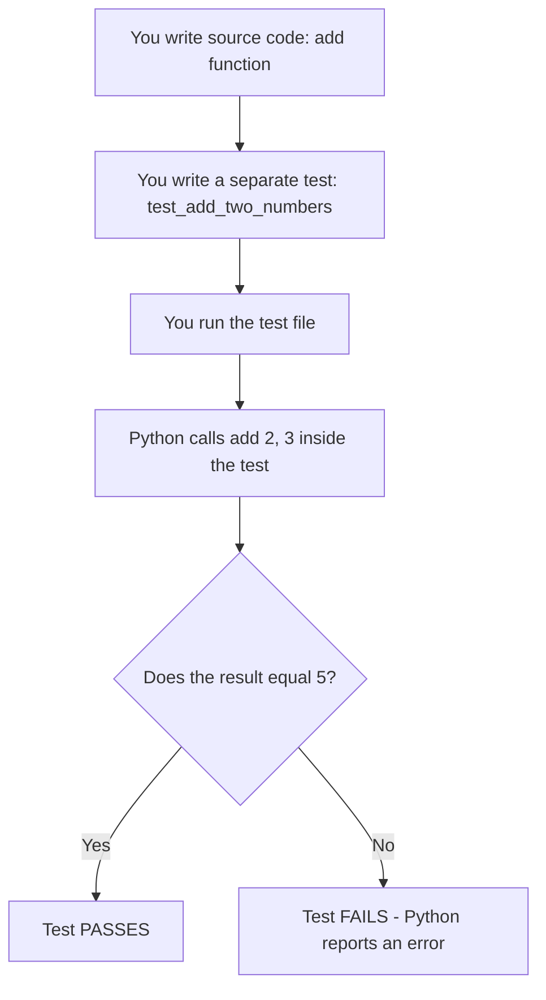

### Beginner Mistakes

* ❌ Thinking testing means "running the program once and looking at the screen." Unit testing means writing **automated, repeatable checks**.
* ❌ Only testing when things "look fine" — the real value of tests shows up **later**, when you change code and something breaks silently.

### Best Practices

* ✅ Write a test for every function that contains real logic (not just a simple print statement).
* ✅ Run your tests every time you change code — this catches "regressions" (things that used to work but broke).

### Summary

Unit testing means writing small, automated pieces of code that check whether individual functions behave the way you expect — reliably, repeatably, and without manual checking.

---

## 2. Unit Testing vs Integration Testing

### Definitions

* **Unit Testing:** Tests **one small piece** (usually a single function) **in isolation**, without depending on other parts of the system.
* **Integration Testing:** Tests how **multiple pieces work together** — e.g., does your function correctly interact with a database, a file, or another function?

### Real-Life Analogy

> 🧠 **Analogy: Testing Car Parts**
> **Unit testing** is like testing the engine alone, on a test bench, disconnected from the rest of the car. **Integration testing** is like putting the engine, wheels, and brakes all together in the actual car and taking it for a drive to see if everything works **together**.

### Table: Unit vs Integration Testing

| Aspect | Unit Testing | Integration Testing |
|---|---|---|
| Scope | One function/unit, in isolation | Multiple components working together |
| Speed | Very fast | Slower (involves more moving parts) |
| Dependencies | Often faked/mocked out | Real dependencies often included |
| Goal | "Does this one piece work correctly?" | "Do these pieces work correctly *together*?" |
| Example | Testing `add(a, b)` alone | Testing that `save_user()` correctly writes to a real database |

### Flowchart

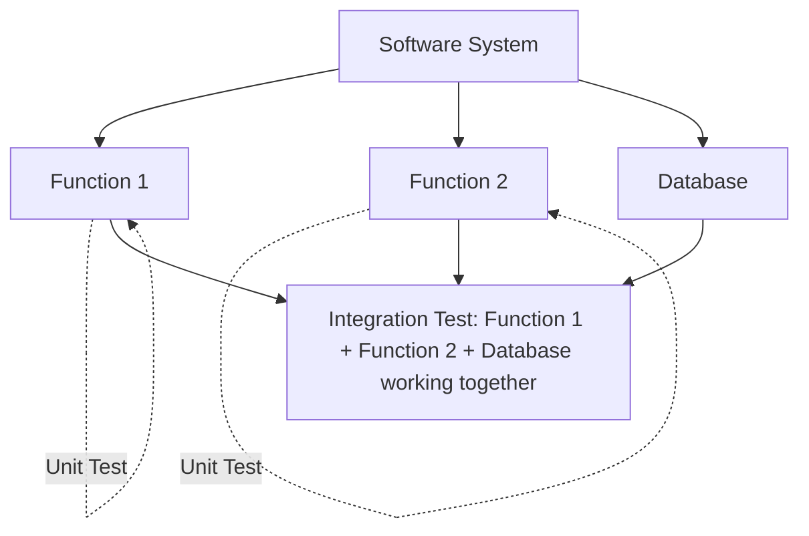

### Beginner Mistakes

* ❌ Assuming unit tests alone guarantee the whole application works — they don't test how pieces interact.
* ❌ Writing only integration tests — they're slower and harder to pinpoint the exact bug when something fails.

### Summary

Unit tests check one piece alone; integration tests check that pieces work correctly together. Good projects use **both**.

---

## 3. The `unittest` Module

### Definition

`unittest` is Python's **built-in** module (comes pre-installed, no need to `pip install` anything) for writing and running tests.

### Why It Exists

Python's creators knew testing was essential, so they built a standard, ready-made toolkit into the language itself — you don't need to invent your own testing system from scratch.

### Syntax: Importing It

```python
import unittest
```

That's it — this single line gives you access to `TestCase`, all the `assert...` methods, `main()`, and more.

### Example: Minimal Skeleton

```python
import unittest

class TestExample(unittest.TestCase):
    def test_something(self):
        self.assertEqual(1 + 1, 2)

if __name__ == "__main__":
    unittest.main()
```

We will explain **every single line** of this skeleton across the next few sections — this is the standard shape of almost every test file you'll write.

### Beginner Mistakes

* ❌ Trying to `pip install unittest` — it's already built into Python; installing it is unnecessary and will actually cause errors.

### Summary

`unittest` is Python's built-in testing framework — always available, and the standard starting point for testing in Python.

---

## 4. `unittest.TestCase`

### Definition

`TestCase` is a **class** provided by `unittest` that you **inherit from** to create your own test classes. Inheriting from it gives your class access to all the special testing tools (like `assertEqual`, `setUp`, etc.).

> 📝 **Note:** "Inherit" means your class **borrows** all the abilities of `TestCase`, the way a child inherits traits from a parent, while also being able to add its own.

### Why It Exists

Testing requires repeated tools: comparing values, setting up data before a test, cleaning up after a test. Rather than writing these yourself, `TestCase` provides them ready-made.

### Syntax

```python
class TestSomething(unittest.TestCase):
    pass
```

| Part | Meaning |
|---|---|
| `class TestSomething` | You are defining a new class named `TestSomething` |
| `(unittest.TestCase)` | This class **inherits** from `TestCase`, gaining all its testing powers |

### Real-Life Analogy

> 🧠 **Analogy: A Toolbox You Borrow**
> `TestCase` is like a fully-stocked toolbox handed to you. By writing `class TestSomething(unittest.TestCase):`, you're saying "give me that toolbox" — now every wrench and screwdriver (`assertEqual`, `assertTrue`, etc.) is available inside your class.

### Example

```python
import unittest

class TestMath(unittest.TestCase):
    def test_addition(self):
        self.assertEqual(2 + 2, 4)
```

**Line-by-line:**

1. `import unittest` — loads the testing toolkit.
2. `class TestMath(unittest.TestCase):` — creates a test class that inherits from `TestCase`.
3. `def test_addition(self):` — defines a test method (explained fully in the next section).
4. `self.assertEqual(2 + 2, 4)` — uses a tool from the inherited toolbox to check that `2 + 2` equals `4`.

* **Side effect?** None directly — but if the assertion fails, `unittest` will report/print a failure when the test runs.
* **Return value?** Test methods don't return meaningful values — their "result" is pass/fail.

### Beginner Mistakes

* ❌ Forgetting to inherit from `unittest.TestCase` — without it, none of the `assert...` methods will exist on your class.
* ❌ Naming the class without the word `Test` — not a strict rule, but a strong convention that helps tools find your tests.

### Best Practices

* ✅ Name test classes like `TestClassName` or `TestFunctionality`, clearly describing what's being tested.

### Summary

`TestCase` is the base class you inherit from to unlock all of `unittest`'s testing tools inside your own test classes.

---

## 5. Writing Test Methods & the `test_` Naming Convention

### Definition

A **test method** is a function defined inside a `TestCase` class that checks one specific behavior. Its name **must start with `test_`** for `unittest` to automatically recognize and run it.

### Why This Convention Exists

`unittest` needs a way to tell "this is a method I should run as a test" apart from "this is just a helper method." Rather than making you register each test manually, it simply looks for anything starting with `test_`.

### Syntax

```python
class TestExample(unittest.TestCase):
    def test_addition(self):        # Will run automatically
        self.assertEqual(1 + 1, 2)

    def helper_method(self):        # Will NOT run automatically — no 'test_' prefix
        pass
```

### Step-by-Step Execution

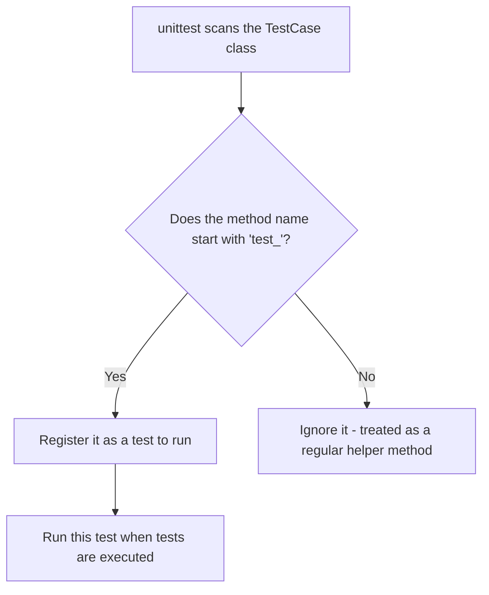

### Example: Multiple Test Methods

```python
import unittest

def add(a, b):
    return a + b

def subtract(a, b):
    return a - b

class TestMathOperations(unittest.TestCase):
    def test_add(self):
        self.assertEqual(add(3, 2), 5)

    def test_subtract(self):
        self.assertEqual(subtract(5, 3), 2)
```

**Explanation:**

* `test_add` and `test_subtract` are both picked up automatically because of their `test_` prefix.
* Each test method checks exactly **one behavior** — this is intentional. One failing assertion shouldn't hide a completely unrelated failure in a different check.

### Beginner Mistakes

* ❌ Naming a test method `check_add` or `addition_test` — since it doesn't **start** with `test_`, `unittest` will silently skip it (it just won't run, with no big warning).
* ❌ Cramming many unrelated checks into a single test method — makes it hard to tell exactly what broke.

### Best Practices

* ✅ Name tests descriptively: `test_add_returns_correct_sum`, not `test_1`.
* ✅ One test method = one specific behavior/scenario.

### Summary

Test methods must start with `test_` so `unittest` can automatically discover and run them — each should verify one specific behavior.

---

## 6. `unittest.main()` and `if __name__ == "__main__":`

### Definition

* **`unittest.main()`** — a function that finds all `TestCase` classes and their `test_` methods in the current file and runs them.
* **`if __name__ == "__main__":`** — a standard Python pattern that ensures certain code (like `unittest.main()`) only runs when the file is executed **directly**, not when it's imported elsewhere.

### Why They Exist

Without `unittest.main()`, Python would define your tests but never actually **run** them (remember: definition ≠ execution, from earlier lectures on functions!).

The `if __name__ == "__main__":` guard prevents your tests from running automatically just because someone **imports** your test file into another script.

### Syntax

```python
if __name__ == "__main__":
    unittest.main()
```

| Part | Meaning |
|---|---|
| `__name__` | A special built-in variable Python sets automatically for every file |
| `"__main__"` | The value `__name__` holds **only** when this exact file is run directly |
| `unittest.main()` | Discovers and runs every test in this file |

### How Python Executes This Internally

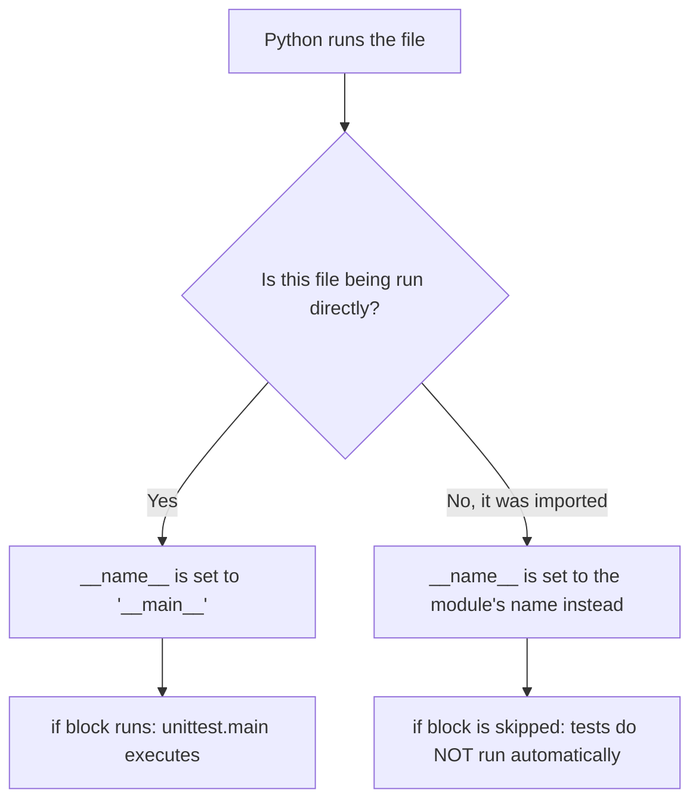

### Example

```python
import unittest

def square(n):
    return n ** 2

class TestSquare(unittest.TestCase):
    def test_square_of_positive_number(self):
        self.assertEqual(square(4), 16)

if __name__ == "__main__":
    unittest.main()
```

**Execution order when run directly (`python test_square.py`):**

1. Python defines `square`.
2. Python defines the `TestSquare` class (test methods are stored, not run yet).
3. Python checks `if __name__ == "__main__":` — true, since we ran this file directly.
4. `unittest.main()` runs, discovers `test_square_of_positive_number`, executes it.
5. `assertEqual(16, 16)` passes silently, and `unittest` prints a summary (e.g., `OK`).

> 💡 **Tip:** You *can* call `unittest.main()` without the `if __name__ == "__main__":` guard, but it's considered best practice to include it — it keeps your file safe to import elsewhere without accidentally re-running all tests.

### Beginner Mistakes

* ❌ Forgetting to call `unittest.main()` — your tests are defined but never actually run.
* ❌ Not understanding that skipping the `if __name__` guard can cause tests to run unexpectedly if the file is imported elsewhere.

### Summary

`unittest.main()` actually executes your tests; the `if __name__ == "__main__":` guard ensures this only happens when the file is run directly.

---

## 7. Assertion Methods

### Definition

An **assertion** is a statement that checks whether something is true. If it's **not** true, the test **fails** immediately and `unittest` reports exactly which check went wrong.

> 🧠 **Analogy: A Checklist Inspector**
> Each `assert...` call is like an inspector checking one box on a checklist: "Is this actually equal to what I expected?" If not, the inspector raises a flag (a failure) right there.

Below is every assertion method from your topic list, explained individually.

---

### 7.1 `assertEqual(a, b)`

Checks that `a` **equals** `b`.

```python
self.assertEqual(add(2, 3), 5)
```

If `add(2, 3)` does not equal `5`, the test fails and shows both values so you can see what went wrong.

### 7.2 `assertNotEqual(a, b)`

Checks that `a` does **not** equal `b`.

```python
self.assertNotEqual(add(2, 3), 6)
```

### 7.3 `assertTrue(x)`

Checks that `x` evaluates to `True`.

```python
self.assertTrue(5 > 3)
```

### 7.4 `assertFalse(x)`

Checks that `x` evaluates to `False`.

```python
self.assertFalse(5 < 3)
```

### 7.5 `assertIsNone(x)`

Checks that `x` **is** `None` (i.e., "nothing was returned/set").

```python
def find_user(name):
    return None   # user not found

self.assertIsNone(find_user("Unknown"))
```

### 7.6 `assertIsNotNone(x)`

Checks that `x` is **not** `None` — something meaningful was returned.

```python
self.assertIsNotNone(find_user("Ravi"))
```

### 7.7 `assertIn(item, collection)`

Checks that `item` exists **inside** `collection` (a list, string, dictionary, etc.).

```python
self.assertIn(3, [1, 2, 3, 4])
self.assertIn("a", "cat")
```

### 7.8 `assertNotIn(item, collection)`

Checks that `item` does **not** exist inside `collection`.

```python
self.assertNotIn(10, [1, 2, 3, 4])
```

### 7.9 `assertIsInstance(obj, type)`

Checks that `obj` is an instance of a particular `type` (e.g., is this actually an `int`? a `str`?).

```python
self.assertIsInstance(5, int)
self.assertIsInstance("hello", str)
```

### 7.10 `assertRaises(ExceptionType)`

Checks that a specific block of code **raises an error** (an "exception") as expected. Used with a `with` block.

```python
def divide(a, b):
    return a / b

class TestDivide(unittest.TestCase):
    def test_divide_by_zero_raises_error(self):
        with self.assertRaises(ZeroDivisionError):
            divide(10, 0)
```

**Step-by-step:**

1. Python enters the `with self.assertRaises(ZeroDivisionError):` block.
2. Python runs `divide(10, 0)` inside it.
3. Since dividing by zero genuinely raises a `ZeroDivisionError`, `unittest` sees this as **expected**, and the test **passes**.
4. If `divide(10, 0)` had **not** raised that error, the test would **fail**, because we expected an error that never happened.

### Table: Assertion Methods at a Glance

| Method | Checks that... | Example |
|---|---|---|
| `assertEqual(a, b)` | `a == b` | `assertEqual(add(2,3), 5)` |
| `assertNotEqual(a, b)` | `a != b` | `assertNotEqual(add(2,3), 6)` |
| `assertTrue(x)` | `x` is truthy | `assertTrue(5 > 3)` |
| `assertFalse(x)` | `x` is falsy | `assertFalse(5 < 3)` |
| `assertIsNone(x)` | `x is None` | `assertIsNone(find_user("x"))` |
| `assertIsNotNone(x)` | `x is not None` | `assertIsNotNone(find_user("Ravi"))` |
| `assertIn(a, b)` | `a` is inside `b` | `assertIn(3, [1,2,3])` |
| `assertNotIn(a, b)` | `a` is not inside `b` | `assertNotIn(10, [1,2,3])` |
| `assertIsInstance(a, t)` | `a` is of type `t` | `assertIsInstance(5, int)` |
| `assertRaises(E)` | code raises exception `E` | `assertRaises(ZeroDivisionError)` |

### Flowchart: How an Assertion Works

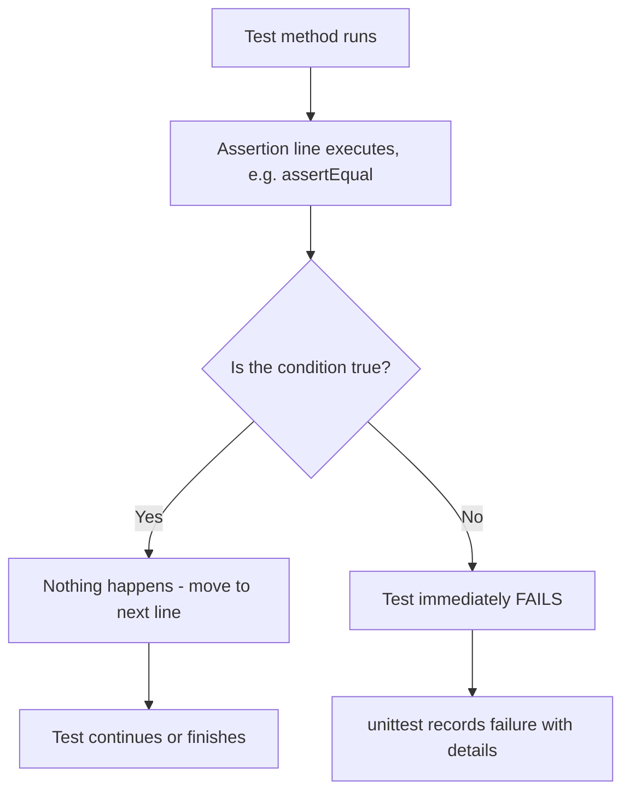

### Beginner Mistakes

* ❌ Mixing up the argument order (though for `assertEqual` it usually doesn't matter functionally, convention is `assertEqual(actual, expected)`).
* ❌ Forgetting the `with` block syntax for `assertRaises`.
* ❌ Using `assertTrue(a == b)` instead of the more specific `assertEqual(a, b)` — the specific version gives a **much clearer error message** when it fails.

### Best Practices

* ✅ Always prefer the **most specific** assertion available (`assertIn` over `assertTrue(x in y)`), because failure messages are more helpful.

### Summary

Assertion methods are the actual "checks" inside your tests — each one verifies a specific kind of expectation and fails loudly (with details) when it's not met.

---

## 8. Testing Normal, Edge, and Invalid Cases

### Definitions

* **Normal (expected) case:** Typical, everyday input the function is designed for.
* **Edge case:** Unusual, boundary, or extreme input (empty input, zero, very large numbers, the very first/last item).
* **Invalid case:** Input the function should **reject** or handle gracefully (wrong data type, negative number where only positive makes sense, etc.).

### Why This Matters

A function might work perfectly for "normal" input but crash or misbehave on edge cases and bad input. Good testing **deliberately** tries to break your code before a real user does.

### Real-Life Analogy

> 🧠 **Analogy: Testing an Umbrella**
> **Normal case:** Does it block light rain? **Edge case:** Does it survive a very strong gust of wind? **Invalid case:** What happens if someone tries to open it underwater? A well-tested umbrella (or function) is checked against all three.

### Example: All Three Case Types for One Function

```python
def divide(a, b):
    if b == 0:
        raise ValueError("Cannot divide by zero")
    return a / b

class TestDivide(unittest.TestCase):

    def test_normal_case(self):
        self.assertEqual(divide(10, 2), 5)

    def test_edge_case_zero_numerator(self):
        self.assertEqual(divide(0, 5), 0)

    def test_invalid_case_division_by_zero(self):
        with self.assertRaises(ValueError):
            divide(10, 0)
```

**Explanation:**

* `test_normal_case` — a typical division that should just work.
* `test_edge_case_zero_numerator` — `0` divided by anything is a boundary-ish case worth checking explicitly.
* `test_invalid_case_division_by_zero` — deliberately invalid input (dividing by zero), checking that our function **handles it properly** by raising a clear error rather than crashing unexpectedly.

### Flowchart

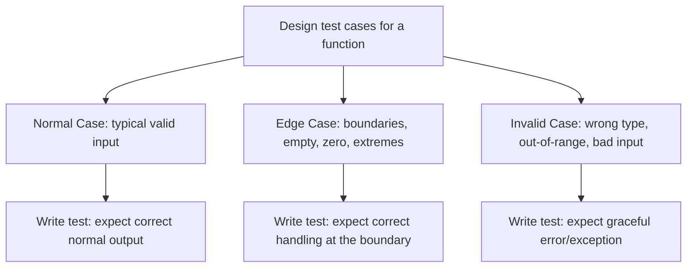

### Beginner Mistakes

* ❌ Only testing the "happy path" (normal cases) and skipping edge/invalid cases — this is the most common beginner testing mistake.

### Best Practices

* ✅ For every function, ask: "What's the simplest valid input? What's the weirdest valid input? What input should be rejected?"

### Summary

Thorough testing covers normal expected behavior, tricky boundary conditions (edge cases), and deliberately bad input (invalid cases) — not just the easy, obvious scenario.

---

## 9. `setUp()` and `tearDown()`

### Definitions

* **`setUp()`** — a special method that runs **automatically before every single test method** in a `TestCase` class. Used to prepare data/objects needed for tests.
* **`tearDown()`** — a special method that runs **automatically after every single test method**. Used to clean up (close files, reset data, etc.).

### Why They Exist

Many tests need the same starting setup (e.g., a list, a fresh object, a temporary file). Instead of repeating that setup code in every test method, you write it **once** in `setUp()`, and `unittest` runs it before each test automatically.

### Real-Life Analogy

> 🧠 **Analogy: Resetting a Kitchen Before Each Recipe**
> Before cooking each dish (test), a chef resets the kitchen — clean counters, fresh ingredients (`setUp`). After cooking, they clean up again (`tearDown`) so the next dish starts fresh, unaffected by the previous one.

### Syntax

```python
class TestExample(unittest.TestCase):

    def setUp(self):
        self.numbers = [1, 2, 3]   # Runs before EVERY test

    def tearDown(self):
        self.numbers = None        # Runs after EVERY test

    def test_length(self):
        self.assertEqual(len(self.numbers), 3)

    def test_contains_two(self):
        self.assertIn(2, self.numbers)
```

**Step-by-step execution order:**

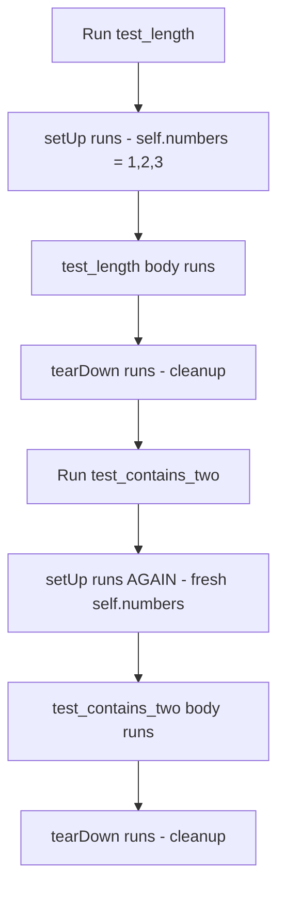

> 📝 **Note:** `setUp()` and `tearDown()` run **once per test method**, not once per class. This guarantees each test starts from a clean, predictable state, uninfluenced by other tests.

### Beginner Mistakes

* ❌ Assuming `setUp()` runs only once for the whole class — it actually runs **before every single test**.
* ❌ Putting expensive, unnecessary work in `setUp()` that not all tests actually need, slowing down the whole test suite.

### Best Practices

* ✅ Use `setUp()` for genuinely shared preparation (e.g., creating a sample object every test needs).
* ✅ Use `tearDown()` to release resources like open files, network connections, or database entries created during testing.

### Summary

`setUp()` prepares a clean environment before each test; `tearDown()` cleans up after each test — both run automatically, once per test method.

---

## 10. Separating Source Code and Test Code

### Definition

**Separating source and test code** means keeping your actual program logic (source code) in one file, and your tests (which check that logic) in a **different** file — rather than mixing them together.

### Why This Matters

* Keeps your main program clean and focused.
* Lets you run tests without cluttering or accidentally modifying your real program.
* Makes it obvious, at a glance, which files are "the product" and which are "the safety net."

### Common Convention

```
project/
│
├── calculator.py         # Source code
└── test_calculator.py    # Test code
```

**`calculator.py`:**

```python
def add(a, b):
    return a + b

def subtract(a, b):
    return a - b
```

**`test_calculator.py`:**

```python
import unittest
from calculator import add, subtract

class TestCalculator(unittest.TestCase):

    def test_add(self):
        self.assertEqual(add(2, 3), 5)

    def test_subtract(self):
        self.assertEqual(subtract(5, 2), 3)

if __name__ == "__main__":
    unittest.main()
```

**Explanation:**

1. `from calculator import add, subtract` — imports the real functions from the source file, so the test file doesn't need to redefine them.
2. The test file focuses **only** on checking behavior — it contains no "real" application logic itself.

### Flowchart

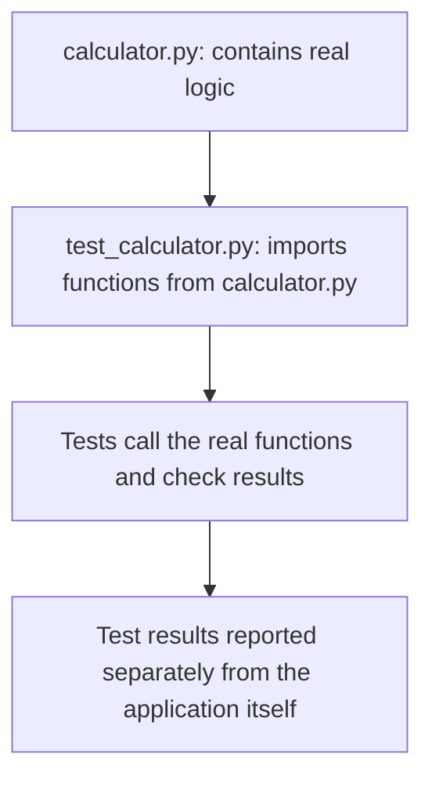

### Beginner Mistakes

* ❌ Writing tests in the **same** file as the application logic for anything beyond tiny scripts — this gets messy fast.
* ❌ Forgetting the naming convention `test_<module_name>.py`, which many tools rely on for automatic discovery (next section).

### Best Practices

* ✅ Name test files `test_<something>.py` — this is expected by `unittest`'s discovery system.
* ✅ Keep a consistent project structure (e.g., a dedicated `tests/` folder for larger projects).

### Summary

Keeping source code and test code in separate files keeps your project organized and lets testing tools automatically find your tests.

---

## 11. Running Tests

There are two common ways to run your tests.

### 11.1 Running with `python test_file.py`

If your test file includes the `if __name__ == "__main__": unittest.main()` block, you can simply run:

```bash
python test_calculator.py
```

**What happens:**

1. Python runs the file directly, so `__name__` becomes `"__main__"`.
2. The `if` block executes, calling `unittest.main()`.
3. All `test_` methods in that file are discovered and run.
4. A summary is printed, e.g.:

```text
..
----------------------------------------------------------------------
Ran 2 tests in 0.001s

OK
```

Each `.` represents one passing test.

### 11.2 Running with `python -m unittest`

```bash
python -m unittest test_calculator.py
```

or, even more commonly, to run **all** tests in a project:

```bash
python -m unittest discover
```

**Explanation:**

* `-m unittest` tells Python "run the `unittest` module as a program, targeting this file/folder," rather than relying on the file itself calling `unittest.main()`.
* This works even if you **forgot** to add the `if __name__ == "__main__":` block.

### Table: Comparing the Two Approaches

| Method | Requires `unittest.main()` in the file? | Can run multiple files at once? |
|---|---|---|
| `python test_file.py` | Yes | No — one file only |
| `python -m unittest` | No | Yes, especially with `discover` |

### Beginner Mistakes

* ❌ Running `python test_file.py` when the file has no `if __name__ == "__main__":` block — nothing will happen, since the tests are defined but never triggered.

### Summary

You can run tests either by executing the test file directly (if it calls `unittest.main()`), or by using `python -m unittest`, which is more flexible and doesn't require that block.

---

## 12. Test Discovery

### Definition

**Test discovery** is `unittest`'s ability to automatically **find** test files and test methods across a project, without you manually listing each one.

### Why It Exists

In a large project with dozens of test files, manually running each one (`python test_a.py`, `python test_b.py`, ...) would be tedious. Discovery lets you run **everything at once**.

### Syntax

```bash
python -m unittest discover
```

By default, this looks through the current directory (and subfolders) for files matching the pattern `test*.py`, then runs every test method inside them.

### Optional Arguments

```bash
python -m unittest discover -s tests -p "test_*.py"
```

| Flag | Meaning |
|---|---|
| `-s tests` | Start searching inside the `tests/` folder |
| `-p "test_*.py"` | Only match files following this filename pattern |

### Flowchart

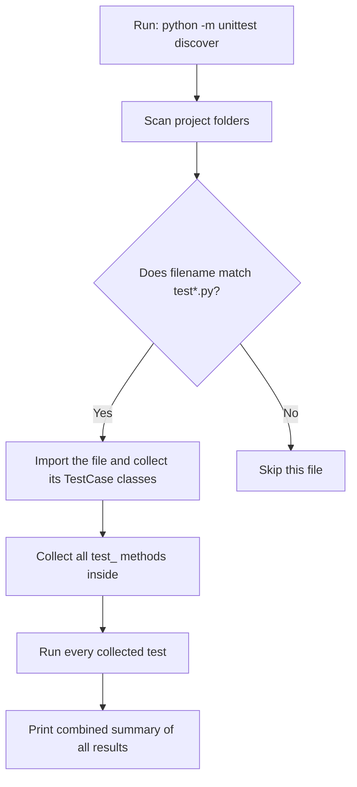

### Beginner Mistakes

* ❌ Naming test files something that doesn't start with `test` (like `calculator_tests.py`) — discovery won't find them by default.

### Best Practices

* ✅ Stick to the `test_*.py` naming convention across your whole project so discovery "just works."

### Summary

Test discovery automatically finds and runs every test file/method in a project matching a naming pattern, saving you from running each file manually.

---

## 13. `subTest()`

### Definition

`subTest()` lets you run the **same assertion logic multiple times with different inputs**, inside a single test method, while still getting **individual, separate failure reports** for each input that fails.

### Why It Exists

Without `subTest()`, if you loop through several inputs and one assertion fails, the loop **stops immediately** — you only find out about the first failure, not all of them.

### Syntax

```python
class TestSquare(unittest.TestCase):
    def test_square_multiple_values(self):
        test_cases = [(2, 4), (3, 9), (4, 16), (5, 26)]  # last one is WRONG on purpose
        for n, expected in test_cases:
            with self.subTest(n=n):
                self.assertEqual(n ** 2, expected)
```

**Step-by-step:**

1. Python loops through each `(n, expected)` pair.
2. For each pair, `with self.subTest(n=n):` creates a "checkpoint" labeled with the current value of `n`.
3. Even if `n=5` fails (`5 ** 2` is `25`, not `26`), `unittest` **records that specific failure** but **continues** checking the remaining cases (none remain here, but it would if there were more).
4. At the end, the test report clearly shows **which specific `n` value** failed, instead of just "something failed."

### Flowchart

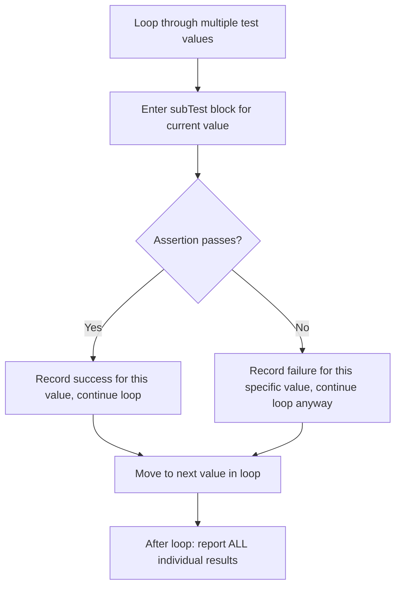

### Beginner Mistakes

* ❌ Using a plain `for` loop with assertions directly (no `subTest`) — the loop stops at the **first** failure, hiding any other failing cases.

### Best Practices

* ✅ Use `subTest()` whenever you're testing the same logic across a list of different inputs.

### Summary

`subTest()` allows testing multiple inputs within one test method while still reporting each failure individually, instead of stopping at the first one.

---

## 14. Mocking Basics: `Mock` and `patch()`

### Definition

**Mocking** means replacing a real object or function (often something slow, unpredictable, or external — like a network call) with a **fake stand-in** during testing, so you can control exactly what it does and test your code in isolation.

### Why It Exists

Imagine testing a function that sends a real email or calls a real weather API. You don't want your tests to:

* Actually send emails every time you test.
* Fail just because the internet is down.
* Take several seconds per test due to network delays.

Mocking lets you **pretend** the email was sent or the API responded, without actually doing it.

### Real-Life Analogy

> 🧠 **Analogy: A Crash Test Dummy**
> Car safety tests don't use real people — they use a dummy that behaves predictably and can be reused endlessly. A `Mock` object is a "crash test dummy" standing in for a real, risky, or expensive dependency.

### 14.1 `Mock` — Creating a Fake Object

```python
from unittest.mock import Mock

fake_response = Mock()
fake_response.status_code = 200
fake_response.json.return_value = {"weather": "sunny"}

print(fake_response.status_code)      # 200
print(fake_response.json())           # {'weather': 'sunny'}
```

**Explanation:**

1. `Mock()` creates a fake, flexible object that can pretend to be almost anything.
2. `fake_response.status_code = 200` — we manually set an attribute, as if this were a real response.
3. `fake_response.json.return_value = {...}` — we tell the fake object: "whenever someone calls `.json()` on you, return this dictionary."
4. Calling `fake_response.json()` doesn't do any real work — it just returns exactly what we told it to.

### 14.2 `patch()` — Temporarily Replacing Real Code With a Mock

`patch()` is used to **temporarily swap out** a real function/object with a `Mock`, only for the duration of a test.

```python
from unittest.mock import patch

def get_current_time():
    import time
    return time.time()

class TestTime(unittest.TestCase):
    @patch("time.time")
    def test_get_current_time(self, mock_time):
        mock_time.return_value = 1000000
        self.assertEqual(get_current_time(), 1000000)
```

**Explanation:**

1. `@patch("time.time")` — this **decorator** (a special wrapper placed above a function) tells Python: "while this test runs, replace `time.time` with a `Mock`."
2. `mock_time` — this fake version is automatically passed into our test method as an argument.
3. `mock_time.return_value = 1000000` — we control exactly what the fake `time.time()` returns.
4. `assertEqual(get_current_time(), 1000000)` — since `get_current_time()` internally calls `time.time()`, and that's now faked, we get a **predictable, controlled result** instead of the real, ever-changing current time.
5. After the test finishes, `patch()` automatically restores the **real** `time.time` — nothing is permanently changed.

### Flowchart

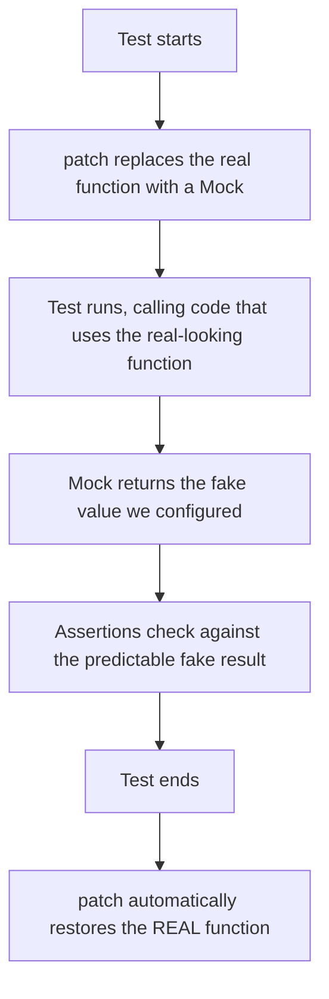

### Table: Why Mocking Helps

| Without Mocking | With Mocking |
|---|---|
| Tests depend on real network/database/time | Tests use predictable fake data |
| Slow, sometimes flaky (fails randomly) | Fast, consistent, reliable |
| Hard to test error scenarios (e.g., "what if the API fails?") | Easy — just make the mock simulate a failure |

### Beginner Mistakes

* ❌ Forgetting that `patch()` only replaces the function/object **during the test**, not permanently.
* ❌ Patching the wrong path (mocking must target **where the function is used**, not always where it's originally defined — an important but slightly advanced detail to be aware of).

### Best Practices

* ✅ Mock things that are slow, unpredictable, external, or costly (network calls, databases, sending emails, current time/date).
* ✅ Don't mock everything — only mock what genuinely needs to be faked to keep the test focused and fast.

### Summary

`Mock` creates a fake, controllable stand-in object; `patch()` temporarily swaps a real function/object for a mock during a test, then restores the original afterward.

---

## 15. Testing Functions That Use APIs/External Dependencies

### Definition

When a function relies on something **outside your program's control** — a web API, a database, the current date/time, a file on disk — testing it directly can be slow, unreliable, or even impossible in an automated environment. The solution is to **mock** that external dependency.

### Example: Testing a Function That Calls an API

**Source code (`weather.py`):**

```python
import requests

def get_temperature(city):
    response = requests.get(f"https://api.weather.example.com/{city}")
    data = response.json()
    return data["temperature"]
```

**Test code (`test_weather.py`):**

```python
import unittest
from unittest.mock import patch
from weather import get_temperature

class TestWeather(unittest.TestCase):

    @patch("weather.requests.get")
    def test_get_temperature(self, mock_get):
        mock_get.return_value.json.return_value = {"temperature": 30}

        result = get_temperature("Delhi")

        self.assertEqual(result, 30)
```

**Line-by-line explanation:**

1. `@patch("weather.requests.get")` — replaces `requests.get`, **specifically as used inside the `weather` module**, with a `Mock`, for the duration of this test only.
2. `mock_get` — the fake version of `requests.get`, automatically passed in as an argument.
3. `mock_get.return_value.json.return_value = {"temperature": 30}` — this says: "when `requests.get(...)` is called, and then `.json()` is called on **its result**, return `{"temperature": 30}`."
4. `result = get_temperature("Delhi")` — calls our real function, but internally, it's now using the fake API response instead of making a real network call.
5. `self.assertEqual(result, 30)` — confirms our function correctly extracted `30` from the (fake) response.

* **Side effect avoided:** No real network request is made — the test runs instantly and doesn't depend on the internet being available.
* **Return value tested:** We verify `get_temperature` correctly processes the API's data structure.

### Flowchart

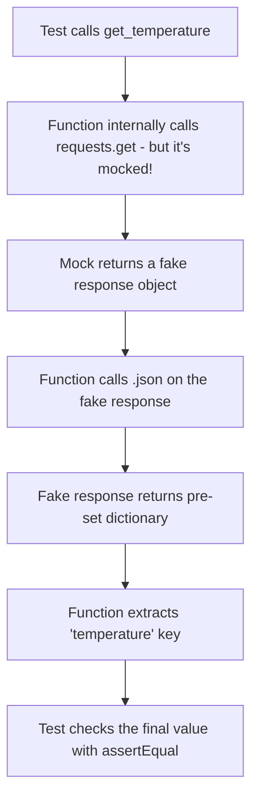

### Beginner Mistakes

* ❌ Writing tests that make **real** API calls — these are slow, can fail due to network issues, and might even cost money or hit rate limits.
* ❌ Forgetting that a mocked API response needs to closely resemble the **real** response's structure, or your test might pass while the real code actually breaks in production.

### Best Practices

* ✅ Always mock external dependencies (APIs, databases, file systems, current time) in unit tests.
* ✅ Reserve testing the **real** integration (actual API call working end-to-end) for a separate, smaller set of **integration tests**.

### Summary

When testing functions that depend on external systems, mock those dependencies so your tests remain fast, reliable, and independent of the outside world.

---

## 16. Practice Zone

### 🧩 Conceptual Questions (10)

1. What is the purpose of unit testing?
2. What is the key difference between unit testing and integration testing?
3. Why must test methods start with `test_`?
4. What does `unittest.main()` actually do?
5. Why do we use `if __name__ == "__main__":` around `unittest.main()`?
6. What is the difference between `setUp()` and `tearDown()`?
7. Why should source code and test code live in separate files?
8. What problem does `subTest()` solve?
9. What is mocking, and why is it useful?
10. Why shouldn't unit tests make real network calls?

### 🔮 Predict the Output (10)

```python
# Q1
def add(a, b):
    return a + b

class T(unittest.TestCase):
    def test_add(self):
        self.assertEqual(add(2, 2), 4)
# If this test runs, does it pass or fail?
```

```python
# Q2
class T(unittest.TestCase):
    def check_add(self):   # note the method name
        self.assertEqual(1 + 1, 2)
# Will 'check_add' run automatically when tests are executed?
```

```python
# Q3
class T(unittest.TestCase):
    def setUp(self):
        self.x = 10
    def test_one(self):
        self.x += 5
        self.assertEqual(self.x, 15)
    def test_two(self):
        self.assertEqual(self.x, 10)
# Does test_two see x = 15 or x = 10?
```

```python
# Q4
def divide(a, b):
    return a / b

class T(unittest.TestCase):
    def test_zero(self):
        with self.assertRaises(ZeroDivisionError):
            divide(5, 0)
# Does this test pass or fail?
```

```python
# Q5
self.assertEqual(5, "5")
# Does this pass or fail? Why?
```

```python
# Q6
self.assertIn(3, [1, 2, 4])
# Pass or fail?
```

```python
# Q7
from unittest.mock import Mock
m = Mock()
m.greet.return_value = "hi"
print(m.greet())
# What is printed?
```

```python
# Q8
class T(unittest.TestCase):
    def test_values(self):
        for n in [1, 2, "3"]:
            with self.subTest(n=n):
                self.assertIsInstance(n, int)
# Which value(s) fail, and does the loop stop early?
```

```python
# Q9
class T(unittest.TestCase):
    def test_true_case(self):
        self.assertTrue(0)
# Pass or fail? (Remember: 0 is falsy in Python)
```

```python
# Q10
def get_name():
    return None

class T(unittest.TestCase):
    def test_name(self):
        self.assertIsNotNone(get_name())
# Pass or fail?
```

### 💻 Coding Exercises (10)

1. Write a function `is_positive(n)` and a full test class checking a positive number, a negative number, and zero.
2. Write a function `get_grade(score)` that returns `"Pass"` or `"Fail"`, and test both cases using `assertEqual`.
3. Write a test using `assertRaises` to confirm that a function `open_file(name)` raises `FileNotFoundError` for a missing file.
4. Write a `TestCase` with a `setUp()` method that creates a list, and two tests that use it differently.
5. Write a function `find_item(lst, item)` and test it using both `assertIn` and `assertNotIn`.
6. Use `subTest()` to test a `is_even(n)` function against at least 5 different numbers in one test method.
7. Write a function that uses `datetime.now()` internally, and use `patch()` to test it with a fixed, predictable date.
8. Create two files: `strings.py` (with a `reverse_string()` function) and `test_strings.py` (testing it) — demonstrating separated source/test code.
9. Write a function that calls an external API using `requests.get`, then write a test that mocks the API call entirely.
10. Write a test class with both `setUp()` and `tearDown()`, printing a message in each, to observe the exact order of execution across two test methods.

### 🐞 Debugging Exercises (5)

```python
# Bug 1 - Test method name issue
class TestMath(unittest.TestCase):
    def addition_test(self):
        self.assertEqual(2 + 2, 4)
# Why does this test never run?
```

```python
# Bug 2 - Missing inheritance
class TestMath():
    def test_add(self):
        self.assertEqual(2 + 2, 4)
# Why does this raise an AttributeError?
```

```python
# Bug 3 - Forgot to run tests
class TestMath(unittest.TestCase):
    def test_add(self):
        self.assertEqual(2 + 2, 4)
# Fix so this file actually runs its tests when executed directly.
```

```python
# Bug 4 - Wrong assertRaises usage
class TestDivide(unittest.TestCase):
    def test_divide_by_zero(self):
        self.assertRaises(ZeroDivisionError, divide(10, 0))
# What's wrong with calling divide(10, 0) directly here?
```

```python
# Bug 5 - subTest misuse expectation
class TestSquares(unittest.TestCase):
    def test_squares(self):
        for n in [1, 2, 3]:
            self.assertEqual(n ** 2, n * n)
# This works, but rewrite it to use subTest() correctly and explain the benefit.
```

### ❓ Frequently Asked Questions

**Q: Do I need to install `unittest` separately?**
No — it's built into Python's standard library.

**Q: What happens if I don't include `if __name__ == "__main__": unittest.main()`?**
You can still run your tests with `python -m unittest test_file.py` — the guard is only required for running the file directly with `python test_file.py`.

**Q: Can `setUp()` fail?**
Yes — if `setUp()` raises an error, the corresponding test is reported as an error (not a regular failure), since the test never even got a chance to run properly.

**Q: Is mocking "cheating" since it's not testing the real API?**
No — mocking tests **your code's logic** in isolation. Testing the real API connection is the job of integration tests, which are separate and typically run less frequently.

### 🎯 Interview Questions

1. What is the difference between `assertEqual` and `assertTrue`?
2. Why is `setUp()` run before every test method instead of once per class?
3. What is the purpose of mocking, and when would you use `patch()`?
4. What's the difference between a unit test and an integration test?
5. Why is test discovery useful in larger projects?

---

## 17. Chapter Summary & Cheat Sheet

### One-Page Summary

* **Unit testing** checks small, individual pieces of code (usually functions) automatically and repeatably.
* **Unit tests** isolate one piece; **integration tests** check multiple pieces working together.
* `unittest` is Python's **built-in** testing module.
* `unittest.TestCase` is the base class you inherit from to gain testing tools.
* Test methods **must** start with `test_` to be automatically discovered and run.
* `unittest.main()` actually runs the tests; wrap it in `if __name__ == "__main__":` so it only runs when the file is executed directly.
* Key assertions: `assertEqual`, `assertNotEqual`, `assertTrue`, `assertFalse`, `assertIsNone`, `assertIsNotNone`, `assertIn`, `assertNotIn`, `assertIsInstance`, `assertRaises`.
* Always test **normal**, **edge**, and **invalid** cases — not just the happy path.
* `setUp()` runs before every test; `tearDown()` runs after every test — both for consistent, clean conditions.
* Keep **source code** and **test code** in separate files (`module.py` and `test_module.py`).
* Run tests with `python test_file.py` (needs the `__main__` guard) or `python -m unittest` (more flexible).
* `python -m unittest discover` automatically finds and runs all matching test files in a project.
* `subTest()` lets a loop of checks report **every** failure, not just the first.
* `Mock` creates fake objects; `patch()` temporarily swaps real code for a mock — essential for testing functions that use APIs, databases, or time.

### Cheat Sheet: Key Syntax

```python
import unittest
from unittest.mock import Mock, patch

class TestSomething(unittest.TestCase):

    def setUp(self):
        pass          # runs before every test

    def tearDown(self):
        pass          # runs after every test

    def test_example(self):
        self.assertEqual(1 + 1, 2)
        self.assertNotEqual(1, 2)
        self.assertTrue(True)
        self.assertFalse(False)
        self.assertIsNone(None)
        self.assertIsNotNone(1)
        self.assertIn(1, [1, 2, 3])
        self.assertNotIn(9, [1, 2, 3])
        self.assertIsInstance(1, int)
        with self.assertRaises(ValueError):
            raise ValueError

    def test_with_subtest(self):
        for n in [1, 2, 3]:
            with self.subTest(n=n):
                self.assertGreater(n, 0)

    @patch("module_name.function_name")
    def test_with_mock(self, mock_func):
        mock_func.return_value = "fake result"

if __name__ == "__main__":
    unittest.main()
```

**Running tests:**

```bash
python test_file.py            # requires __main__ guard
python -m unittest test_file   # does not require it
python -m unittest discover    # runs all matching test files
```

### Memory Trick

> 🧠 **"STAR"** — **S**etUp prepares, **T**est checks (with asserts), **A**ssertRaises catches errors, **R**estore happens in tearDown/patch.

---

## 18. Glossary

| Term | Meaning |
|---|---|
| **Unit** | The smallest testable piece of code, usually one function. |
| **Unit testing** | Automatically checking that one small piece of code behaves correctly, in isolation. |
| **Integration testing** | Testing that multiple components work correctly together. |
| **`unittest`** | Python's built-in module for writing and running tests. |
| **`TestCase`** | The base class you inherit from to write tests, providing assertion tools. |
| **Test method** | A method (starting with `test_`) inside a `TestCase` that checks one behavior. |
| **`unittest.main()`** | Discovers and runs all tests in the current file. |
| **Assertion** | A statement that checks whether a condition is true, failing the test if not. |
| **Edge case** | An unusual or boundary input (empty, zero, extreme values). |
| **Invalid case** | Input a function should reject or handle with an error. |
| **`setUp()`** | Runs automatically before every test method, to prepare a clean environment. |
| **`tearDown()`** | Runs automatically after every test method, to clean up. |
| **Test discovery** | `unittest`'s ability to automatically find and run test files/methods across a project. |
| **`subTest()`** | Lets multiple checks in a loop report individual pass/fail results, without stopping early. |
| **Mocking** | Replacing a real object/function with a fake, controllable stand-in for testing. |
| **`Mock`** | A class used to create fake objects that can simulate real behavior. |
| **`patch()`** | Temporarily replaces a real function/object with a `Mock` during a test, then restores it. |
| **Exception** | An error that occurs during program execution (e.g., `ZeroDivisionError`). |

---

### 📌 Final Reminder

> Good tests are your safety net. They let you change and improve your code with confidence, because if something breaks, your tests will tell you immediately — instead of a user finding out first.

**End of Lecture 10.**